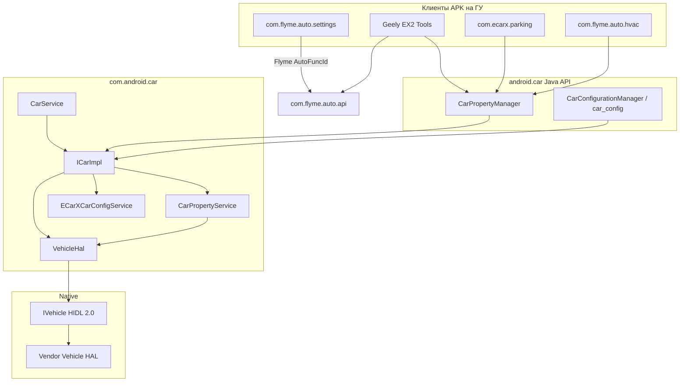
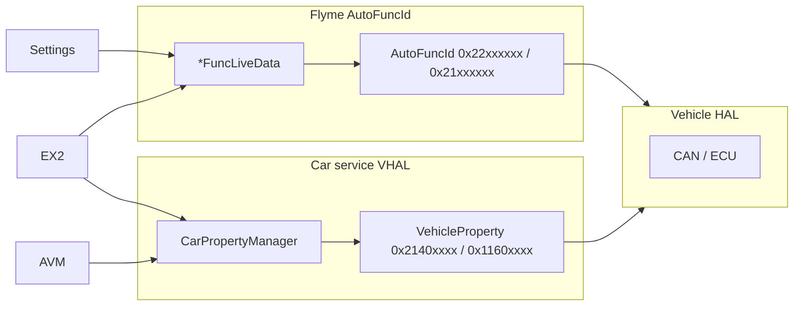

# com.android.car — справочник по разбору APK (Car service)

Документ описывает системный **Car service** (`com.android.car`) с головного устройства Geely **IHU629G**: как он подключается к Vehicle HAL, какие Car API-сервисы поднимает, какие VHAL property id определены в прошивке, и как это связано с Flyme Settings / Geely EX2 Tools.

**Важно:** это **не** UI-приложение. APK — системный сервис Android Automotive: мост между `IVehicle` (HIDL VHAL) и Java API `android.car.*` (`CarPropertyManager`, `CarAudioManager`, …). Штатные Flyme-приложения (Settings, HVAC) часто ходят в машину через **`com.flyme.auto.api`** (`AutoFuncId`, `0x22xxxxxx`), но **те же физические сигналы** часто дублируются в VHAL property id из этого APK (`VehicleProperty`, `0x2140xxxx` / `0x1160xxxx`).

---

## 0. Обзор приложения

| Параметр | Значение |
|----------|----------|
| Пакет | `com.android.car` |
| Label | **Car service** |
| versionCode | `28` |
| versionName | `9` |
| minSdk / targetSdk / compileSdk | 28 / 28 / 28 (Android 9) |
| sharedUserId | `android.uid.system` |
| coreApp | `true` |
| Главный сервис | `com.android.car.CarService` (`singleUser`) |
| Регистрация в системе | `ServiceManager.addService("car_service", ICarImpl)` |
| DEX с HAL-типами / property id | `classes.dex` (~1.4 MB, `VehicleProperty` + HIDL) |
| DEX с логикой сервисов | `classes2.dex` (~4.6 MB, `ICarImpl`, eCarX-расширения) |
| Констант `VehicleProperty` | **1833** (vendor-расширенный VHAL для Geely/eCarX) |
| Java-классов (JADX) | ~1438 |

**Назначение:** поднять Vehicle HAL, зарегистрировать Car API, обслуживать property/sensor/audio/power/driving state, плюс vendor-сервисы eCarX (конфиг комплектации, PDC, Bluetooth, face recognition, Baidu power manager).

**Стек (по dex/JADX):**

- `CarService.onCreate()` → `IVehicle.getService()` → `VehicleHal` → `ICarImpl.init()`
- Клиенты: `Car.createCar()` → `ICar.getCarService("property")` → `CarPropertyService`
- Vendor: `ICar.getCarService("car_config")` → `ECarXCarConfigService`
- Переподключение VHAL: `VehicleDeathRecipient` + `vehicleHalReconnected()`

**Связанные компоненты (не в APK, но обязательны):**

- Native **Vehicle HAL** (`android.hardware.automotive.vehicle@2.0-service`)
- Flyme **`com.flyme.auto.api`** — параллельный слой `AutoFuncId` (см. [flyme-settings-apk.md](./flyme-settings-apk.md))
- **`com.ecarx.parking`** — AVM-триггер через VHAL (см. [ecarx-parking-apk.md](./ecarx-parking-apk.md))

---

## 1. Источник и артефакты

| Параметр | Значение |
|----------|----------|
| Платформа (источник дампа) | IHU629G |
| Исходный APK (ADBAppControl) | `downloads/250060 IHU629G/Car service (com.android.car) [v.9].apk` |
| Локальная копия | `.tmp/android-car.apk` |
| Распакованный APK | `.tmp/android-car-apk/` |
| JADX | `.tmp/android-car-jadx/` |

### Получить APK с устройства

```bash
adb shell pm path com.android.car
adb pull /system/priv-app/CarService/CarService.apk .tmp/android-car.apk
```

### Распаковать и искать

```powershell
Copy-Item -LiteralPath ".tmp\android-car.apk" -Destination ".tmp\android-car.zip"
Expand-Archive -LiteralPath .tmp\android-car.zip -DestinationPath .tmp\android-car-apk -Force

$dexdump = (Get-ChildItem "$env:LOCALAPPDATA\Android\Sdk\build-tools" -Recurse -Filter "dexdump.exe" | Select-Object -First 1).FullName
& $dexdump -d .tmp\android-car-apk\classes.dex | Select-String "PERF_VEHICLE_SPEED|LIGHTINSIDE_ATMOSPHERE"
```

**JADX / jadx-gui** — основной инструмент для `ICarImpl`, `CarPropertyService`, `ECarXCarConfigService`, `VehicleProperty`.

---

## 2. Архитектура



### 2.1 Жизненный цикл `CarService`

1. `onCreate()` — ожидание `IVehicle.getService()` (до 10 с при reconnect).
2. `new ICarImpl(context, vehicle, …)` — создание всех sub-сервисов.
3. `ICarImpl.init()` → `VehicleHal.init()` → `init()` каждого `CarServiceBase`.
4. `ServiceManager.addService("car_service", mICarImpl)` — точка входа для `Car.createCar()`.
5. `linkToDeath` на VHAL; при падении HAL — reconnect и `vehicleHalReconnected()`.
6. Свойство `sys.com.android.car.PID` — детект перезапуска Car service (`CarService.sHasCrashed`).

### 2.2 Car API — имена сервисов (`ICarImpl.getCarService`)

| Имя | Реализация | Назначение |
|-----|------------|------------|
| `property` | `CarPropertyService` | Чтение/запись VHAL, подписки |
| `sensor` | `CarPropertyService` | (alias) |
| `hvac` / `cabin` / `info` / `vendor_extension` | `CarPropertyService` | (alias) |
| `car_config` | `ECarXCarConfigService` | Feature flags комплектации eCarX |
| `audio` | `CarAudioService` | Маршрутизация аудио, зоны |
| `power` | `CarPowerManagementService` | Power policy, suspend |
| `drivingstate` | `CarDrivingStateService` | UX restrictions input |
| `uxrestriction` | `CarUxRestrictionsManagerService` | Ограничения UI при движении |
| `package` | `CarPackageManagerService` | App blocking |
| `car_bluetooth` | `ECarxBluetoothService` | BT policy (на IHU629G MTK-ветка отключена) |
| `diagnostic` | `CarDiagnosticService` | OBD / diagnostic HAL |
| `configuration` | `CarConfigurationService` | JSON-конфиг авто |
| `cluster_service` | `InstrumentClusterService` | Приборная панель |
| `app_focus` | `AppFocusService` | Фокус навигации/voice |
| `vehicle_map_subscriber_service` | `VmsSubscriberService` | VMS |

**Internal** (`getCarInternalService`): `internal_input`, `system_activity_monitoring`.

---

## 3. Vendor-расширения eCarX / BICV

Поверх AOSP Car service на IHU629G добавлены классы (пакет `com.android.car`, `classes2.dex`):

| Класс | Роль |
|-------|------|
| `ECarXCarConfigService` | `car_config`: коды комплектации (`CMD_*`), подписка на ignition/gear/night mode/atmosphere, синхронизация `LocalConfig` |
| `EcarXUpdateLocalConfigService` | Обновление локального конфига с VHAL (не G2/HL платформы) |
| `G2UpdateLocalConfigService` | То же для продуктов `ro.product.name` = `BDS3928` / `BDS3930` |
| `ECarxBluetoothService` | Bluetooth policy eCarX |
| `ECarXPhoneStatusService` | Статус телефона ↔ VHAL |
| `PDCService` | Парктроник: слушает radar/PDC property, шлёт broadcast при смене режима |
| `FaceRecognitionService` | Face ID / VIMS интеграция |
| `BDSystemService` / `BDPowerManagerService` | Baidu / power management |
| `AutoTimeService` | SNTP/GPS синхронизация времени |
| `AmbienceLampService` | Системная синхронизация ambient light с drive mode / speed (**класс есть, в `ICarImpl` init не подключён**) |

### 3.1 `ECarXCarConfigService` — ключевые property

Подписка при старте (`REQUIRED_PROPERTIES`):

| VehicleProperty | Hex | Назначение |
|-----------------|-----|------------|
| `IGNITION_STATE` | AOSP | Зажигание |
| `DRIVE_ENGINE_STATUS` | vendor | Статус двигателя |
| `VPOWERINFO_EMSSSM_STATUS` | vendor | EMS |
| `GEAR_SELECTION` | AOSP | Передача |
| `BODY_LIGHT_WIDTHLAMP_SW` | vendor | Габариты |
| `NIGHT_MODE` | AOSP | День/ночь |
| `MCU_USB_MODE_SELECT` | vendor | USB mode |
| `MCU_POWER_SLEEP_MODE` | vendor | Sleep |
| `AUTO_HOLD_SWITCH_STATUS` | `0x2140a161` | Auto Hold |
| `MCU_RET_BLE_VER_INFO` | vendor | BLE версия |
| `EPTREADY` | vendor | Ready EV |

Atmosphere / display (`POSITION_LIGHT_CTRL_PROPS`): `LIGHTINSIDE_ATMOSPHERE_LAMP_*`, `BODY_LIGHT_ATMO_*`, `MCU_ATMOSPHERE_LIGHT_*`, `SCREEN_LIGHT_AUTO`, `ATE_SCREEN_BRIGHT`.

**Режимы вождения в config service** (локальные константы, не Flyme hex):

| Константа | Значение |
|-----------|----------|
| `DRIVE_NORMAL` | 0 |
| `DRIVE_CONFORT` | 1 |
| `DRIVE_SPORT` | 2 |
| `DRIVE_ECO` | 3 |
| `DRIVE_OFFROAD` | 4 |
| `DRIVE_SNOW` | 5 |

### 3.2 `PDCService`

Слушает radar/PDC property (в т.ч. `RRS_MODE_AND_BUTTON_PRESS`, `DRIVE_RADAR_OBSTACLE_DISTANCE_INFO`, `GEAR_SELECTION`). При активном PDC — `Intent` broadcast (интеграция с launcher / overlay). Связан с теми же radar id, что использует AVM APK.

---

## 4. Манифест — компоненты с UI

| Компонент | Назначение |
|-----------|------------|
| `CarService` | Главный системный серvice |
| `PerUserCarService` | Per-user car helpers |
| `ActivityBlockingActivity` | Экран блокировки приложения (UX restrictions) |
| `CarNightService$NullActivity` | Stub для night mode |
| `LowPowerActivity` / `LowBatteryActivity` | Оверлеи низкого заряда / power limit |
| `UsbPowerStActivity` | Диалог USB power (вызывается из `ECarXCarConfigService`) |

APK также **объявляет** все `android.car.permission.*` — они выдаются системным и priv-app клиентам.

---

## 5. VHAL / VehicleProperty id

Полный список — `android.hardware.automotive.vehicle.V2_0.VehicleProperty` в `classes.dex` (**1833** id). Ниже — property, релевантные для Geely EX2 Tools и соседних APK.

### 5.1 Скорость, батарея, температура

| Имя | int | Hex | Тип | Примечание |
|-----|-----|-----|-----|------------|
| `PERF_VEHICLE_SPEED` | `291504647` | `0x11600207` | float | km/h (используется в EX2 Tools) |
| `PERF_VEHICLE_SPEED_DISPLAY` | `291504648` | `0x11600208` | float | Приборка, × 0.05625 в AVM |
| `ED_EV_BATTERY_PERCENTAGE` | `557885165` | `0x2140a6ed` | float | OEM SOC 0–100 |
| `EV_BATTERY_LEVEL` | `291504905` | `0x11600309` | float | AOSP fallback |
| `AC_AMBIENT_TEMP` | `557884279` | `0x2140a377` | int | Декод: `(raw - 80) / 2` °C |
| `AC_INSIDE_TEMP` | `557884281` | `0x2140a379` | int | То же |
| `ENV_OUTSIDE_TEMPERATURE` | `291505923` | `0x11600703` | float | AOSP fallback |

### 5.2 Режим вождения (VHAL-слой)

Flyme Settings пишет **`DM_FUNC_DRIVE_MODE_SELECT`** (`0x22010100`) через `AutoFuncId` — **этого id нет** в `VehicleProperty`. На уровне VHAL в Car service:

| Имя | int | Hex | Примечание |
|-----|-----|-----|------------|
| `AP_DRIVE_MODE_SET_STATUS` | `557854720` | `0x21403000` | Статус drive mode (AP) |
| `PHEV_DRV_MODE_SET` | `557850837` | `0x214020d5` | Запись режима PHEV |
| `PHEV_DRV_MODE` | `557850839` | `0x214020d7` | Текущий режим |
| `DRIVE_MODE_MEMORY_ON` | `557850658` | `0x21402022` | Память режима |
| `DRIVE_AUTO_HOLD` | `557850763` | `0x2140208b` | Auto Hold (VHAL) |
| `AUTO_HOLD_SWITCH_STATUS` | `557883745` | `0x2140a161` | Auto Hold switch |

**Практика для EX2 Tools:** primary write/read — Flyme API (`updateFuncValueForce`); VHAL `0x22010100` — fallback read/write через `CarPropertyManager`.

### 5.3 Атмосферная подсветка (VHAL-слой)

Flyme master switch: **`BCM_FUNC_LIGHT_ATMOSPHERE_LAMPS`** (`0x21051000`) — в `VehicleProperty` **нет**. Ближайшие VHAL id:

| Имя | int | Hex |
|-----|-----|-----|
| `LIGHTINSIDE_ATMOSPHERE_LAMP_SWITCH` | `557885013` | `0x2140a655` |
| `LIGHTINSIDE_ATMOSPHERE_LAMP_MODE` | `557883544` | `0x2140a078` |
| `LIGHTINSIDE_ATMOSPHERE_LAMP_MODE_3B` | `557883539` | `0x2140a073` |
| `MCU_ATMOSPHERE_LIGHT_WELCOME` | `557885025` | `0x2140a661` |
| `MCU_ATMOSPHERE_LIGHT_DRIVE_COORDINATED` | `557885015` | `0x2140a657` |
| `MCU_ATMOSPHERE_LIGHT_SPEED_COORDINATED` | `557885016` | `0x2140a658` |
| `AL_MODE_SET` | `557885459` | `0x2140a813` |
| `AL_BRIGHTNESS_LEVEL_ADJUST` | `557885458` | `0x2140a812` |

### 5.4 AVM / камера (пересечение с `com.ecarx.parking`)

| Имя | int | Hex | Примечание |
|-----|-----|-----|------------|
| `AVM_DISPLAY_SWITCH_FROM` | `557885012` | `0x2140a654` | Команда open/close AVM |
| `AVM_DISPLAY_SWITCH` | `557862976` | `0x21405000` | |
| `AVM_CAMERA_POWER_ON` | `557862996` | `0x21405054` | Статус камеры |
| `AVM_OVERSPEED_WARNING` | `557863009` | `0x21405061` | |
| `PERF_VEHICLE_SIAVM_SWITCH` | см. ecarx doc | `0x2140a402` | Статус AVM on/off |

Полная таблица AVM property — в [ecarx-parking-apk.md §5](./ecarx-parking-apk.md).

### 5.5 ADAS / HVAC / прочее (фрагмент)

В `VehicleProperty` также определены сотни vendor id: `ADAS_*`, `HVAC_*`, `IPK_*`, `DVR_*`, `VENDOR_*`, `PAS_FUNC_*` (PDC), `BODY_*`, `DRIVE_*`. Поиск по имени — через JADX или:

```powershell
Select-String -Path .tmp\android-car-jadx\sources\android\hardware\automotive\vehicle\V2_0\VehicleProperty.java -Pattern "ATMOSPHERE|DRIVE_MODE|REGENERATION"
```

---

## 6. Два слоя доступа к машине



| Задача | Рекомендуемый путь | Fallback |
|--------|-------------------|----------|
| Drive mode | Flyme `DM_FUNC_DRIVE_MODE_SELECT` | VHAL `0x22010100` / `PHEV_DRV_MODE_SET` |
| Ambient light ON/OFF | Flyme `BCM_FUNC_LIGHT_ATMOSPHERE_LAMPS` | VHAL `LIGHTINSIDE_ATMOSPHERE_LAMP_SWITCH` |
| Speed | VHAL `PERF_VEHICLE_SPEED` | — |
| Battery SOC | VHAL `ED_EV_BATTERY_PERCENTAGE` | `EV_BATTERY_LEVEL` |
| Outside temp | VHAL `AC_AMBIENT_TEMP` | `ENV_OUTSIDE_TEMPERATURE` |
| AVM open | VHAL `AVM_DISPLAY_SWITCH_FROM` | EAS / `com.ecarx.parking` |
| Feature availability | `car_config` / `ECarXCarConfigService` | `AutoCarConfig` в Flyme API |

---

## 7. Карта классов APK (точки входа)

| Класс | DEX | Назначение |
|-------|-----|------------|
| `CarService` | 2 | Application Service, VHAL connect |
| `ICarImpl` | 2 | Фасад `ICar.Stub`, список sub-сервисов |
| `VehicleHal` | 2 | Агрегатор HAL: property, power, input, vms, diagnostic |
| `PropertyHalService` | 2 | Subscribe/set/get → `IVehicle` |
| `CarPropertyService` | 2 | `ICarProperty.Stub`, permissions, listeners |
| `PropertyHalServiceIds` | 2 | Маппинг AOSP property → `android.car.permission.*` |
| `VehicleProperty` | 1 | **Справочник всех property id** |
| `ECarXCarConfigService` | 2 | Vendor config + `car_config` API |
| `CarDrivingStateService` | 2 | Driving state для UX |
| `CarAudioService` | 2 | Audio zones / routing |
| `PDCService` | 2 | Park distance control events |
| `CarPowerManagementService` | 2 | Shutdown / garage mode hooks |

---

## 8. Как найти property id

1. **JADX** — `VehicleProperty.java`, поиск по префиксу (`ADAS_`, `LIGHTINSIDE_`, …).
2. **Класс-потребитель** — `grep` по `VehicleProperty.ИМЯ` в `.tmp/android-car-jadx/sources/com/android/car/`.
3. **dexdump** — строковые имена в `classes.dex`:
   ```powershell
   & $dexdump -d .tmp\android-car-apk\classes.dex | Select-String "ATMOSPHERE_LAMP"
   ```
4. **Int → hex** — property id в Java `int`; hex = `0x{value:X}` (на Windows PowerShell).
5. **Runtime** — на устройстве:
   ```bash
   adb shell dumpsys android.car.ICar --services
   adb shell dumpsys android.car.ICar --list-properties
   ```

### Шаблон чтения через CarPropertyManager (Kotlin)

```kotlin
val car = Car.createCar(context)
val mgr = car.getCarManager(Car.PROPERTY_SERVICE) as CarPropertyManager
val speed = mgr.getFloatProperty(0x11600207, 0)  // PERF_VEHICLE_SPEED
```

Требуются signature/priv permissions (`android.car.permission.CAR_*`) или системный UID.

---

## 9. Отладка

```bash
# Car service / VHAL
adb logcat | findstr /i "CarService Property.service VehicleHal CarConfigService"

# Проверка регистрации
adb shell service list | findstr car

# Crash VHAL
adb logcat | findstr /i "Vehicle HAL died SysProp_CarService_pid"

# Property write/read
adb logcat | findstr /i "setProperty getProperty onPropertyChange"
```

| Симптом | Вероятная причина |
|---------|-------------------|
| `IllegalStateException: Vehicle HAL service is not available` | VHAL не поднялся / нет `IVehicle` |
| `CarPropertyManager` SecurityException | Нет `android.car.permission.*` |
| Flyme write OK, VHAL read stale | Разные слои (`AutoFuncId` vs `VehicleProperty`) |
| Property `null` / `STATUS_UNAVAILABLE` | Не поддерживается на комплектации — проверить `car_config` |
| `CarService has crashed` | Перезапуск после падения (`sHasCrashed=true`) |

---

## 10. Связь с Geely EX2 Tools

Константы в `VhalConstants.kt` согласованы с `VehicleProperty` этого APK:

| EX2 Tools | Hex | VehicleProperty |
|-----------|-----|-----------------|
| `PROP_PERF_VEHICLE_SPEED` | `0x11600207` | `PERF_VEHICLE_SPEED` |
| `PROP_ED_EV_BATTERY_PERCENTAGE` | `0x2140a6ed` | `ED_EV_BATTERY_PERCENTAGE` |
| `PROP_EV_BATTERY_LEVEL` | `0x11600309` | `EV_BATTERY_LEVEL` |
| `PROP_DM_FUNC_DRIVE_MODE_SELECT` | `0x22010100` | Flyme only (не в Car service) |
| `PROP_BCM_FUNC_LIGHT_ATMOSPHERE_LAMPS` | `0x21051000` | Flyme only (не в Car service) |

Temperature reader использует `AC_AMBIENT_TEMP` / `AC_INSIDE_TEMP` из этого справочника.

---

*Документ основан на разборе APK `com.android.car` v9 (versionCode 28, IHU629G). При смене прошивки повторите разбор — vendor `VehicleProperty` и набор eCarX-сервисов могут отличаться.*
