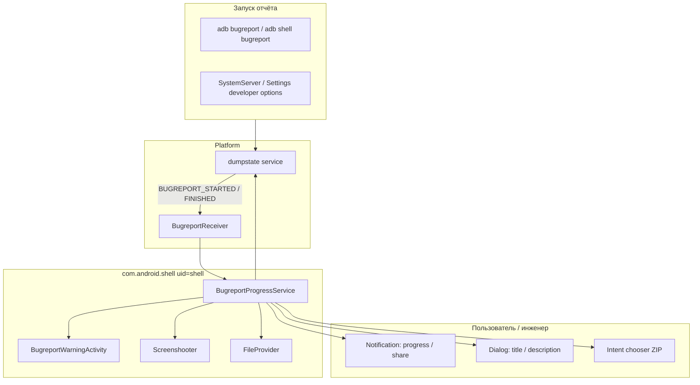

# com.android.shell — справочник по разбору APK (Shell / Оболочка)

Документ описывает системный пакет **Shell** (`com.android.shell`) с головного устройства Geely **IHU629G**: что внутри APK, как он связан с `adb shell`, и как реализует UX для **bugreport** (отчёт об ошибке).

**Важно:** это **не** Flyme/eCarX и **не** Car/VHAL. APK — стандартный компонент **AOSP Android 9** с `sharedUserId="android.uid.shell"`. На ГУ он работает под UID **shell (2000)** — тем же, что и интерактивная оболочка `adb shell`. Сам бинарник `/system/bin/sh` в APK **не входит**; здесь только Java-компоненты для bugreport и FileProvider.

---

## 0. Обзор приложения

| Параметр | Значение |
|----------|----------|
| Пакет | `com.android.shell` |
| Label (RU) | **Оболочка** |
| Label (EN) | **Shell** |
| versionCode | `28` |
| versionName | `9` |
| minSdk / targetSdk / compileSdk | 28 / 28 / 28 (Android 9) |
| sharedUserId | `android.uid.shell` (UID **2000**) |
| coreApp | `true` |
| Application | не объявлен (default `Application`) |
| Launcher Activity | **нет** |
| DEX | один `classes.dex` (~435 классов, **19** классов `com.android.shell.*`) |
| Размер APK | ~713 KB |

**Назначение на устройстве:**

1. **Bugreport UX** — уведомления о ходе/завершении `dumpstate`, диалог предупреждения о конфиденциальных данных, форма «название / заголовок / описание», скриншот, шаринг ZIP.
2. **Интеграция с dumpstate** — через binder `android.os.IDumpstate` / `IDumpstateListener` (системный сервис `dumpstate`).
3. **DocumentsProvider** (опционально) — `BugreportStorageProvider` для просмотра сохранённых отчётов (по умолчанию **выключен**).
4. **FileProvider** — `content://com.android.shell/...` для безопасной передачи файлов отчёта другим приложениям.

**Что APK не делает:**

- Не является «лаунчером оболочки» и не показывается в списке приложений.
- Не содержит логики автомобиля, VHAL, Flyme API.
- Не заменяет `adb shell` — только сопутствующий системный пакет с тем же UID.

**Стек (по dex / manifest):**

| Слой | Компонент |
|------|-----------|
| Platform | `dumpstate` (native), `ctl.start` / `ctl.stop bugreport` |
| Binder | `IDumpstate`, `IDumpstateListener`, `IDumpstateToken` |
| Service | `BugreportProgressService` |
| Receivers | `BugreportReceiver`, `RemoteBugreportReceiver` |
| UI | `BugreportWarningActivity`, notification actions, `BugreportInfoDialog` |
| Support libs | AndroidX Lifecycle, Support v4 (`FileProvider`, fragments) |

---

## 1. Источник и артефакты

| Параметр | Значение |
|----------|----------|
| Платформа (источник дампа) | IHU629G |
| Исходный APK (ADBAppControl) | `downloads/250060 IHU629G/Оболочка (com.android.shell) [v.9].apk` |
| Локальная копия | `.tmp/android-shell.apk` |
| Распакованный APK | `.tmp/android-shell-apk/` |
| JADX | `.tmp/android-shell-jadx/` |

> **PowerShell:** в имени файла есть `[v.9]` — используйте `-LiteralPath`, иначе скобки интерпретируются как wildcard.

### Получить APK с устройства

```bash
adb shell pm path com.android.shell
adb pull /system/priv-app/Shell/Shell.apk .tmp/android-shell.apk
```

Точный путь на прошивке может отличаться (`/system/app/`, `/system/priv-app/`).

### Распаковать и искать

```powershell
Copy-Item -LiteralPath ".tmp\android-shell.apk" -Destination ".tmp\android-shell.zip"
Expand-Archive -LiteralPath .tmp\android-shell.zip -DestinationPath .tmp\android-shell-apk -Force

$aapt = (Get-ChildItem "$env:LOCALAPPDATA\Android\Sdk\build-tools" -Recurse -Filter "aapt.exe" | Select-Object -First 1).FullName
& $aapt dump badging .tmp\android-shell.apk
& $aapt dump xmltree .tmp\android-shell.apk AndroidManifest.xml

$dexdump = (Get-ChildItem "$env:LOCALAPPDATA\Android\Sdk\build-tools" -Recurse -Filter "dexdump.exe" | Select-Object -First 1).FullName
& $dexdump -d .tmp\android-shell-apk\classes.dex | Select-String "Lcom/android/shell/|IDumpstate|BUGREPORT"
```

**JADX** — для чтения `BugreportProgressService`, `BugreportReceiver` (исходники соответствуют AOSP `packages/apps/Shell`, ветка Android 9).

---

## 2. Архитектура bugreport



**Типичный сценарий:**

1. Платформа стартует `dumpstate` и шлёт `com.android.internal.intent.action.BUGREPORT_STARTED`.
2. `BugreportReceiver` поднимает `BugreportProgressService`.
3. Сервис биндится к `IDumpstate`, показывает progress-notification, при необходимости — `BugreportWarningActivity` (один раз, см. `BugreportPrefs`).
4. По завершении — `BUGREPORT_FINISHED`, добавление title/description в ZIP (`addDetailsToZipFile`), опциональный скриншот (`Screenshooter.takeScreenshot()`).
5. Notification с action **Share** → `application/vnd.android.bugreport` через `FileProvider`.

**Отмена:** action `android.intent.action.BUGREPORT_CANCEL` → `setprop ctl.stop bugreport`, удаление временных скриншотов.

---

## 3. Компоненты (AndroidManifest)

| Компонент | exported | permission | Назначение |
|-----------|----------|------------|------------|
| `android.support.v4.content.FileProvider` | `false` | — | `authorities="com.android.shell"`, paths `@xml/file_provider_paths` |
| `.BugreportStorageProvider` | `true` | `MANAGE_DOCUMENTS` | Documents UI; **`android:enabled="false"`** по умолчанию |
| `.BugreportWarningActivity` | `false` | — | Диалог «отчёт содержит конфиденциальные данные» + checkbox «Больше не показывать» |
| `.BugreportReceiver` | implicit | `DUMP` | `BUGREPORT_STARTED`, `BUGREPORT_FINISHED` |
| `.RemoteBugreportReceiver` | implicit | `DUMP` | `REMOTE_BUGREPORT_FINISHED` |
| `.BugreportProgressService` | `false` | — | Основная логика прогресса, ZIP, notification |

### 3.1 Broadcast / intent actions (из dex)

| Action | Направление | Роль |
|--------|-------------|------|
| `com.android.internal.intent.action.BUGREPORT_STARTED` | platform → receiver | Старт сервиса |
| `com.android.internal.intent.action.BUGREPORT_FINISHED` | platform → receiver | Завершение dumpstate |
| `com.android.internal.intent.action.REMOTE_BUGREPORT_FINISHED` | platform → receiver | Удалённый bugreport (enterprise) |
| `android.intent.action.BUGREPORT_SHARE` | notification → service | Открыть chooser шаринга |
| `android.intent.action.BUGREPORT_CANCEL` | notification → service | Отмена |
| `android.intent.action.BUGREPORT_SCREENSHOT` | notification → service | Скриншот |
| `android.intent.action.BUGREPORT_INFO_LAUNCH` | notification → service | Диалог title/description |
| `android.intent.action.REMOTE_BUGREPORT_DISPATCH` | receiver → platform | Отправка remote hash |

**Intent extras:**

| Extra | Использование |
|-------|----------------|
| `android.intent.extra.BUGREPORT` | `Parcelable` → `BugreportInfo` |
| `android.intent.extra.SCREENSHOT` | URI скриншота |
| `android.intent.extra.REMOTE_BUGREPORT_HASH` | hash удалённого отчёта |
| `android.intent.extra.INTENT` | вложенный intent для warning activity |

**MIME type:** `application/vnd.android.bugreport`

---

## 4. Классы `com.android.shell` (19)

| Класс | Назначение |
|-------|------------|
| `BugreportProgressService` | Центральный сервис: dumpstate listener, notifications, zip, share |
| `BugreportProgressService.BugreportInfo` | Состояние одного отчёта (`Parcelable`) |
| `BugreportProgressService.DumpstateListener` | `IDumpstateListener` stub |
| `BugreportProgressService.BugreportInfoDialog` | UI title / description / save |
| `BugreportProgressService.ScreenshotHandler` | Handler для скриншота |
| `BugreportProgressService.ServiceHandler` | Message loop сервиса |
| `BugreportReceiver` | Старт/стоп по platform broadcast |
| `BugreportReceiver$1` | AsyncTask / background work |
| `RemoteBugreportReceiver` | Remote bugreport finished |
| `BugreportWarningActivity` | Privacy warning перед шарингом |
| `BugreportStorageProvider` | `FileSystemProvider` → `com.android.shell.documents` |
| `BugreportPrefs` | SharedPreferences `bugreports` / key `warning-state` |
| `Screenshooter` | `takeScreenshot()` → `Bitmap`, сохранение PNG + vibrate |
| `-$$Lambda$...` | synthetic lambda |

### 4.1 `BugreportInfo` — поля состояния

| Поле | Смысл |
|------|--------|
| `id` | ID отчёта (notification tag) |
| `pid` | PID процесса dumpstate |
| `progress`, `max`, `realProgress`, `realMax` | Прогресс для notification |
| `lastUpdate`, `formattedLastUpdate` | Время последнего обновления |
| `finished` | dumpstate завершён |
| `bugreportFile` | Путь к файлу отчёта |
| `name`, `title`, `description` | Метаданные пользователя |
| `shareDescription` | Текст для share intent |
| `addingDetailsToZip`, `addedDetailsToZip` | Этап доп. ZIP |
| `screenshotFiles`, `screenshotCounter` | Временные скриншоты (`screenshot-*.png`) |
| `context` | Context |

Методы: `addScreenshot`, `renameScreenshots`, `getPathNextScreenshot`, `readFile` / `writeFile` (sidecar metadata).

### 4.2 Хранение на устройстве

| Путь / prefs | Содержимое |
|--------------|------------|
| `{filesDir}/bugreports/` | Рабочая директория отчётов (строка `bugreports` в dex) |
| `SharedPreferences` `"bugreports"` | Key `warning-state` — показывать ли privacy dialog |
| `dumpstate.*` | Префикс имён файлов dumpstate |
| `screenshot-*.png` | Временные скриншоты |
| `com.android.shell.documents` | Authority DocumentsProvider (если enabled) |

Application flags: `defaultToDeviceProtectedStorage`, `directBootAware` — работа до разблокировки credential storage.

---

## 5. Ресурсы UI

### Layouts

| Resource | Назначение |
|----------|------------|
| `layout/confirm_repeat` | Checkbox «Больше не показывать» |
| `layout/dialog_bugreport_info` | Поля name / title / description |
| `drawable/ic_bug_report_black_24dp` | Иконка notification |
| `xml/file_provider_paths` | Paths для FileProvider |

### Строки (RU, выборка)

| id | RU |
|----|-----|
| `app_label` | Оболочка |
| `bugreport_notification_channel` | Отчеты об ошибках |
| `bugreport_in_progress_title` | Создание отчета об ошибке #%d… |
| `bugreport_finished_title` | Отчет об ошибке #%d сохранен |
| `bugreport_confirm` | Предупреждение о конфиденциальных данных в логах |
| `bugreport_screenshot_action` | Сделать скриншот |
| `bugreport_info_action` | Детали |

Полный набор локалей в APK: ar, bg, de, en, es, fr, hi, ja, ko, **ru**, uk, zh-CN, zh-TW и др.

---

## 6. Разрешения

В manifest **~120** `uses-permission` — зеркало прав UID `shell` для операций через `adb shell` и системные API. Группы:

| Группа | Примеры |
|--------|---------|
| Package manager | `INSTALL_PACKAGES`, `DELETE_PACKAGES`, `CLEAR_APP_USER_DATA`, `FORCE_STOP_PACKAGES` |
| Settings / config | `WRITE_SETTINGS`, `WRITE_SECURE_SETTINGS`, `CHANGE_CONFIGURATION` |
| Input / display | `INJECT_EVENTS`, `INTERNAL_SYSTEM_WINDOW`, `READ_FRAME_BUFFER` |
| Storage | `READ/WRITE_EXTERNAL_STORAGE`, `MOUNT_UNMOUNT_FILESYSTEMS` |
| Telephony / contacts (legacy) | `CALL_PHONE`, `READ_CONTACTS`, `SEND_SMS` |
| Debug / dump | `DUMP`, `SET_DEBUG_APP`, `READ_INPUT_STATE` |
| Users / cross-user | `INTERACT_ACROSS_USERS`, `CREATE_USERS` |
| Permissions mgmt | `GRANT_RUNTIME_PERMISSIONS`, `REVOKE_RUNTIME_PERMISSIONS` |
| Power / USB | `DEVICE_POWER`, `MANAGE_USB` |
| App ops / usage | `PACKAGE_USAGE_STATS`, `GET_APP_OPS_STATS`, `WATCH_APPOPS` |

На Geely EX2 Tools эти права **не наследуются** обычным приложением — они действуют только для процессов с `android.uid.shell` / root / system.

---

## 7. Связь с ADB и Geely EX2 Tools

### 7.1 ADB

```bash
# UID пакета
adb shell dumpsys package com.android.shell | findstr userId

# Bugreport (platform вызовет com.android.shell UI)
adb bugreport
adb shell bugreport /sdcard/bugreport.zip

# Проверка компонентов
adb shell dumpsys activity broadcasts com.android.shell
adb shell dumpsys activity services com.android.shell
```

Команды `adb shell pm`, `am`, `cmd` выполняются от имени **shell** и опираются на те же platform API; APK `com.android.shell` нужен в первую очередь для **интерактивного bugreport**, а не для каждой shell-команды.

### 7.2 Отличие от других системных APK на IHU629G

| APK | UID | Роль |
|-----|-----|------|
| `com.android.shell` | `shell` (2000) | Bugreport UX, FileProvider |
| `com.android.car` | `system` | Car service / VHAL (см. [android-car-apk.md](./android-car-apk.md)) |
| `com.flyme.auto.*` | `system` | Flyme Auto UI и сервисы |
| `com.mediatek.thermalmanager` | `system` | MTK thermal (см. [mediatek-thermalmanager-apk.md](./mediatek-thermalmanager-apk.md)) |

### 7.3 Практические выводы

- APK **стандартный AOSP Pie** — на IHU629G совпадает с `versionName=9`, без Flyme-кастомизаций в manifest/dex.
- Для reverse-engineering автомобиля **не содержит** property id, CAN, HVAC — только инфраструктура отладки.
- Полезен при анализе **снятия bugreport** с ГУ и путей сохранения логов на head unit.
- Не удалять/не отключать на user-сборках без понимания: сломается UX системного bugreport (уведомления, share).

---

## 8. Быстрый поиск в dex

```powershell
$dexdump = (Get-ChildItem "$env:LOCALAPPDATA\Android\Sdk\build-tools" -Recurse -Filter "dexdump.exe" | Select-Object -First 1).FullName

# Все классы shell
& $dexdump .tmp\android-shell-apk\classes.dex | Select-String "Lcom/android/shell/"

# Строки bugreport flow
& $dexdump -d .tmp\android-shell-apk\classes.dex | Select-String "ctl.stop|IDumpstate|bugreports|warning-state"

# Platform broadcasts
& $dexdump -d .tmp\android-shell-apk\classes.dex | Select-String "BUGREPORT_STARTED|BUGREPORT_FINISHED|REMOTE_BUGREPORT"
```

---

## 9. Ссылки

- AOSP (Android 9): `packages/apps/Shell` — исходники совпадают по структуре классов.
- Связанные документы проекта: [android-car-apk.md](./android-car-apk.md), [README.md](./README.md).
