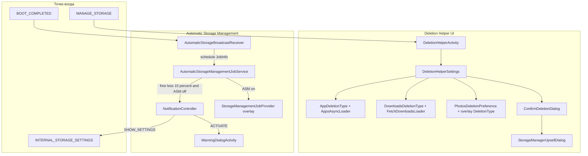

# com.android.storagemanager — справочник по разбору APK (Storage Manager)

Документ описывает APK **Storage Manager** (`com.android.storagemanager`) — системное приложение AOSP **Android 9 (API 28)** для освобождения места на накопителе: ручной **Deletion Helper** и фоновый **Automatic Storage Management (ASM)**.

**Важно:** это **не** Geely/Flyme/eCarX-специфика. Это штатный платформенный пакет `packages/apps/StorageManager`. В данной сборке (`versionName=9`) overlay-провайдеры Google Photos / фоновой очистки **заглушены** (`FeatureFactoryImpl` возвращает `null`) — автоматическое удаление фото/видео в Job **не выполняется**, остаётся скелет ASM + UI.

Сборка из Telegram: `…_com_android_storagemanager_v_9.apk`.

---

## 0. Обзор приложения

| Параметр | Значение |
|----------|----------|
| Пакет | `com.android.storagemanager` |
| Label | **Storage Manager** / RU: **Менеджер хранилища** |
| versionCode / versionName | `28` / `9` |
| minSdk / targetSdk | 24 / 28 |
| compileSdk / platform | 28 / Android 9 |
| sharedUserId | **нет** |
| Application | default `Application` |
| DEX | один `classes.dex` (~1.8 MB) |
| Размер APK | ~4.6 MB |
| Launcher | **нет** отдельного MAIN/LAUNCHER — вход через Settings / intent `MANAGE_STORAGE` |

**Назначение (весь функционал):**

1. **Deletion Helper (ручная очистка)** — экран «Free up space» / «Remove items»: выбор и удаление редко используемых приложений, файлов в Downloads, (опционально) backed-up photos/videos.
2. **Automatic Storage Management** — периодический JobScheduler-job при зарядке + idle: если свободно &lt; 15% private storage и ASM выключен → показать notification «включи менеджер»; если ASM включён → делегировать очистку overlay-провайдеру (в этой APK — `null`).
3. **Opt-in / upsell** — уведомления и диалоги «включить автоматическое управление хранилищем».
4. **Интеграция с Settings** — обработка `android.os.storage.action.MANAGE_STORAGE` (в т.ч. когда другое приложение запросило место через `StorageManager.allocateBytes`).

**Стек:**

| Слой | API / компонент |
|------|-----------------|
| Storage | `StorageManager`, `PrivateStorageInfo`, `StorageStats` / `StorageStatsSource` |
| Usage | `UsageStatsManager` (`PACKAGE_USAGE_STATS`) |
| Packages | `PackageManager.deletePackageAsUser` (`DELETE_PACKAGES`) |
| Files | `Environment.DIRECTORY_DOWNLOADS`, `File.delete` |
| Jobs | `JobScheduler` + `JobService` (`BIND_JOB_SERVICE`) |
| Settings | `Settings.Secure` keys `automatic_storage_manager_*` |
| Overlay | `FeatureFactory` → Photos / Job provider (OEM/GMS) |

---

## 1. Источник и артефакты

| Параметр | Значение |
|----------|----------|
| Исходный APK | Telegram Desktop `…_com_android_storagemanager_v_9.apk` |
| Локальная копия | `.tmp/storagemanager/storagemanager.apk` |
| Распакованный APK | `.tmp/storagemanager/apk/` |
| aapt badging / manifest | `.tmp/storagemanager/badging.txt`, `manifest.txt` |
| JADX | `.tmp/storagemanager/jadx/app/src/main/java/com/android/storagemanager/` |
| Список классов | `.tmp/storagemanager/classes.txt` |

### Распаковать

```powershell
$apk = "path\to\…_com_android_storagemanager_v_9.apk"
$base = ".tmp\storagemanager"
New-Item -ItemType Directory -Force -Path $base\apk | Out-Null
Copy-Item -LiteralPath $apk -Destination "$base\storagemanager.apk"
Copy-Item "$base\storagemanager.apk" "$base\storagemanager.zip"
Expand-Archive -Path "$base\storagemanager.zip" -DestinationPath "$base\apk" -Force

$aapt = (Get-ChildItem "$env:LOCALAPPDATA\Android\Sdk\build-tools" -Recurse -Filter "aapt.exe" | Select-Object -First 1).FullName
& $aapt dump badging $apk
& $aapt dump xmltree $apk AndroidManifest.xml
```

---

## 2. Архитектура



### Пакеты в dex (свои)

| Пакет | Роль |
|-------|------|
| `…deletionhelper.*` | UI и логика ручной очистки |
| `…automatic.*` | Job, boot, notifications, warning dialog |
| `…overlay.*` | Hooks для OEM/GMS (в APK — stub) |
| `…utils.*` | AsyncLoader, иконки, loading UX |
| `com.android.settingslib.*` | StorageStats, PrivateStorageInfo, HelpUtils (вшиты) |

---

## 3. Манифест: компоненты

### 3.1 Permissions

| Permission | Зачем |
|------------|--------|
| `PACKAGE_USAGE_STATS` | Когда приложение последний раз использовалось |
| `GET_PACKAGE_SIZE` | Размер приложений (`StorageStats`) |
| `DELETE_PACKAGES` | Удаление выбранных APK (`deletePackageAsUser`) |
| `READ/WRITE_EXTERNAL_STORAGE` | Сканирование и удаление Downloads |
| `MANAGE_USERS` / `INTERACT_ACROSS_USERS` | Multi-user (платформенный паттерн) |
| `WRITE_SECURE_SETTINGS` | Вкл/выкл ASM в `Settings.Secure` |
| `RECEIVE_BOOT_COMPLETED` | Планирование Job после boot |
| `USE_RESERVED_DISK` | Резерв диска платформы |

### 3.2 Activities

| Класс | Назначение |
|-------|------------|
| `.deletionhelper.DeletionHelperActivity` | Главный UI очистки. Intent-filter: `android.os.storage.action.MANAGE_STORAGE` + `DEFAULT`. `launchMode=singleTask`. |
| `.automatic.WarningDialogActivity` | Диалог после активации ASM (если `ro.storage_manager.enabled=false`). Без history, excludeFromRecents. |

### 3.3 Services

| Класс | Назначение |
|-------|------------|
| `.automatic.AutomaticStorageManagementJobService` | `JobService`, permission `BIND_JOB_SERVICE`, не exported. Периодическая проверка storage / запуск ASM / показ notification. |

### 3.4 Receivers

| Класс | Actions |
|-------|---------|
| `.automatic.AutomaticStorageBroadcastReceiver` | `BOOT_COMPLETED` → schedule Job |
| `.automatic.NotificationController` | `ACTIVATE`, `NO_THANKS`, `DISMISS`, `SHOW_NOTIFICATION` / `show_notification`, `DEBUG_SHOW_NOTIFICATION`, `SHOW_SETTINGS` |

---

## 4. Функционал подробно

### 4.1 Deletion Helper — ручная очистка места

**Экран:** PreferenceFragment со списком категорий + кнопки Cancel / «Free up X».

**Категории UI** (`res/xml/deletion_helper_list.xml`):

| Key | Preference | Что делает |
|-----|------------|------------|
| `deletion_gauge` | `GaugePreference` | Если intent содержит `android.os.storage.extra.REQUESTED_BYTES` — показать «App X needs Y» |
| `delete_photos` | `PhotosDeletionPreference` | Backed up photos & videos (только если есть overlay provider) |
| `delete_downloads` | `DownloadsDeletionPreferenceGroup` | Файлы в `DIRECTORY_DOWNLOADS` |
| `apps_group` | `AppDeletionPreferenceGroup` | Редко используемые приложения |

**Режимы порога (thresholdType):**

| Type | Меню | Поведение |
|------|-------|-----------|
| `0` (default) | «Hide recent items» | Apps: не использовались ≥ **90 дней** (`debug.asm.app_unused_limit`, default 90). Downloads: age filter через `debug.asm.file_age_limit` (default 0 = все). |
| `1` | «Show all items» / empty-state link | Apps: все не-system / не-persistent (без порога по usage). Downloads/apps groups могут скрываться в empty-state. |

Переключатель режимов: options menu, gated by `Settings.Global.enable_deletion_helper_no_threshold_toggle` (default 1).

#### 4.1.1 Apps — редко используемые приложения

**Класс:** `AppsAsyncLoader` + `AppDeletionType` + `PackageDeletionTask`.

Алгоритм:

1. `UsageStatsManager.queryAndAggregateUsageStats` за ~364 дня + alternate `queryUsageStats`.
2. Для каждого installed app (по UID): `StorageStatsSource.getStatsForUid` → размер.
3. Фильтры исключения:
   - system/bundled (`FLAG_SYSTEM`);
   - persistent process (`FLAG_PERSISTENT`);
   - default HOME / launcher;
   - нет валидных daysSinceInstall / daysSinceLastUse.
4. Сортировка по размеру ↓.
5. Удаление: `PackageManager.deletePackageAsUser` через `IPackageDeleteObserver` для всех **checked** пакетов.

**Важно для ГУ:** удаляет **пакет целиком** (uninstall), не clear cache/data.

#### 4.1.2 Downloads

**Класс:** `FetchDownloadsLoader` + `DownloadsDeletionType`.

1. Рекурсивно обходит `Environment.getExternalStoragePublicDirectory(DIRECTORY_DOWNLOADS)`.
2. Берёт файлы с `lastModified <= now - debug.asm.file_age_limit * 1 day` (default age=0 → все файлы).
3. Для изображений — thumbnail через `ThumbnailUtils`.
4. Удаление: `File.delete()` на фоне (`AsyncTask`) для checked файлов (по умолчанию все checked).

Требует runtime `READ_EXTERNAL_STORAGE`.

#### 4.1.3 Photos & videos (backed up)

**Интерфейс:** `DeletionHelperFeatureProvider.createPhotoVideoDeletionType`.

В **этой** APK `FeatureFactoryImpl.getDeletionHelperFeatureProvider() == null` → preference **удаляется с экрана**. На Pixel/GMS обычно подключается Google Photos overlay, который удаляет локальные копии уже синхронизированных медиа.

Строки UI всё равно есть: «Backed up photos & videos», «Over 30 days old».

#### 4.1.4 Confirm + Upsell

1. **ConfirmDeletionDialog** — подтверждение «%1$s of content will be removed»; затем `clearData()` по всем категориям.
2. **StorageManagerUpsellDialog** — после успешного free: предложить включить ASM (`Settings.Secure.automatic_storage_manager_enabled = 1`). Антиспам: SharedPreferences `StorageManagerUpsellDialog` (no_thanks / dismiss delays 14–90 дней).

#### 4.1.5 Empty state

Если все категории пусты → interstitial «нет что удалять» + кликабельная ссылка «Show all items» (thresholdType=1).

---

### 4.2 Automatic Storage Management (фоновый job)

#### 4.2.1 Планирование

`AutomaticStorageBroadcastReceiver` на `BOOT_COMPLETED`:

```text
JobInfo:
  id = 0
  component = AutomaticStorageManagementJobService
  requiresCharging = true
  requiresDeviceIdle = true
  periodic = debug.asm.period (default 86400000 ms = 24h)
```

Доп. проверка в job: `JobPreconditions.isCharging()` (BatteryManager).

#### 4.2.2 Логика `onStartJob`

| Шаг | Условие | Действие |
|-----|---------|----------|
| 1 | Не charging | `jobFinished(reschedule=true)` |
| 2 | Policy disable threshold | Выключить ASM (`enabled=0`, `turned_off_by_policy=1`) |
| 3 | `freeBytes >= 15% * totalBytes` | Skip, записать `automatic_storage_manager_last_run` |
| 4 | ASM **выключен** | Broadcast → `NotificationController` show notification |
| 5 | ASM **включён** | `StorageManagementJobProvider.onStartJob(..., daysToRetain)` |

**Порог «мало места»:** `freeBytes < totalBytes * 15 / 100`.

**Days to retain:** `Settings.Secure.automatic_storage_manager_days_to_retain` (массив ресурсов 30/60/90 дней).

В **этой** сборке шаг 5 **no-op**: `getStorageManagementJobProvider() == null`.

#### 4.2.3 Settings.Secure keys

| Key | Смысл |
|-----|--------|
| `automatic_storage_manager_enabled` | 0/1 — ASM on/off |
| `automatic_storage_manager_days_to_retain` | Сколько дней хранить media перед автоочисткой |
| `automatic_storage_manager_last_run` | Timestamp последнего прогона |
| `automatic_storage_manager_turned_off_by_policy` | Выключен политикой / deadline |

Связанные свойства:

| Property | Default | Смысл |
|----------|---------|--------|
| `ro.storage_manager.enabled` | false | Если true — ASM «официально» включён на билде; меняет тексты warning |
| `debug.asm.period` | 86400000 | Период Job |
| `debug.asm.app_unused_limit` | 90 | Порог «неиспользуемое приложение» (дни) |
| `debug.asm.file_age_limit` | 0 | Мин. возраст файла Downloads (дни) |
| `STORAGE_MANAGER_SHOW_OPT_IN_PROPERTY` | (строка в dex) | Opt-in поведение |

---

### 4.3 Notifications (opt-in ASM)

`NotificationController` — BroadcastReceiver + Notification channel `"storage"`.

| Action | Поведение |
|--------|-----------|
| `…show_notification` / `SHOW_NOTIFICATION` | Показать, если не превышены лимиты показа |
| `DEBUG_SHOW_NOTIFICATION` | Показать всегда |
| `ACTIVATE` | `automatic_storage_manager_enabled=1`; если `!ro.storage_manager.enabled` → WarningDialog |
| `NO_THANKS` | Отложить показ на **90 дней** |
| `DISMISS` | Отложить на **14 дней**, +dismiss counter |
| `SHOW_SETTINGS` | Открыть `android.settings.INTERNAL_STORAGE_SETTINGS` |

Лимиты SharedPreferences `NotificationController`:

- max shown: **4**
- max dismissed: **9**
- ключи: `notification_shown_count`, `notification_dismiss_count`, `notification_next_show_time`

Кнопки notification: **No thanks** / **Turn on** (+ tap → Settings).

---

### 4.4 Warning dialog

`WarningDialogActivity` + `WarningDialogFragment` — AlertDialog с сообщением activation warning после включения ASM на билдах без `ro.storage_manager.enabled`. Только OK → finish.

---

## 5. Карта классов (полный функциональный набор)

### deletionhelper

| Класс | Роль |
|-------|------|
| `DeletionHelperActivity` | Host Activity, button bar, empty state, menu threshold |
| `DeletionHelperSettings` | PreferenceFragment, координация категорий, Free button |
| `DeletionType` | Интерфейс категории очистки |
| `AppDeletionType` | Apps backend + LoaderCallbacks |
| `AppsAsyncLoader` | Сканирование apps + usage + sizes |
| `AppDeletionPreference` / `AppDeletionPreferenceGroup` | UI чекбоксов apps |
| `DownloadsDeletionType` | Downloads backend |
| `FetchDownloadsLoader` | Рекурсивный сбор файлов |
| `DownloadsDeletionPreferenceGroup` / `DownloadsFilePreference` | UI Downloads |
| `PhotosDeletionPreference` | UI photos (делегирует overlay) |
| `PackageDeletionTask` | Uninstall пакетов |
| `ConfirmDeletionDialog` | Подтверждение удаления |
| `StorageManagerUpsellDialog` | Upsell ASM после очистки |
| `GaugePreference` | Индикатор «приложение запросило X байт» |
| `CollapsibleCheckboxPreferenceGroup` | Сворачиваемая группа с master-checkbox |
| `NestedDeletionPreference` / `DeletionPreference` | Базовые preference items |
| `LoadingSpinnerController` | Spinner пока грузятся категории |

### automatic

| Класс | Роль |
|-------|------|
| `AutomaticStorageBroadcastReceiver` | Boot → schedule job |
| `AutomaticStorageManagementJobService` | Периодическая логика ASM |
| `JobPreconditions` | isCharging |
| `NotificationController` | Opt-in notification FSM |
| `WarningDialogActivity` / `WarningDialogFragment` | Пост-активация warning |

### overlay

| Класс | Роль |
|-------|------|
| `FeatureFactory` / `FeatureFactoryImpl` | Factory; **Impl = stub (null providers)** |
| `DeletionHelperFeatureProvider` | Photos/video deletion plugin |
| `StorageManagementJobProvider` | Фоновая автоочистка plugin |

### utils

| Класс | Роль |
|-------|------|
| `AsyncLoader` | Base Loader |
| `IconProvider` | MIME/иконки файлов |
| `PreferenceListCache` | Recycle preference items |
| `Utils` | Fade loading container |
| `ButtonBarProvider` | Интерфейс Cancel/Free кнопок |

---

## 6. Intent / интеграция с системой

| Intent / extra | Кто шлёт | Эффект |
|----------------|----------|--------|
| `android.os.storage.action.MANAGE_STORAGE` | Settings, apps via StorageManager | Открыть Deletion Helper |
| `android.os.storage.extra.REQUESTED_BYTES` | Caller, запросивший место | Gauge «App needs X» |
| `android.settings.INTERNAL_STORAGE_SETTINGS` | Notification tap | Экран Storage в Settings |
| `com.android.storagemanager.automatic.*` | Job / PendingIntents | Управление notification / ASM |

Типичный вызов из другого приложения (AOSP):

```java
StorageManager sm = context.getSystemService(StorageManager.class);
// при нехватке места система/приложение открывает:
Intent i = new Intent(StorageManager.ACTION_MANAGE_STORAGE);
i.putExtra(StorageManager.EXTRA_REQUESTED_BYTES, neededBytes);
context.startActivity(i);
```

---

## 7. Что реально работает в этой APK (v9)

| Функция | Статус в данном APK |
|---------|---------------------|
| UI Deletion Helper | ✅ |
| Список + uninstall unused apps | ✅ (нужны privileges DELETE_PACKAGES + USAGE_STATS) |
| Скан/удаление Downloads | ✅ (нужен READ/WRITE storage) |
| Photos & videos cleanup | ❌ stub overlay |
| Фоновая автоочистка Job (удаление media) | ❌ stub overlay |
| Показ notification при low storage | ✅ |
| Включение флага ASM в Secure settings | ✅ |
| Реальная автоочистка после включения ASM | ❌ без GMS/OEM overlay |

---

## 8. Переиспользование в geely_ex2_tools

Имеет смысл **не** тащить весь AOSP PreferenceFragment UI, а взять паттерны:

### 8.1 Полезные паттерны

1. **Сканер «мёртвых» приложений** — `UsageStatsManager` + `StorageStatsManager` + фильтр N дней без usage + exclude system/launcher.
2. **Очистка Downloads / кэшей** — рекурсивный walk каталогов + age threshold + confirm dialog.
3. **Low-storage watchdog** — периодический Job/WorkManager: если `free/total < threshold` → notification / экран очистки.
4. **Settings.Secure-подобные флаги** — у нас уже есть `AppKv` / DataStore; аналог `*_enabled`, `*_last_run`, `*_days_to_retain`.
5. **Upsell / rate-limit notifications** — SharedPreferences counters + delay 14/90 дней (антиспам).

### 8.2 Что адаптировать под ГУ Geely EX2

| AOSP | На ГУ / нашем app |
|------|-------------------|
| `deletePackageAsUser` | Только system-signed / privileged; иначе — clear cache / открыть Settings |
| Photos overlay (Google) | Не применимо; вместо этого: media на USB, map cache, logs, APK в Download |
| Job requires charging+idle | На always-on HU: idle почти всегда; charging — по питанию от бортсети (BatteryManager может врать) |
| `MANAGE_STORAGE` | Можно зарегистрировать свой activity с тем же action **только** если заменяем system StorageManager; иначе свой deep-link |
| 15% threshold | На маленьком userdata ГУ лучше абсолютный порог (например free &lt; 500 MB) |

### 8.3 Минимальный feature-скелет для нашего проекта

```text
feature/storage/
  ui/StorageCleanupScreen.kt          # Compose: apps / downloads / caches
  StorageCleanupViewModel.kt
data/storage/
  StorageStatsRepository.kt           # free/total, per-app sizes
  UnusedAppsScanner.kt                # UsageStats + age filter
  DownloadsCleaner.kt                 # walk + delete
  StorageWatchdog.kt                  # periodic low-storage check
  StorageSettings.kt                  # enabled, threshold, lastRun (AppKv)
```

Права (манифест, system flavor): `PACKAGE_USAGE_STATS`, `DELETE_PACKAGES` или `CLEAR_APP_CACHE`, `MANAGE_EXTERNAL_STORAGE` / legacy storage, при system UID — `WRITE_SECURE_SETTINGS` не обязателен.

### 8.4 Не переиспользовать as-is

- Support Library Preference UI + settingslib blobs из dex.
- Google Photos overlay.
- Предположение «телефон» в строках notification («phone is running out of space») — для HU нужны свои strings.

---

## 9. Метрики (MetricsLogger actions)

Из кода Confirm / Free / Cancel:

| Action id | Когда |
|-----------|--------|
| 467 | Нажали Free (открыли confirm) |
| 468 | Cancel |
| 469 | Confirm delete OK |
| 470 | Confirm cancel |
| 471 | Ошибка uninstall packages |
| 472 | Ошибка delete downloads files |

---

## 10. Краткий чеклист «весь функционал»

- [x] Экран ручной очистки (Deletion Helper) по `MANAGE_STORAGE`
- [x] Gauge «приложение запросило N байт»
- [x] Категория infrequently used apps (90 дней / show all)
- [x] Uninstall выбранных apps
- [x] Категория Downloads + удаление файлов
- [x] Категория backed-up photos (UI only; backend stub)
- [x] Confirm dialog + опциональный upsell ASM
- [x] Empty state + toggle no-threshold
- [x] Boot → schedule periodic Job (charging + idle)
- [x] Job: порог free &lt; 15%
- [x] Job: notification opt-in если ASM off
- [x] Job: делегирование overlay если ASM on (stub)
- [x] Notification actions: Activate / No thanks / Dismiss / Open Settings
- [x] Warning dialog после Activate
- [x] Secure settings flags для ASM
- [x] Debug system properties для порогов/периода
- [x] FeatureFactory overlay hooks (заглушки)

---

## 11. Связанные документы

| Документ | Связь |
|----------|--------|
| [android-shell-apk.md](./android-shell-apk.md) | Другой AOSP system app (shell / bugreport) |
| [managedprovisioning-apk.md](./managedprovisioning-apk.md) | AOSP provisioning |
| [system-install.md](./system-install.md) | Установка privileged apps на ГУ |
