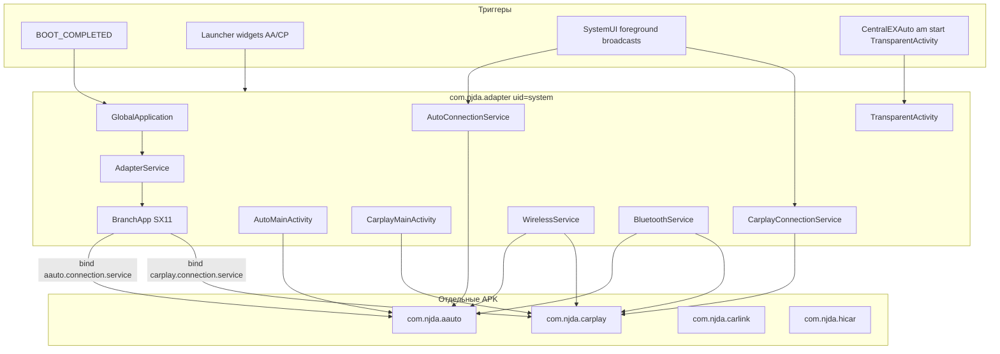

# com.njda.adapter — справочник по разбору APK (ConnAdaptor / ca_fix)

Документ описывает APK **`ca_fix.apk`** — патченную сборку системного адаптера **ConnAdaptor** (`com.njda.adapter`) для головных устройств Geely/Flyme (SX11 / IHU629G и аналоги).

**Важно:** это **не** отдельное пользовательское приложение. Это **drop-in replacement** штатного `/system/app/ConnAdaptor/ConnAdaptor.apk`: тот же package, `android.uid.system`, роль — мост между стеками phone projection (Android Auto / CarPlay / CarLink / HiCar) и ПО ГУ.

В логах тег **`DADAO_ADAPTOR`**, свойство `sys.dadao.adapter` = versionName.

Сборка из Telegram: **`ca_fix.apk`**, version **`1.4.8.260128023317`** (`versionCode=20260128`). Тот же артефакт раздаётся через CentralEXAuto: [`connadaptor.json`](https://raw.githubusercontent.com/swimapps/CentralEXAuto/main/connadaptor.json).

---

## 0. Обзор приложения

| Параметр | Значение |
|----------|----------|
| Пакет | `com.njda.adapter` |
| Label | *(пустой в badging)* — системный адаптер |
| versionCode / versionName | `20260128` / `1.4.8.260128023317` |
| minSdk / targetSdk | 28 / 28 (compileSdk 34) |
| sharedUserId | `android.uid.system` |
| Application | `com.njda.adapter.core.GlobalApplication` |
| Подпись | AOSP platform testkey (`android@android.com`) |
| Системный путь (stock) | `/system/app/ConnAdaptor/ConnAdaptor.apk` |
| Имя патча CentralEXAuto | `ca_fix.apk` |
| MD5 (GitHub manifest) | `d49ab03b18a5c5e21928c59c465394d7` |

**Назначение:**

- поднять и удерживать сервисы проекции телефона на ГУ;
- отдать AIDL API лаунчеру / SystemUI / другим HU-приложениям;
- показать fullscreen-поверхности AA/CarPlay (`AutoMainActivity` / `CarplayMainActivity`);
- управлять BT RFCOMM / Wi‑Fi hotspot для wireless AA/CP;
- показывать диалоги подключения через `TransparentActivity`.

**Стек:** `com.njda.adapter` (этот APK) **клиент** к отдельным пакетам:

| Пакет | Роль |
|-------|------|
| `com.njda.aauto` | Нативный стек Android Auto |
| `com.njda.carplay` | Нативный стек CarPlay |
| `com.njda.carlink` | CarLink |
| `com.njda.hicar` | Huawei HiCar |

Без этих APK ConnAdaptor не поднимет сессии проекции.

---

## 1. Источник и артефакты

| Параметр | Значение |
|----------|----------|
| Исходный APK | `ca_fix.apk` (Telegram / Downloads) |
| Локальная копия | `.tmp/ca_fix.apk` |
| Распакованный APK | `.tmp/ca-fix/apk/` |
| aapt badging / manifest | `.tmp/ca-fix/badging.txt`, `manifest.txt` |
| JADX | `.tmp/ca-fix-jadx/` |
| CentralEXAuto manifest | `https://raw.githubusercontent.com/swimapps/CentralEXAuto/main/connadaptor.json` |

### Распаковать

```powershell
$apk = "path\to\ca_fix.apk"
Copy-Item -LiteralPath $apk -Destination ".tmp\ca_fix.zip"
Expand-Archive -Path .tmp\ca_fix.zip -DestinationPath .tmp\ca-fix\apk -Force

$aapt = (Get-ChildItem "$env:LOCALAPPDATA\Android\Sdk\build-tools" -Recurse -Filter "aapt.exe" | Select-Object -First 1).FullName
& $aapt dump badging $apk
& $aapt dump xmltree $apk AndroidManifest.xml
```

---

## 2. Архитектура



| Слой | Роль |
|------|------|
| **ConnAdaptor** | Интеграция, AIDL, UI surfaces, BT/Wi‑Fi, диалоги |
| **aauto / carplay / …** | Протоколы проекции |
| **Flyme launcher / SystemUI** | Виджеты, foreground, пользовательский вход |

---

## 3. Компоненты манифеста

### Activities

| Класс | Назначение |
|-------|------------|
| `view.CarplayMainActivity` | Fullscreen Surface CarPlay + touch |
| `view.AutoMainActivity` | Fullscreen Surface Android Auto + touch |
| `view.AutoFrxActivity` | Auxiliary/FRX display (`com.intent.action.frx`) |
| `view.TransparentActivity` | 1×1 «невидимая» Activity для Flyme-диалогов подключения; wake-триггер CentralEXAuto |
| `view.PermissionActivity` | Runtime permissions (location/mic) |

### Основные Services

| Service | Intent action | Назначение |
|---------|---------------|------------|
| `core.AdapterService` | `com.njda.adapter.service` | Ядро: `BranchApp.init()` |
| `…AutoConnectionService` | `androidauto.connection.service` | AA session API |
| `…AutoDeviceService` | `androidauto.device.service` | Список AA-устройств |
| `…CarplayConnectionService` | `carplay.connection.service` | CP session API |
| `…CarplayDeviceService` | `carplay.device.service` | Список CP-устройств |
| `…WirelessService` | `common.wireless.service` | Wi‑Fi AP / STA |
| `…BluetoothService` | `common.bluetooth.service` | BT RFCOMM / pairing |
| `…ResourceService` | `common.resource.service` | Foreground, audio, navi state |
| `…AudioStreamService` | `common.audio.service` | Аудиопотоки |
| `…InputService` | `adapter.input.service` | Медиа-кнопки / steering |
| `…PowerStateService` | `common.power.service` | Display on/off |
| `…SensorService` | `common.sensors.service` | Night mode / UI |
| `…Carlink*` / `…HiCar*` | `carlink.*` / `hicar.*` | CarLink / HiCar |
| `…AdapterMediaBrowserService` | `MediaBrowserService` | Media browser |
| `…SX11RecoveryMediaService` | `com.njda.adapter.music.recovery` | Восстановление медиа после CP |

### Receivers

| Класс | Actions |
|-------|---------|
| `core.BootReceiver` | `BOOT_COMPLETED` (priority 1000) → `GlobalApplication.startCoreService` |
| `view.AutoWidget` | AppWidget + `com.njda.aauto.widget.broadcast` / click |
| `view.CarplayWidget` | AppWidget + `com.njda.carplay.widget.broadcast` / click |

---

## 4. Boot / call flow

```text
BOOT_COMPLETED
  └─ BootReceiver.onReceive
       └─ GlobalApplication.startCoreService
            └─ startService(action=com.njda.adapter.service)
                 └─ AdapterService.onCreate
                      └─ BranchApp.init(context)
                           ├─ check persist.cpaa.enable
                           ├─ AAutoAdapter.init → bind com.njda.aauto
                           ├─ CarplayAdapter.init → bind com.njda.carplay
                           └─ SX11 managers (BT, wireless, media, resource…)

GlobalApplication.onCreate (дублирует старт):
  LogPrint TAG = DADAO_ADAPTOR
  setprop sys.dadao.adapter = versionName
  startCoreService
```

Код `BootReceiver`:

```java
public void onReceive(Context context, Intent intent) {
    GlobalApplication.startCoreService(context);
}
```

Код старта ядра:

```java
public static void startCoreService(Context context) {
    if (isServiceRunning) return;
    Intent intent = new Intent("com.njda.adapter.service");
    intent.setPackage(context.getPackageName());
    context.startService(intent);
}
```

Свойства, влияющие на поведение (из BranchConfig / кода):

| Property | Смысл |
|----------|-------|
| `persist.cpaa.enable` | Разрешены CarPlay + Android Auto |
| `persist.cpaa.enAuthentication` | Режим сертификата |
| `persist.aauto.vehicle.id` | Vehicle id для AA |
| `sys.dadao.adapter` | versionName адаптера (пишет Application) |
| `ro.product.brand` / name | Ветки конфига (напр. BELGEE отключает AA) |

---

## 5. Android Auto / CarPlay (высокоуровнево)

### Android Auto

1. `AAutoAdapter` биндится к `com.njda.aauto` (`aauto.connection.service`).
2. При запросе display → `SX11ResourceManager` → **`AutoMainActivity`** (Surface + touch → `AutoSessionProxy`).
3. Wireless: hotspot через `WirelessService` / `WirelessDefaultManager`.
4. Первое подключение: диалог через **`TransparentActivity`**.

### CarPlay

1. `CarplayAdapter` → `com.njda.carplay`.
2. Display → **`CarplayMainActivity`**.
3. BT OOB / RFCOMM + optional wireless AP.
4. Диалоги / loading — снова `TransparentActivity`.

### TransparentActivity

- Не экран проекции, а оболочка для Flyme AlertDialog / loading.
- CentralEXAuto делает: `am start com.njda.adapter/.view.TransparentActivity` — **wake/activate** процесса ConnAdaptor (часто без extras → быстрый exit), а не запуск карты AA.
- Виджет AA шлёт `com.bd.systemui.aa.foreground`; CP — `com.bd.systemui.cp.foreground`.

---

## 6. Как ставит CentralEXAuto

| Шаг | Действие |
|-----|----------|
| 1 | Скачать `ca_fix.apk` из `connadaptor.json` |
| 2 | Положить в `/data/local/tmp/fixes/` (или staging) |
| 3 | `setenforce 0` (часто) |
| 4 | `mount --bind …/ca_fix.apk /system/app/ConnAdaptor/ConnAdaptor.apk` |
| 5 | Перезапуск процесса / reboot — работает патченная сборка |

Это **не** `pm install` в `/data/app`. Package остаётся системным `com.njda.adapter`.

Связанный документ: [centralexauto-apk.md](./centralexauto-apk.md).

---

## 7. Каталог важных классов

| Класс | Роль |
|-------|------|
| `GlobalApplication` | Application, `sys.dadao.adapter`, старт ядра |
| `BootReceiver` | Boot → `startCoreService` |
| `AdapterService` | `BranchApp.init()`, crash → `System.exit` |
| `BranchApp` / `DefaultBranchApp` | Оркестрация SX11-менеджеров |
| `BranchConfig` | Feature flags по vehicle props |
| `AAutoAdapter` / `CarplayAdapter` | Init proxy + listeners |
| `AutoConnectionListener` / `CarplayConnectionListener` | Мост stack ↔ adapter |
| `SX11ResourceManager` | MainActivity, fullscreen, media |
| `SX11AdapterManager` | Диалоги → `TransparentActivity` |
| `SX11BluetoothManager` / `WirelessDefaultManager` | BT / Wi‑Fi AP |
| `SX11MediaManager` | eCarX MediaCenter |
| `AutoMainActivity` / `CarplayMainActivity` | Видеопроекция |
| `TransparentActivity` | Connect UX / wake |
| `AutoWidget` / `CarplayWidget` | Launcher widgets |
| `AutoConnectionProxy` / `CarplayConnectionProxy` | Клиенты к `com.njda.aauto` / `carplay` |

---

## 8. Permissions (зачем)

| Группа | Примеры | Зачем |
|--------|---------|-------|
| Car | `CAR_VENDOR_EXTENSION`, `CONTROL_CAR_CLIMATE`, cluster, audio volume | Интеграция с HU / cluster |
| BT privileged | `BLUETOOTH_*`, `BLUETOOTH_PRIVILEGED` | RFCOMM / OOB / HFP |
| Wi‑Fi / network | `OVERRIDE_WIFI_CONFIG`, `NETWORK_STACK`, country code | Hotspot для wireless AA/CP |
| Phone / mic / location | `RECORD_AUDIO`, `READ_PHONE_STATE`, location | Звонки, голос, AA требования |
| System | `INTERACT_ACROSS_USERS`, `SYSTEM_ALERT_WINDOW`, `STOP_APP_SWITCHES` | Multi-user HU, overlays |

Плюс `sharedUserId=android.uid.system`.

Опечатка в манифесте: `android.permissiOn.BLUETOOTH_ADVERTISE` (заглавная `O`) — permission, скорее всего, не применяется как задумано.

---

## 9. Установка и ограничения

1. Нужна **platform-подпись** (здесь AOSP testkey) и установка как **system app**.
2. Обычный `adb install` user-APK **не даст** полный функционал / может не встать из‑за `sharedUserId`.
3. Зависимости: `com.njda.aauto`, `com.njda.carplay` (± carlink/hicar) должны быть на системе.
4. Патч через CentralEXAuto — временный bind-mount до umount/reboot (пока mount жив).
5. Не путать с `geely_ex2_tools` — это другой продукт; инструменты EX2 Tools могут лишь *запускать* `TransparentActivity`, если ConnAdaptor уже на ГУ.

---

## 10. Связь со stock ConnAdaptor

| | Stock | ca_fix |
|--|-------|---------|
| Package | `com.njda.adapter` | тот же |
| Path | `/system/app/ConnAdaptor/ConnAdaptor.apk` | bind поверх |
| UID | system | system |
| Роль | OEM phone projection adapter | патченная сборка той же роли |

**Вывод:** `ca_fix.apk` — **патч бинарника ConnAdaptor**, а не новое приложение. Лаунчер, SystemUI и AIDL-клиенты продолжают работать с тем же package.
