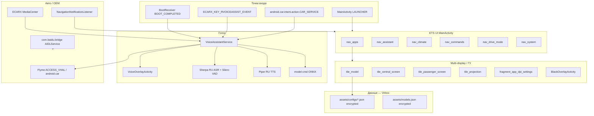

# com.baidu.che.codriver — справочник по разбору APK (CarAssistant-ETS)

Документ описывает APK **CarAssistant-ETS** (`com.baidu.che.codriver`) — системный toolkit / голосовой ассистент для ГУ Geely на Flyme Auto / ECARX (сборка **kx11a5**). Помимо on-device RU ASR/TTS это **панель настроек ETS**: выбор модели, multi-display (центральный / пассажирский / projection), per-app DPI, климат/сиденья, drive mode, системные переключатели.

**Важно:**

- Это **не** `geely_ex2_tools` (`com.geely.ex2.tools`) и **не** штатный Baidu Maps.
- Package — наследие **Baidu CoDriver**; UI-лейбл RU/zh-CN: **CarAssistant-ETS**.
- Код и vehicle-конфиги защищены **Virbox**: `classes.dex` — stub, `assets/configs/*.json` и `models.json` — encrypted blob. Статикой читаются манифест, имена ресурсов и plaintext assets (README моделей ASR/TTS), но **не** поля профиля `ex2`.

Сборка из Telegram: `CarAssistantETS_com_baidu_che_codriver_v_7_0_2026_0124_1137_kx11a5.apk`.

---

## 0. Обзор приложения

| Параметр | Значение |
|----------|----------|
| Пакет | `com.baidu.che.codriver` |
| Label | **Car Assistant** / RU·zh-CN: **CarAssistant-ETS** |
| versionCode / versionName | `74` / `7.0.2026_0124_1137-kx11a5` |
| minSdk / targetSdk / compileSdk | 28 / 33 / 33 (Android 13) |
| sharedUserId | `android.uid.system` |
| Application | `v4034ead1.l4034ead1` (Virbox stub) |
| Launcher | `com.baidu.che.codriver.MainActivity` |
| ABI | только `arm64-v8a` |
| Размер APK | ~262.9 MB |
| Подпись | platform (`META-INF/PLATFORM.*`) |
| uses-feature | `android.hardware.type.automotive` (required) |
| uses-library | `android.car` (optional) |

**Назначение (по манифесту + карте UI-ресурсов):**

1. **ETS multi-display** — central / passenger / projection, screen switch, per-app DPI, выбор приложений на экран, black overlay, autostart.
2. **Vehicle profile** — выбор модели (`ex2`, `monjaro`, …) из `assets/configs/<key>.json` (зашифрованы).
3. **On-device голос** — Sherpa-ONNX RU ASR, Silero VAD, Piper-style RU TTS (`ru_RU-dmitri-medium`), командная ONNX-модель.
4. **Управление авто** — климат/окна/двери/громкость через `android.car` + Flyme VHAL / Meizu FlymeAuto / ECARX MediaCenter.
5. **Navi HUD** — `NotificationListenerService` читает уведомления навигации.
6. **AIDL bridge** — `com.baidu.bridge.server.AIDLService` (`com.bridge.server.AIDLService`).

**Стек (видимый слой):**

| Слой | API / компонент |
|------|-----------------|
| Защита | Virbox (stub DEX, encrypted assets, `l4034ead1_*.so`, `kqkticwjgzy.dat` magic `SENS`) |
| ASR | Sherpa-ONNX + ONNX Runtime (`libsherpa-onnx-*.so`, `libonnxruntime*.so`) |
| TTS / VAD | Piper ONNX + espeak-ng data; `silero_vad.onnx` |
| UI | AndroidX / Material / Lottie; кастомные fragments + tiles (не PreferenceScreen) |
| Сеть | OkHttp, `INTERNET` |
| Платформа | `android.car`, Flyme Auto, ECARX |

---

## 1. Источник и артефакты

| Параметр | Значение |
|----------|----------|
| Исходный APK | Telegram Desktop `CarAssistantETS_com_baidu_che_codriver_v_7_0_2026_0124_1137_kx11a5.apk` |
| Локальная копия | `.tmp/carassistant-ets/CarAssistantETS.apk` |
| Распакованный APK | `.tmp/carassistant-ets/apk/` |
| aapt badging / manifest | `.tmp/carassistant-ets/badging.txt`, `manifest.txt` |
| Resource IDs (filtered dump) | `.tmp/carassistant-ets/resources-ids.txt` |
| Список configs | `.tmp/carassistant-ets/configs-list.txt` |
| Заголовок `ex2.json` | `.tmp/carassistant-ets/ex2-header.hex` |

Папка `.tmp/` в `.gitignore`.

### Распаковать

```powershell
$apk = "path\to\CarAssistantETS_com_baidu_che_codriver_v_7_0_2026_0124_1137_kx11a5.apk"
$base = ".tmp\carassistant-ets"
New-Item -ItemType Directory -Force -Path $base\apk | Out-Null
Copy-Item -LiteralPath $apk -Destination "$base\CarAssistantETS.apk"
Copy-Item "$base\CarAssistantETS.apk" "$base\CarAssistantETS.zip"
Expand-Archive -Path "$base\CarAssistantETS.zip" -DestinationPath "$base\apk" -Force

$aapt = (Get-ChildItem "$env:LOCALAPPDATA\Android\Sdk\build-tools" -Directory |
  Sort-Object Name -Descending | Select-Object -First 1 |
  ForEach-Object { Join-Path $_.FullName "aapt.exe" })
& $aapt dump badging $apk | Set-Content "$base\badging.txt"
& $aapt dump xmltree $apk AndroidManifest.xml | Set-Content "$base\manifest.txt"
```

**JADX** на stub DEX почти бесполезен: классы приложения спрятаны Virbox. Имеет смысл смотреть ресурсы/манифест/`assets`, а не декомпилят.

---

## 2. Архитектура



### Ограничение статического разбора

| Слой | Статус |
|------|--------|
| AndroidManifest / badging | читается |
| Resource **names** (`tile_*`, `nav_*`, `fragment_*`) | читаются |
| Resource **string values** настроек (RU/EN лейблы экранов) | почти нет в arsc — текст в DEX |
| `assets/configs/*.json`, `models.json`, `model-cmd/vocab.txt` | Virbox encrypted (`4B 11 02…`) |
| Логика выбора модели / DPI / SharedPreferences | в защищённом payload |

Заголовок всех непустых configs (в т.ч. `ex2.json`):

```text
4b 11 02 d4 c0 ee d5 cb f4 19 04 0b 23 43 7c 61 d2 e6 e8 ef 82 …
```

---

## 3. UI: разделы и настройки «переключения на ГУ»

Нижняя навигация (`activity_main` → `navigation_panel`):

| nav id | RID | Раздел |
|--------|-----|--------|
| `nav_apps` | `0x7f080169` | Приложения / экраны / DPI / модель |
| `nav_assistant` | `0x7f08016a` | Голосовой ассистент |
| `nav_climate` | `0x7f08016b` | Климат / сиденья / руль |
| `nav_commands` | `0x7f08016c` | Голосовые команды |
| `nav_drive_mode` | `0x7f08016d` | Режим езды / сценарии |
| `nav_system` | `0x7f08016e` | Система (Wi‑Fi, время, ADAS, статус) |

### 3.1 `nav_apps` — ядро multi-display

| UI / layout | Смысл |
|-------------|-------|
| `tile_model` | Выбор vehicle profile → `assets/configs/<key>.json` |
| `tile_central_screen` + `fragment_central_screen_settings` | Центральный экран (основное ГУ) |
| `tile_passenger_screen` + `fragment_passenger_screen_settings` | Пассажирский дисплей |
| `tile_projection` + `fragment_projection_settings` | Проекция (`projection_surface_view`, presentation layouts) |
| `screen_switch` / `screens_container` | Переключатели дисплеев |
| `fragment_app_dpi_settings` (`dpi_slider`, `apps_dpi_list`) | Per-app DPI |
| `fragment_app_selection` | Какие приложения на какой экран |
| `tile_black_screen` / `BlackOverlayActivity` | Чёрный overlay |
| `tile_autostart` / `fragment_autostart_settings` | Автозапуск |

Preference XML / `res/xml/*preference*` / `menu/` **нет** — настройки на кастомных fragments + home tiles.

### 3.2 Home tiles (`id/tile_*`)

| id | RID |
|----|-----|
| `tile_autostart` | `0x7f08023f` |
| `tile_black_screen` | `0x7f080240` |
| `tile_central_screen` | `0x7f080241` |
| `tile_drive_mode` | `0x7f080242` |
| `tile_model` | `0x7f080246` |
| `tile_passenger_screen` | `0x7f080247` |
| `tile_projection` | `0x7f08024b` |
| `tile_seat_heat` / `_vent` / `_massage` | `0x7f08024c`–`24e` |
| `tile_status` | `0x7f08024f` |
| `tile_time` | `0x7f080250` |
| `tile_wheel_heat` | `0x7f080253` |
| `tile_wifi` | `0x7f080254` |

### 3.3 Прочие разделы (кратко)

| Раздел | Что видно по ресурсам |
|--------|------------------------|
| `nav_assistant` | `fragment_assistant`, `switch_show_voice_overlay`, grid ассистента |
| `nav_climate` | seat heat / vent / massage, wheel heat |
| `nav_commands` | `fragment_commands`, `item_command` |
| `nav_drive_mode` | scenarios: brake / drive_mode / recuperation / steering / suspension |
| `nav_system` | Wi‑Fi, time, status, ADAS (`switch_aeb`, `switch_lka`) |

Темы UI (radio): `arctic` / `emerald` / `gold` / `obsidian`.

---

## 4. Vehicle profiles (`assets/configs`)

| Файл | Размер | Статус |
|------|-------:|--------|
| `ex2.json` | 6275 | encrypted — целевой профиль EX2 |
| `monjaro.json` | 9707 | encrypted — самый большой |
| `preface.json` | 4784 | encrypted |
| `boyue.json` | 4329 | encrypted |
| `default_template.json` | 4326 | encrypted — базовый шаблон |
| `e5.json` | 4242 | encrypted |
| `starship.json` | 4137 | encrypted |
| `coolray.json` | 3678 | encrypted |
| `starshine_6.json` | 2333 | encrypted |
| `boyue_l_lite.json` | 0 | пустой |
| `boyue_l_max.json` | 0 | пустой |

Плюс `assets/models.json` (1113 B) — тот же класс шифрования.

Архитектура профиля (вывод по именам, не по содержимому): **`default_template` + per-model override** (`ex2`, …). Суффикс версии `kx11a5` — маркер платформы KX11/SX11.

---

## 5. Компоненты манифеста

| Тип | Имя | Exported | Назначение |
|-----|-----|----------|------------|
| Activity | `MainActivity` | true | LAUNCHER / ETS UI |
| Activity | `VoiceOverlayActivity` | false | singleInstance, noHistory, overlay голоса |
| Activity | `BlackOverlayActivity` | false | чёрный экран |
| Service | `VoiceAssistantService` | true | `BIND_VOICE_INTERACTION`; Flyme policy; `CAR_SERVICE`; ECARX voice key |
| Service | `com.baidu.bridge.server.AIDLService` | true | action `com.bridge.server.AIDLService` |
| Service | `navi.NavigationNotificationListener` | true | Navi HUD (`NotificationListenerService`) |
| Receiver | `BootReceiver` | true | `BOOT_COMPLETED`, `QUICKBOOT_POWERON` |
| Receiver | `media.MediaButtonReceiver` | true | `MEDIA_BUTTON` |
| Provider | `media.ArtworkProvider` | true | `com.baidu.che.codriver.artwork` |
| Provider | FileProvider / androidx-startup | false | стандарт |

### Intent actions у `VoiceAssistantService`

- `com.flyme.auto.settings.action.privacy_policy`
- `com.flyme.auto.settings.action.user_policy`
- `com.flyme.auto.settings.action.user_improve_policy`
- `android.car.intent.action.CAR_SERVICE`
- `com.baidu.che.codriver.VoiceAssistantService`
- `ecarx.intent.action.ECARX_KEY_RVOICEASSIST_EVENT` (priority 999)

---

## 6. Permissions (зачем)

| Группа | Permissions | Зачем |
|--------|-------------|-------|
| Голос | `RECORD_AUDIO`, `CAPTURE_AUDIO_HOTWORD`, `CAPTURE_AUDIO_OUTPUT`, `FOREGROUND_SERVICE_MICROPHONE`, `BIND_VOICE_INTERACTION`, `MODIFY_AUDIO_SETTINGS` | ASR / hotword / FGS |
| Авто | `CONTROL_CAR_*`, `CAR_PROPERTY_*`, `CAR_PRIVILEGED`, `CAR_SPEED`, … | VHAL / климат / окна / двери / громкость |
| Flyme / Meizu | `com.flyme.auto.permission.ACCESS_VHAL`, HVAC fan, USER; `com.meizu.flymeauto.permission.*` | OEM car API |
| ECARX | `ecarx.oem.permission.OPENAPI_MEDIACENTER_PERMISSION` | медиацентр |
| Система | `WRITE_SECURE_SETTINGS`, `INJECT_EVENTS`, `SYSTEM_ALERT_WINDOW`, `INTERACT_ACROSS_USERS(_FULL)`, boot | DPI/settings, overlay, multi-user HU |
| Медиа | `MEDIA_CONTENT_CONTROL`, `RECEIVE_MEDIA_BUTTONS` | кнопки / artwork |

`sharedUserId=android.uid.system` + platform signature — условие полного функционала на ГУ.

---

## 7. On-device ML assets (не vehicle-конфиг)

| Путь | Роль |
|------|------|
| `assets/sherpa-onnx-streaming-zipformer-small-ru-vosk-2025-08-16/` | Streaming RU ASR (~encoder десятки MB) |
| `assets/tts-ru/ru_RU-dmitri-medium.onnx` + espeak-ng-data | RU TTS (Piper-style) |
| `assets/silero_vad.onnx` | VAD |
| `assets/model-cmd/` | Командная / intent ONNX (~117 MB) + encrypted vocab |
| `lib/arm64-v8a/libonnxruntime*.so`, `libsherpa-onnx-*.so` | Рантайм |

Plaintext: `assets/sherpa-…/README.md`, `assets/tts-ru/MODEL_CARD`.  
Lottie в `res/*.json` — анимации UI, не профили машин.

---

## 8. Что переносить в `geely_ex2_tools`

| # | Что брать | Зачем | Полезность |
|---|-----------|-------|------------|
| 1 | Multi-display: central / passenger + `screen_switch` | Ядро «переключения на ГУ» | ★★★★★ |
| 2 | Per-app DPI (`apps_dpi_list` + slider) | Масштаб UI после смены дисплея | ★★★★★ |
| 3 | Model keys + схема `default_template` → override `ex2` | Ветвление фич; у себя — открытый JSON/DataStore | ★★★★☆ |
| 4 | Projection (`Presentation` / surface) | Второй / внешний дисплей | ★★★★☆ |
| 5 | Flyme VHAL + `android.car` + ECARX permissions / intents | Реальные car APIs на ГУ (часть уже есть через `com.flyme.auto.api`) | ★★★★☆ |
| 6 | Black / voice overlay pattern | UX поверх штатной оболочки | ★★★☆☆ |
| 7 | `ECARX_KEY_RVOICEASSIST_EVENT` | Железная кнопка ассистента | ★★★☆☆ |
| 8 | Drive-mode / climate tiles | Паритет с ETS; климат/drive лучше смотреть в [flyme-hvac](./flyme-hvac-apk.md), [flyme-settings](./flyme-settings-apk.md), [flyme-energy](./flyme-energy-apk.md) | ★★☆☆☆ |
| 9 | AIDL `com.bridge.server.AIDLService` | Только если нужен совместимый bridge с другими клиентами CoDriver | ★★☆☆☆ |

### Не переносить

- Содержимое `ex2.json` / остальных configs / `models.json` (Virbox).
- Stub DEX / shell `.so` / `kqkticwjgzy.dat`.
- Drop-in копирование encrypted assets без рантайма расшифровки.
- Полный стек ASR/TTS (~сотни MB) — отдельный продукт, не toolkit EX2 Tools.

### Практический вывод

Из этого APK полезна **информационная архитектура ETS-панели**, а не голосовой Baidu:

1. выбор модели (`ex2`);
2. настройки **центрального / пассажирского** экрана;
3. **per-app DPI**;
4. **projection**;
5. autostart / black overlay;
6. system-uid + Flyme/ECARX hooks.

---

## 9. Связь с другими справочниками

| Документ | Связь |
|----------|-------|
| [flyme-settings-apk.md](./flyme-settings-apk.md) | `com.flyme.auto.api` / VHAL для настроек авто |
| [flyme-hvac-apk.md](./flyme-hvac-apk.md) | Климат — отдельный штатный APK |
| [flyme-auto-service-apk.md](./flyme-auto-service-apk.md) | CoreService / restrictions; permissions `com.flyme.auto.*` |
| [android-car-apk.md](./android-car-apk.md) | Car service / Vehicle HAL |
| [centralexauto-apk.md](./centralexauto-apk.md) | Другой system toolkit (AA/CarPlay, floaters); похожий `sharedUserId` |
| [ca-fix-apk.md](./ca-fix-apk.md) | Phone projection adapter (не UI ETS) |

| | CarAssistant-ETS | geely_ex2_tools |
|--|------------------|-----------------|
| Пакет | `com.baidu.che.codriver` | `com.geely.ex2.tools` |
| UID | `android.uid.system` | зависит от установки (user / system) |
| Фокус | ETS multi-display + on-device voice + car control | Battery / speed / wifi / ambient / driving tools |
| Конфиги моделей | encrypted Virbox | свои открытые prefs / DataStore |
| Общий интерес | Карта экранов ГУ, DPI, Flyme/ECARX intents, model key `ex2` | Можно брать идеи UI/фич, не blob конфигов |

---

## 10. Заметки по установке / безопасности

1. Нужны **platform signature** и `sharedUserId=android.uid.system` — user-установка без подписи платформы не даст полного доступа.
2. Широкие privileges: `INJECT_EVENTS`, `WRITE_SECURE_SETTINGS`, hotword / capture audio output, across-users.
3. Virbox усложняет аудит: реальный код недоступен статикой.
4. Объём ~263 MB — в основном ML-модели; для «только экраны/DPI» переносить весь APK в tools бессмысленно.
5. При смене прошивки/платформы (не `kx11a5`) набор model keys и intents может отличаться — повторить badging + список `assets/configs`.

---

*Документ основан на разборе APK `com.baidu.che.codriver` v74 (`7.0.2026_0124_1137-kx11a5`). Поля профилей (`ex2.json` и др.) статически недоступны из‑за Virbox.*
