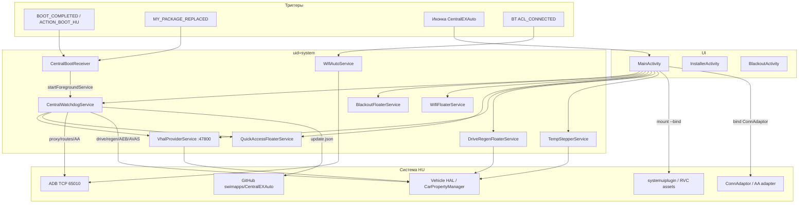

# com.ex.auto — справочник по разбору APK (CentralEXAuto)

Документ описывает стороннее приложение **CentralEXAuto** (`com.ex.auto`) — системный toolkit для головных устройств Geely/Flyme (в т.ч. EX2 / IHU): Android Auto / CarPlay, VHAL-оверлеи, Wi‑Fi, HVAC, патчи ConnAdaptor и remote-обновления.

**Важно:** это **не** штатное приложение Geely и **не** `geely_ex2_tools` (`com.geely.ex2.tools`). Исходники публикуются как [swimapps/CentralEXAuto](https://github.com/swimapps/CentralEXAuto). UI на португальском («Visão Geral», «Ferramentas», …).

Разбор выполнен по APK **`CentralEXAuto-geely-platform-signed.apk`**, version **2.10.8** (`versionCode=166`). На GitHub на момент разбора уже есть манифест обновления до **2.11.2** (`versionCode=170`).

---

## 0. Обзор приложения

| Параметр | Значение |
|----------|----------|
| Пакет | `com.ex.auto` |
| Label | **CentralEXAuto** |
| versionCode / versionName | `166` / `2.10.8` |
| minSdk / targetSdk | 28 / 29 (compileSdk 33) |
| sharedUserId | `android.uid.system` |
| Launcher Activity | `com.ex.auto.MainActivity` |
| Основной сервис | `com.ex.auto.CentralWatchdogService` (foreground) |
| Prefs | `tela_preta_prefs` (`AppConstants.PREFS_NAME`) |
| ADB TCP | `127.0.0.1:65010` (legacy `5555`) |
| Телеметрия TCP | `VhalProviderService` порт **47800** |
| File server | `PhoneFileServer` порт **8765** |
| Updates | `https://raw.githubusercontent.com/swimapps/CentralEXAuto/main/update.json` |

**Назначение:** расширить штатный HU без официальной поддержки нужных функций:

- автоматизация Android Auto / CarPlay (прокси, маршруты AP0, bind-патчи ConnAdaptor / CarplayMonitor);
- оверлеи (blackout экрана, drive/regen, HVAC stepper, Wi‑Fi, quick access);
- чтение/запись VHAL (AC, AEB, температуры, SOC, режимы езды/регена);
- установка сторонних APK и self-update с GitHub;
- телеметрия по TCP и отчёты об устройстве.

**Стек (по dex/JADX):** Kotlin → Java (декомпилят), AndroidX + Material, `android.car` (`CarPropertyManager`, `CarAudioManager`), локальный ADB shell, `mount --bind`, HTTP к GitHub.

---

## 1. Источник и артефакты

| Параметр | Значение |
|----------|----------|
| Исходный APK | `CentralEXAuto-geely-platform-signed.apk` (Telegram / Downloads) |
| Локальная копия | `.tmp/centralexauto.apk` |
| Распакованный APK | `.tmp/centralexauto/apk/` |
| aapt badging / manifest | `.tmp/centralexauto/badging.txt`, `manifest.txt` |
| JADX | `.tmp/centralexauto-jadx/` |

### Распаковать и искать

```powershell
$apk = "path\to\CentralEXAuto-geely-platform-signed.apk"
Copy-Item -LiteralPath $apk -Destination ".tmp\centralexauto.zip"
Expand-Archive -Path .tmp\centralexauto.zip -DestinationPath .tmp\centralexauto\apk -Force

$aapt = (Get-ChildItem "$env:LOCALAPPDATA\Android\Sdk\build-tools" -Recurse -Filter "aapt.exe" | Select-Object -First 1).FullName
& $aapt dump badging $apk
& $aapt dump xmltree $apk AndroidManifest.xml

# JADX
.\.tmp\jadx\bin\jadx.bat -d .tmp\centralexauto-jadx --show-bad-code --no-res $apk
```

Ключевые пакеты в JADX:

- `com.ex.auto` — UI, watchdog, floaters, ADB, updates
- `com.ex.auto.wifimanager` — BT → Wi‑Fi auto-connect
- `com.geely.driveregenfloater` — overlay drive/regen
- `com.geely.hvacstepperv2` — overlay HVAC stepper

---

## 2. Архитектура



| Слой | Роль |
|------|------|
| **MainActivity** | Настройки, ручные действия, установка APK, VHAL-кнопки |
| **CentralWatchdogService** | Постоянный foreground-оркестратор после boot |
| **Floaters** | Overlay-кнопки поверх лаунчера |
| **ADB / bind-mount** | Shell, `pm install`, патчи system/vendor файлов |
| **GitHub** | Манифесты обновлений и доп. приложений |

---

## 3. Компоненты манифеста

### Activities

| Класс | exported | Когда вызывается | Что делает |
|-------|----------|------------------|------------|
| `MainActivity` | да (LAUNCHER) | Тап по иконке | Главный UI (9 секций) |
| `InstallerActivity` | да | `VIEW` / `INSTALL_PACKAGE` + MIME `application/vnd.android.package-archive` | Side-load: `pm install -r -g` через shell |
| `BlackoutActivity` | нет | Из floater / Quick Access | Полноэкранное затемнение; touch → `finish()` |

### Services

| Класс | Назначение |
|-------|------------|
| `CentralWatchdogService` | Watchdog: AA trigger, proxy/routes AP0, AEB/AVAS restore, drive/regen, status-temp, auto-update, messages |
| `BlackoutFloaterService` | Плавающая кнопка: backlight → 0 через sysfs |
| `WifiFloaterService` | Overlay toggle Wi‑Fi |
| `QuickAccessFloaterService` | Боковая панель быстрых действий |
| `VhalProviderService` | TCP JSON snapshot телеметрии на **:47800** |
| `wifimanager.WifiAutoService` | BT-устройство → включить Wi‑Fi и подключиться к SSID |
| `driveregenfloater.DriveRegenFloaterService` | Overlay drive mode + regen |
| `hvacstepperv2.TempStepperService` | Overlay ±температура / fan presets |

### Receivers

| Класс | Actions | Действие |
|-------|---------|----------|
| `CentralBootReceiver` | `BOOT_COMPLETED`, `ACTION_BOOT_HU`, `MY_PACKAGE_REPLACED` | `startForegroundService(CentralWatchdogService)` |
| `wifimanager.BootReceiver` | `BOOT_COMPLETED` | `WifiAutoService` |
| `driveregenfloater.BootReceiver` | `BOOT_COMPLETED`, `LOCKED_BOOT_COMPLETED`, `ACTION_BOOT_HU`, `ACTION_SHUTDOWN_HU` | Старт/стоп `DriveRegenFloaterService` по prefs |
| `hvacstepperv2.BootReceiver` | `BOOT_COMPLETED`, `LOCKED_BOOT_COMPLETED` | Старт `TempStepperService` если `hvac_stepper_enabled` |

---

## 4. Boot / call flow (где вызывается)

### 4.1. Холодный старт HU

```text
BOOT_COMPLETED | ACTION_BOOT_HU | MY_PACKAGE_REPLACED
  └─ CentralBootReceiver.onReceive
       └─ startForegroundService(CentralWatchdogService)

Параллельно (другие receivers):
  wifimanager.BootReceiver          → WifiAutoService
  driveregenfloater.BootReceiver    → DriveRegenFloaterService  (если drive_regen_enabled)
  hvacstepperv2.BootReceiver        → TempStepperService        (если hvac_stepper_enabled)
```

### 4.2. `CentralWatchdogService.onCreate` (оркестрация)

По коду сервиса (упрощённая шкала задержек Handler):

```text
t≈0
  startForeground(notif)
  addInvisibleOverlay()                  # держит процесс «живым»
  registerReceiver(SCREEN_ON)            # wakeupReceiver
  checkCrashFromPreviousBoot()           # KEY_BOOT_STABLE / KEY_CRASH_DETECTED
  DeviceReporter.ensureIbanesAdbPort()
  registerAaBtReceiver()                 # BT ACL → AA trigger
  registerMessageNetworkCallback()
  scheduleAp0Poll()                      # каждые ~6 с: IP телефона на AP0
  scheduleAvasRestore() / scheduleAebRestore()
  scheduleApplyDriveRegenOnBoot(+~20s)
  if KEY_QUICK_ACCESS_ENABLED → startService(QuickAccessFloaterService)

t≈15s   KEY_TELEMETRY_AUTOSTART → VhalProviderService.setEnabled(true)
t≈18s   startStatusTempLoop → StatusTempIcon (наружная t° + SOC)
t≈20s   MessageManager.check (messages.json)
t≈25s   KEY_RVC_BLACK_BG → RvcBlackBg.apply
        KEY_HVAC_DIGITAL → HvacDigital.apply
t≈60s   autoUpdateRunnable (update.json → download → pm install)
        KEY_BOOT_STABLE = true
```

**Crash guard:** если предыдущий boot не успел выставить `KEY_BOOT_STABLE`, ставятся `KEY_CRASH_DETECTED` + `KEY_AUTO_APPLY_PAUSED`; resume через `onStartCommand` extra `crash_action=resume`.

### 4.3. Типовые цепочки из UI

```text
MainActivity.swAutoProxy
  → notifyWatchdog (extra auto_proxy_changed)
    → CentralWatchdogService.ap0PollRunnable
      → detectPhoneIpOnAp0()
      → applyProxyToCentral(ip)     # settings global http_proxy :8080
      → applyRoutesSilent(phoneIp)  # ip rule/route table 200 через ADB

MainActivity.swBlackout / QuickAccess screen_off
  → BlackoutFloaterService.enableScreenOff
      → setenforce 0
      → echo 0 > /sys/class/leds/lcd-backlight/brightness

DriveRegenFloaterService / watchdog gear callback
  → onChangeEvent(GEAR_SELECTION=289408000 | CURRENT_GEAR=289408001)
  → scheduleGearApply → applyDriveRegenSavedModes
      → setIntProperty(PROP_DRIVE_MODE=570491136)
      → setIntProperty(PROP_ENERGY_REGEN=537003264)

QuickAccess / prefs AEB
  → CarPropertyManager.setProperty(Boolean, AEB_PROP_ID=557858874, zone=0)

VhalProviderService.setEnabled(true)
  → startForegroundService
  → Car.createCar → TelemetryReader
  → ServerSocket.bind(:47800) → каждые ~500 ms snapshotJson() клиентам
```

### 4.4. Ручной запуск приложения

```text
LAUNCHER → MainActivity.onCreate
  → DeviceReporter.checkAndReport*
  → buildNavSections / switchNavSection(0)
  → restoreFloaterStates, initCarTelemetry, checkForUpdates
  → при необходимости startForegroundService(CentralWatchdogService)
```

---

## 5. UI `MainActivity` (секции)

Левая навигация (`buildNavSections` / `ViewFlipper`):

| # | Заголовок (PT) | Содержание |
|---|----------------|------------|
| 0 | **Visão Geral** | Версия, телеметрия авто, кнопки drive/regen, вентилятор, AC, лог сессии |
| 1 | **Ferramentas** | Blackout, RVC black bg, HVAC digital, ADB GPIO, reboot, telemetry switches |
| 2 | **Rede & Conexão** | Wi‑Fi, floater Wi‑Fi, phone connect, file server :8765, HTTP proxy |
| 3 | **Android Auto** | Bind/restart AA–CarPlay, auto-route on AA, обновления ConnAdaptor / CarplayMonitor |
| 4 | **Áudio** | Bind WAV carlock → `/vendor/etc/carlock/yuedongyinghe.wav`, audio groups |
| 5 | **AVAS** | Mute / level / volume через `CarAudioManager` (reflection) |
| 6 | **Aplicativos** | Установка Chromium, Equalizer, ES File Explorer, DualDashcam, ConnLogger; local APK |
| 7 | **Configurações** | Check updates, overlay permission, alpha floaters, drive/quick access toggles |
| 8 | **Acesso Rápido** | Конфиг иконок Quick Access (порядок, видимость) |

---

## 6. Инвентарь функций

| Функция | Где реализовано | Как работает |
|---------|-----------------|--------------|
| Blackout экрана | `BlackoutFloaterService`, `BlackoutActivity` | Sysfs backlight = 0 или fullscreen dim |
| Drive / Regen | `DriveRegenFloaterService` + watchdog | Запись VHAL режимов; re-apply при смене передачи |
| HVAC stepper | `TempStepperService` | ±0.5°C, fan ramp, presets (`FanPresetStore`) |
| HVAC digital UI | `HvacDigital` | Download APK → `mount --bind` на `com.flyme.auto.systemuiplugin` |
| RVC чёрный фон | `RvcBlackBg` | Bind PNG на `/system/etc/automotive/evsapp/rvc/rvc_left_bg.png` |
| Wi‑Fi floater | `WifiFloaterService` | Overlay toggle |
| Wi‑Fi по BT | `WifiAutoService` | ACL_CONNECTED целевого BT → connect SSID |
| Quick Access | `QuickAccessFloaterService` | wifi, drive_regen, aa_activate/reset, avas, screen_off, aeb, telemetry |
| Android Auto | Watchdog + MainActivity | `am start com.njda.adapter/.view.TransparentActivity`; proxy/routes |
| ConnAdaptor patch | MainActivity / update flow | Bind `ca_fix.apk` → `/system/app/ConnAdaptor/ConnAdaptor.apk` |
| CarplayMonitor | MainActivity / update | Bind binary → `/system/bin/CarplayMonitor` |
| AEB | Watchdog + QuickAccess | Boolean VHAL `557858874` |
| AVAS mute | Watchdog + UI | `CarAudioManager.setAVASMode(0)` |
| Телеметрия | `VhalProviderService` + `TelemetryReader` | JSON stream :47800 |
| Status temp | `StatusTempIcon` | Иконки в status bar: ambient + SOC |
| Self-update | Watchdog `autoUpdateRunnable` | `update.json` → APK → `pm install` |
| Side-load | `InstallerActivity`, manifests | GitHub JSON + `pm install` |
| Phone file server | `PhoneFileServer` | HTTP :8765 → `/data/local/tmp/apks` или `sons` |
| Remote messages | `MessageManager` | `messages.json` overlay (+ `SimpleCrypto` для `enc`) |
| Device report | `DeviceReporter` | SMTP-отчёт (serial / xdsn / version) при первом запуске |

---

## 7. VHAL property IDs (из кода)

| ID | Контекст | Смысл |
|----|----------|-------|
| `289408000` | gear callback | `GEAR_SELECTION` |
| `289408001` | gear callback | `CURRENT_GEAR` |
| `570491136` | drive | выбор режима вождения |
| `570491137` / `138` / `139` | drive | Eco / Comfort / Dynamic |
| `537003264` | regen | уровень регенерации (база) |
| `537003265` / `266` / `267` | regen | Low / Mid / High |
| `557858874` | AEB | on/off (`AEB_PROP_ID`) |
| `358613145` | HVAC | AC on (`PROP_HVAC_AC_ON`) |
| `358614275` | TempStepper | уставка температуры |
| `358614274` | TempStepper | температура салона |
| `356517120` | TempStepper | скорость вентилятора |
| `291505923` | temp | наружная (alt) |
| `557884279` | StatusTemp | ambient: `(raw-80)/2` |
| `557884281` | telemetry | inside temp |
| `557885165` | SOC | `V_ED_EV_BATTERY_PERCENTAGE` |
| `559982316` | aux | 12V voltage |
| `559982313` / `559982315` | energy flow | driving / battery |
| `291504647` / `648` | speed | AOSP speed / display |
| `291504644` | odo | odometer |
| `289407752` | range | remaining |
| `557885103`, `098`, `105`, `120`, `121` | battery temp | кандидаты HV temp |

Areas: `PROPERTY_AREAS = {0, 1, 16777216}`, `HVAC_AC_AREAS = {1, 5, 49, 0}`.

Подключение:

```text
Car.createCar(context) → getCarManager("property") → CarPropertyManager
```

---

## 8. Внешние пакеты и артефакты (GitHub)

База: `https://raw.githubusercontent.com/swimapps/CentralEXAuto/main/`

| Manifest / URL | Пакет / файл | Назначение |
|----------------|--------------|------------|
| `update.json` | сам CentralEXAuto | Self-update |
| `connadaptor.json` | `ca_fix.apk` | Patch ConnAdaptor |
| `carplaymonitor.json` | `CarplayMonitor` binary | `/system/bin/CarplayMonitor` |
| `carplayfelipe.json` | `com.swimapps.ativadorcarplay` | CarPlay activator |
| `hvacdigital.json` + APK URL | SystemUI plugin | Digital HVAC UI |
| `chromium.json` | `org.bromite.chromium` | Браузер |
| `equalizer.json` | `com.jazibkhan.equalizer` | Эквалайзер |
| `filemanager.json` | `com.estrongs.android.pop` | ES File Explorer |
| `dualdashcam.json` | `br.com.central.dualdashcam` | Dashcam |
| `connadaptorlogger.json` | `com.geely.connadaptorlogger` | Логгер |
| `messages.json` | — | Remote UI messages |

Локальные пути staging: `/data/local/tmp/`, `/data/local/tmp/fixes/`, `/data/local/tmp/apks/`, `/sdcard/Download`.

Пример актуального `update.json` (на момент разбора):

```json
{
  "versionCode": 170,
  "versionName": "2.11.2",
  "apkUrl": "https://raw.githubusercontent.com/swimapps/CentralEXAuto/main/CentralEXAuto-geely-platform-signed.apk",
  "sha256": "331bf64e4fa520a6a4de3f98ab8f4e98a077d0fdbc627b6dcf63f1678de87948"
}
```

---

## 9. Каталог классов приложения

### `com.ex.auto`

| Класс | Роль |
|-------|------|
| `AppConstants` | URL, пути, pref keys, VHAL IDs |
| `MainActivity` | Главный UI и orchestration |
| `CentralWatchdogService` | Фоновый оркестратор |
| `CentralBootReceiver` | Boot → watchdog |
| `InstallerActivity` | Установка APK по intent |
| `BlackoutActivity` / `BlackoutFloaterService` | Затемнение экрана |
| `QuickAccessFloaterService` | Панель быстрых действий |
| `WifiFloaterService` | Wi‑Fi overlay |
| `VhalProviderService` | TCP telemetry server |
| `TelemetryReader` | Сбор snapshot VHAL |
| `StatusTempIcon` | Иконки температуры/SOC |
| `AdbLocal` / `LocalAdbClient` | Shell через ADB wire protocol |
| `HvacDigital` | Bind digital SystemUI plugin |
| `RvcBlackBg` | Bind чёрного RVC background |
| `PhoneFileServer` | HTTP upload :8765 |
| `MessageManager` / `SimpleCrypto` | Remote messages |
| `DeviceReporter` | SMTP device report |
| `OverlayPositionStore` / `FloaterSupportKt` | Позиции и notifications floaters |

### `com.ex.auto.wifimanager`

| Класс | Роль |
|-------|------|
| `WifiAutoService` | BT → Wi‑Fi connect |
| `BootReceiver` | Автостарт |
| `MainActivity` | UI настройки BT/SSID |
| `Constants` / `BluetoothCompat` / `WifiApHelper` | Prefs, BT helpers, AP0 |

### `com.geely.driveregenfloater` / `com.geely.hvacstepperv2`

| Класс | Роль |
|-------|------|
| `DriveRegenFloaterService` + `BootReceiver` | Overlay drive/regen |
| `TempStepperService` + `BootReceiver` | Overlay HVAC |
| `FanPreset` / `FanPresetStore` | Пресеты вентилятора/температуры |

---

## 10. Permissions (зачем)

| Permission | Зачем в этом APK |
|------------|------------------|
| `SYSTEM_ALERT_WINDOW` | Floaters / overlays |
| `FOREGROUND_SERVICE` | Watchdog, Wi‑Fi auto, telemetry |
| `RECEIVE_BOOT_COMPLETED` | Автостарт |
| `DEVICE_POWER` / `WAKE_LOCK` | Blackout / wake |
| Wi‑Fi / network / tether / `OVERRIDE_WIFI_CONFIG` | Auto Wi‑Fi, AP0, proxy |
| Location | Сопутствует Wi‑Fi scan |
| Bluetooth* | Триггер AA / Wi‑Fi auto |
| `CAR_ENERGY` / `POWERTRAIN` / `HVAC` / `EXTERIOR_ENVIRONMENT` | VHAL energy/drive/HVAC/temp |
| `CAR_CONTROL_AUDIO_*` | AVAS / audio |

Плюс `sharedUserId=android.uid.system` даёт доступ к `settings`, `mount`, sysfs backlight, privileged `pm`.

---

## 11. Заметки по безопасности / установке

1. APK рассчитан на **system signature** (`android.uid.system`) — обычная установка user-debug без подписи платформы не даст полного функционала.
2. Повсеместно используется **локальный ADB shell** и часто `setenforce 0` перед bind-mount.
3. Обновления и доп. APK тянутся с **GitHub raw** (`swimapps/CentralEXAuto`); для части артефактов есть SHA256-проверка.
4. `DeviceReporter` отправляет идентификаторы устройства по SMTP (учётные данные захардкожены в APK).
5. `PhoneFileServer` (:8765) и `VhalProviderService` (:47800) слушают без auth в сети HU.
6. Bind-mount меняет поведение system/vendor путей до umount/reboot (ConnAdaptor, SystemUI plugin, RVC PNG, CarplayMonitor, carlock WAV).

---

## 12. Связь с `geely_ex2_tools`

| | CentralEXAuto | geely_ex2_tools |
|--|---------------|-----------------|
| Пакет | `com.ex.auto` | `com.geely.ex2.tools` |
| UID | system (sharedUserId) | обычное app (если не переподписан) |
| UI | XML/View + Material, PT | Jetpack Compose |
| Фокус | AA/CarPlay, floaters, bind-патчи, remote update | Battery/speed/wifi/ambient/driving tools в экосистеме EX2 |
| Общий интерес | VHAL property IDs, HVAC, drive/regen, Wi‑Fi wake | Можно сверять ID и сценарии с этим справочником |

Оба приложения работают с Car Property / VHAL на Geely HU, но это **разные продукты** с разной архитектурой и целями.
