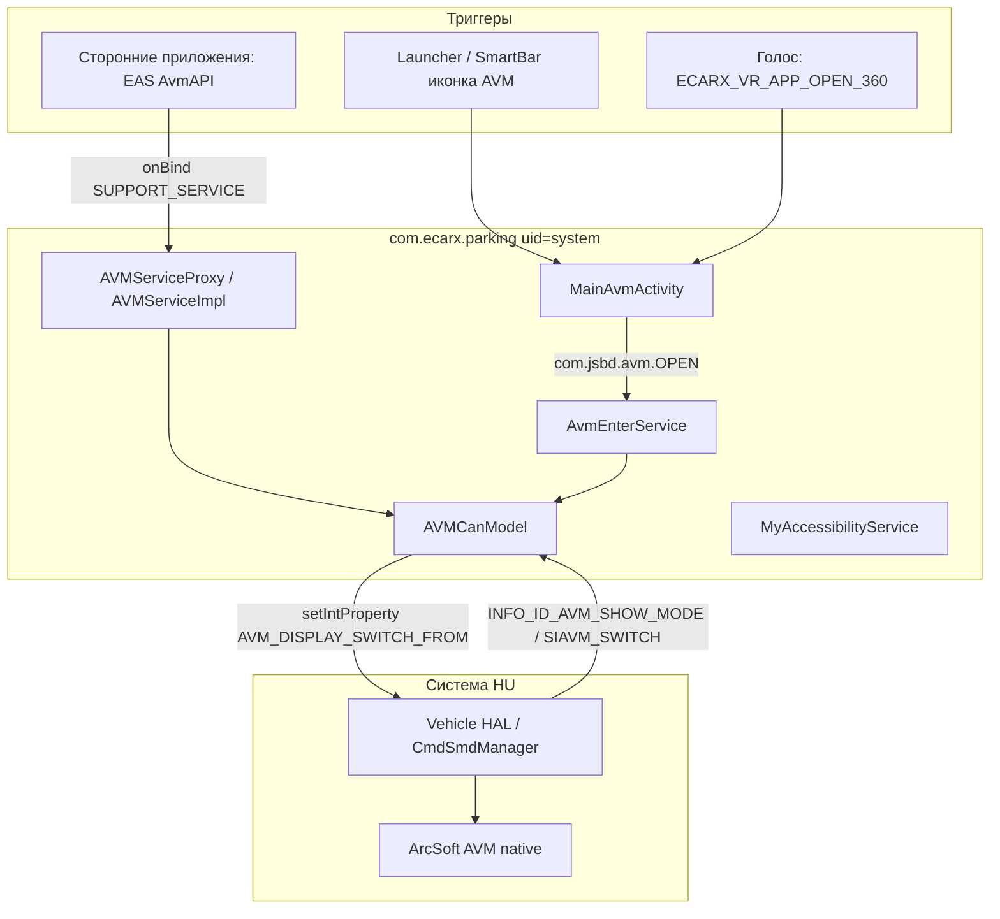

# com.ecarx.parking — справочник по разбору APK (AVM)

Документ описывает штатное приложение **AVM** (`com.ecarx.parking`) с головного устройства Geely **IHU629G**: как оно открывает круговой обзор, какие VHAL-свойства использует, и как интегрироваться из стороннего APK.

**Важно:** это **не** приложение с экраном камеры. APK — системный **контроллер**: проверяет условия (ACC, скорость, камера) и пишет в VHAL команду «показать AVM». Саму картинку (4 камеры, 3D-модель, радар) рисует отдельный native-сервис **ArcSoft AVM** на уровне системы.

Сборка из dex: **`OneOSAvmApp_E22H-G_20250903`**.

---

## 0. Обзор приложения

| Параметр | Значение |
|----------|----------|
| Пакет | `com.ecarx.parking` |
| Label | **AVM** |
| versionCode | `100000000` |
| versionName | `1` |
| minSdk / targetSdk | 28 / 34 |
| sharedUserId | `android.uid.system` |
| Application | `com.ecarx.parking.AvmApp` (`android:persistent=true`) |
| Launcher Activity | `com.ecarx.parking.MainAvmActivity` (stub, сразу `finish()`) |
| Основной сервис | `com.ecarx.parking.AvmEnterService` (foreground) |
| DEX с логикой приложения | `classes3.dex` (~20 классов `com.ecarx.parking.*`) |

**Назначение:** триггер и API для включения/выключения AVM с лаунчера, голосового ассистента и других приложений через eCarX EAS. Дополнительно — PDC-оверлей (код есть, в билде E22H-G wiring не найден) и AccessibilityService для трекинга карты.

**Стек (по dex/JADX):**

- `MainAvmActivity` → `startForegroundService(com.jsbd.avm.OPEN)` → `finish()`
- `AvmEnterService` → `AVMCanModel` → `CarPropertyManager`
- EAS: `AvmEnterService.onBind` → `AVMServiceProxy` → `AVMServiceImpl`
- Логи: `Logcat` с тегом `OneOSAvmApp_E22H-G_20250903`
- Аналитика: SensorsData v0.0.9

**Связанные системные компоненты (не в APK, но участвуют в работе):**

- ArcSoft AVM native (pid ~289 в логах, `ArcSoftAVM_sdk`, 5120×800, 4 камеры)
- Vehicle HAL / `CmdSmdManager` (property `AVM_DISPLAY_SWITCH_FROM`)
- `com.geely.sdk.avm` / `ecarx.avmservice` AIDL (в dex как зависимости)

---

## 1. Источник и артефакты

| Параметр | Значение |
|----------|----------|
| Платформа (источник дампа) | IHU629G |
| Исходный APK (ADBAppControl) | `downloads/250060 IHU629G/AVM (com.ecarx.parking) [v.1].apk` |
| Локальная копия | `.tmp/ecarx-parking.zip` |
| Распакованный APK | `.tmp/ecarx-parking-apk/` |
| JADX | `.tmp/ecarx-parking-src/` |

### Получить APK с устройства

```bash
adb shell pm path com.ecarx.parking
adb pull /system/app/.../AVM.apk .tmp/ecarx-parking.apk
```

### Распаковать и искать

```powershell
Copy-Item -LiteralPath ".tmp\ecarx-parking.apk" -Destination ".tmp\ecarx-parking.zip"
Expand-Archive -Path .tmp\ecarx-parking.zip -DestinationPath .tmp\ecarx-parking-apk -Force

$dexdump = (Get-ChildItem "$env:LOCALAPPDATA\Android\Sdk\build-tools" -Recurse -Filter "dexdump.exe" | Select-Object -First 1).FullName
& $dexdump -d .tmp\ecarx-parking-apk\classes3.dex | Select-String "AVM_DISPLAY_SWITCH_FROM|PERF_VEHICLE_SIAVM|PdcCover"
```

**JADX / jadx-gui** — основной инструмент для `AvmEnterService`, `AVMCanModel`, `AVMServiceImpl`.

---

## 2. Архитектура



| Слой | Роль |
|------|------|
| **Java APK** | Проверки, запись VHAL, EAS API, overlay PDC (неактивен) |
| **VHAL** | Команда открытия/закрытия, feedback режима AVM |
| **ArcSoft** | Рендер видео 360°, 3D-иконки, задний радар на картинке |

Подключение к автомобилю в APK:

```text
Car.createCar(context) → connect() → getCarManager("property") → CarPropertyManager
areaId = 0
```

---

## 3. Точки входа: как открыть AVM

### 3.1 Лаунчер (иконка AVM)

`MainAvmActivity` — прокси: стартует сервис и сразу завершается (~20–30 ms).

```bash
adb shell am start -n com.ecarx.parking/.MainAvmActivity
```

Внутри вызывается:

```text
action = com.jsbd.avm.OPEN
component = com.ecarx.parking/.AvmEnterService
extra START_SOURCE = 1  (launcher)
```

### 3.2 Прямой Intent на сервис

```bash
adb shell am start-foreground-service \
  -a com.jsbd.avm.OPEN \
  -n com.ecarx.parking/.AvmEnterService \
  --ei START_SOURCE 1
```

Закрытие (action есть, обработчик в `onStartCommand` минимальный — надёжнее через VHAL или EAS):

```bash
adb shell am start-foreground-service \
  -a com.jsbd.avm.CLOSE \
  -n com.ecarx.parking/.AvmEnterService
```

### 3.3 Голос / VR (ECARX)

| Параметр | Значение |
|----------|----------|
| Action | `ecarx.intent.action.ECARX_VR_APP_OPEN` |
| Category | `ecarx.intent.category.ECARX_VR_APP_OPEN_360` |
| Activity | `MainAvmActivity` |

```bash
adb shell am start \
  -a ecarx.intent.action.ECARX_VR_APP_OPEN \
  -c ecarx.intent.category.ECARX_VR_APP_OPEN_360 \
  -n com.ecarx.parking/.MainAvmActivity
```

### 3.4 EAS API (для других системных приложений)

`AvmEnterService` регистрируется как EAS provider:

| Параметр | Значение |
|----------|----------|
| Action bind | `com.ecarx.eas.core.intent.action.SUPPORT_SERVICE` |
| meta-data provider | `avm` |
| Модуль | `AvmAPI` |

Методы `AVMServiceProxy` → `AVMServiceImpl`:

| Метод | Действие |
|-------|----------|
| `openAvm` | `AVM_DISPLAY_SWITCH_FROM = 3` (если скорость ≤ 30 km/h) |
| `closeAvm` | `AVM_DISPLAY_SWITCH_FROM = 4` |
| `getAvmCurrentStatus` | `SystemProperties.get("VIDEO_REQUEST_AVM")` |
| APA / HPA / switch view | **402** — не поддерживается |

### 3.5 Напрямую через VHAL (для geely_ex2_tools)

Минимальный путь без запуска Activity:

```kotlin
carPropertyManager.setIntProperty(0x2140a654, 0, 1)  // open (launcher source)
carPropertyManager.setIntProperty(0x2140a654, 0, 3)  // open (EAS source)
carPropertyManager.setIntProperty(0x2140a654, 0, 4)  // close
```

Статус AVM — слушать `PERF_VEHICLE_SIAVM_SWITCH` (`557842882`): **1** = открыт, **3** = закрыт.

---

## 4. Логика открытия (`AvmEnterService.openAvm`)

Перед записью в VHAL выполняются проверки:

| # | Проверка | Property / метод | Условие блокировки | Строка UI |
|---|----------|------------------|--------------------|-----------|
| 1 | Debounce | `isClickable()` | повтор < 1 сек | — |
| 2 | Питание | `getPowerStatus()` → `PEPS_POWER_MODE` `0x2140a331` | `== 0` | `open_error_acc_off` |
| 3 | Камера | `getCameraStatus()` → `0x21405054` | `== 1` | `open_error_avm_error` |
| 4 | Скорость | `getVehicleSpeed()` → `0x2140a258` × 0.05625 | `> 30` km/h | `open_error_over_speed` |

Успех → `setIntProperty(VehicleProperty.AVM_DISPLAY_SWITCH_FROM, 1)`.

Дополнительно: при `onAVMShowModeChanged == 6` и скорости > 30 показывается toast «over speed» (обратная связь от системы).

### Типичная последовательность из logcat

```text
MainAvmActivity.onCreate
  → startForegroundService(action=com.jsbd.avm.OPEN, source=1)
  → finish()

AvmEnterService.onStartCommand
  → getIntProperty(0x2140a331)   # PEPS_POWER_MODE
  → getIntProperty(0x21405054)   # camera status
  → getFloatProperty(0x2140a258) # speed raw
  → setIntProperty(0x2140a654, 1) # AVM_DISPLAY_SWITCH_FROM

VHAL: AVM_DISPLAY_SWITCH_FROM = 1
  → INFO_ID_AVM_SHOW_MODE = 1
  → PERF_VEHICLE_SIAVM_SWITCH = 1

ArcSoft AVM (отдельный процесс): avm_sdk_process / avm_sdk_draw (~7 ms/frame)
```

---

## 5. VHAL / property id

### 5.1 Запись (команды)

| Имя (логическое) | int | Hex | Значения |
|------------------|-----|-----|----------|
| `AVM_DISPLAY_SWITCH_FROM` | `557885012` | `0x2140a654` | `1` launcher, `3` EAS open, `4` close |

### 5.2 Чтение (проверки и статус)

| Имя (логическое) | int | Hex | Примечание |
|------------------|-----|-----|------------|
| `PEPS_POWER_MODE` | `557884209` | `0x2140a331` | `0` = ACC off |
| Camera / AVM error | `557862996` | `0x21405054` | `1` = ошибка камеры |
| Vehicle speed (raw) | `557883992` | `0x2140a258` | × `0.05625` → km/h |
| `PERF_VEHICLE_SIAVM_SWITCH` | `557842882` | `0x2140a402` | `1` on, `3` off |
| `INFO_ID_AVM_SHOW_MODE` | `557885032` | `0x2140a668` | feedback режима отображения |
| Gear | `557884933` | `0x2140a385` | `1` = P, `2` = R (для PdcCover) |

### 5.3 PDC / радар (подписки при `persist.radar.type=1`)

Регистрируются в `AVMCanModel.onServiceConnected`:

| Группа | Property / константа |
|--------|----------------------|
| Расстояния PDC | `PDC_NEAREST_DISTANCE`, `PDC_STOP_DISPLAY_REQUEST` |
| Громкость радара | `ID_SOC_WARN_VOLUME` |
| 8 датчиков PAS | `PAS_FUNC_PAS_RADAR_FRONT_*`, `PAS_FUNC_PAS_RADAR_REAR_*` |
| Статус радара | `PAS_FUNC_PAS_RADAR_WORK_STATUS` |
| Скорость на приборке | `PERF_VEHICLE_SPEED_DISPLAY` (`291504648`, × 0.05625) |
| Тема | `NIGHT_MODE` (`538247424`) |

---

## 6. Карта классов APK

| Класс | Назначение |
|-------|------------|
| `AvmApp` | Application singleton, `getInstance()` |
| `MainAvmActivity` | Launcher stub → сервис → `finish()` |
| `AvmEnterService` | Foreground service: open/close, EAS bind, accessibility setup |
| `AVMCanModel` | Singleton: `CarPropertyManager`, read/write, listeners |
| `AVMCanModelAdapter` | Callback-интерфейс для property events |
| `AVMServiceProxy` | EAS `IEASFrameworkSuppportService.Stub`, маршрутизация `AvmAPI` |
| `AVMServiceImpl` | `openAvm` / `closeAvm` / `getAvmCurrentStatus` |
| `PdcCover` | System overlay PDC (8 датчиков, свайпы, auto-hide 4 с) |
| `MyAccessibilityService` | `map.window.status` при смене foreground app |
| `AvmBootBroadcaset` | Пустой receiver (в манифесте не зарегистрирован) |
| `ToastManager` | Toast при ошибках открытия |
| `Logcat` | Обёртка логов с file:line |

### Манифест (ключевое)

| Компонент | Атрибуты |
|-----------|----------|
| `application` | `persistent`, `sharedUserId=system`, `AvmApp` |
| `MainAvmActivity` | `exported`, `launchMode=singleInstance`, landscape |
| `AvmEnterService` | `exported`, EAS provider `avm` |
| `MyAccessibilityService` | `BIND_ACCESSIBILITY_SERVICE`, exported |

---

## 7. PdcCover (PDC overlay)

Класс `PdcCover` реализует плавающий overlay (`WindowManager`, `TYPE_SYSTEM_ERROR`):

| Поведение | Деталь |
|-----------|--------|
| Показ | При препятствии на радаре (`hasObstacle`) |
| Скрытие | Нет препятствий 4 с; скорость > 15 km/h; передача R; ACC off; кнопка exit |
| Свайп вправо | `AVM_DISPLAY_SWITCH_FROM = 1` (открыть AVM) |
| Свайп влево | скрыть overlay |
| Не показывать | Передача P (`gear == 1`), R (`gear == 2`) |
| Громкость | toggle `ID_SOC_WARN_VOLUME` 0/1 |

**Состояние в APK v1 (E22H-G):** `PdcCover.getInstance()` **нигде не вызывается** в dex — layout и drawable (`pdc_layout_copy`, `pdc_*`) есть, но wiring отсутствует. Вероятно legacy или отключено на этой платформе.

---

## 8. MyAccessibilityService

Следит за `TYPE_WINDOW_STATE_CHANGED` (event 32):

| Foreground package | Действие |
|--------------------|----------|
| `com.geely.map` | `SystemProperties.set("map.window.status", "1")` |
| Другие (кроме whitelist) | сброс `map.window.status` → `0` |

Whitelist (игнорируются): `com.android.systemui`, `com.baidu.che.codriver`, `com.android.dialer`, `com.flyme.auto.mediacontrol`, `com.flyme.auto.user`, `com.android.packageinstaller`, `com.sohu.inputmethod.sogou.oem`, сам `com.ecarx.parking`.

Сервис **принудительно включается** в `AvmEnterService.onCreate()` через запись в `Settings.Secure.ENABLED_ACCESSIBILITY_SERVICES` (system uid).

---

## 9. Использование из geely_ex2_tools

### Вариант A — Intent (как лаунчер)

```kotlin
val intent = Intent("com.jsbd.avm.OPEN").apply {
    component = ComponentName("com.ecarx.parking", "com.ecarx.parking.AvmEnterService")
    putExtra("START_SOURCE", 1)
}
context.startForegroundService(intent)
```

Плюс: повторяет штатные проверки (ACC, скорость, камера). Минус: нужен system/подписанный контекст для `startForegroundService` на некоторых сборках.

### Вариант B — VHAL напрямую

```kotlin
carPropertyManager.setIntProperty(0x2140a654, 0, 1)
```

Плюс: минимальная задержка. Минус: проверки нужно дублировать самим; требуются car permissions.

### Вариант C — чтение статуса

```kotlin
val isOpen = carPropertyManager.getIntProperty(557842882, 0) == 1
// или SystemProperties.get("VIDEO_REQUEST_AVM", "0")
```

---

## 10. Как найти новое свойство в APK

1. **JADX** — поиск в `AVMCanModel.onChangeEvent` и `getIntProperty` / `setIntProperty`.
2. **dexdump** — `classes3.dex`, классы `com/ecarx/parking/can/AVMCanModel`.
3. **logcat** на HU — фильтр `OneOSAvmApp_E22H-G_20250903`, `CarPropertyManager`, `CmdSmdManager`.
4. Сопоставить int id с hex: в логах APK печатает `propertyId = N (0x........)`.

### Шаблон подписки (как в APK)

```kotlin
carPropertyManager.registerListener(listener, 557842882, 0f) // PERF_VEHICLE_SIAVM_SWITCH
```

---

## 11. Отладка

```bash
# Логи AVM-приложения
adb logcat | findstr /i "OneOSAvmApp MainAvmActivity AvmEnterService AVMCanModel"

# VHAL / property
adb logcat | findstr /i "AVM_DISPLAY_SWITCH_FROM INFO_ID_AVM_SHOW_MODE SIAVM"

# Native рендер (отдельный процесс)
adb logcat | findstr /i "ArcSoftAVM"
```

| Симптом | Вероятная причина |
|---------|-------------------|
| Activity мелькает и пропадает | Норма: `MainAvmActivity` — stub |
| Toast «ACC off» | `PEPS_POWER_MODE == 0` |
| Toast «over speed» | скорость > 30 km/h |
| Toast «AVM error» | `0x21405054 == 1` |
| `setProperty` без картинки | ArcSoft-сервис не запущен / камеры |
| `PERF_VEHICLE_SIAVM_SWITCH` не меняется | VHAL не принял команду или условия не выполнены |
| PDC overlay не появляется | `PdcCover` не инициализируется в этом билде |

### Пример успешного открытия (фрагмент logcat)

```text
D MainAvmActivity: onCreate:
D OneOSAvmApp: AvmEnterService.onStartCommand: source=1 action=com.jsbd.avm.OPEN
D CarPropertyManager: setProperty, propId: 0x2140a654, val: 1
E Property.service: setProperty: propId is AVM_DISPLAY_SWITCH_FROM = 0x2140a654
D OneOSAvmApp: onAVMShowModeChanged = 1
D OneOSAvmApp: pro Id PERF_VEHICLE_SIAVM_SWITCH ,value =1
```

---

*Документ основан на разборе APK `com.ecarx.parking` v1 (IHU629G, build `OneOSAvmApp_E22H-G_20250903`). При смене прошивки повторите разбор APK — property id, значения `AVM_DISPLAY_SWITCH_FROM` и наличие PdcCover wiring могут отличаться.*
