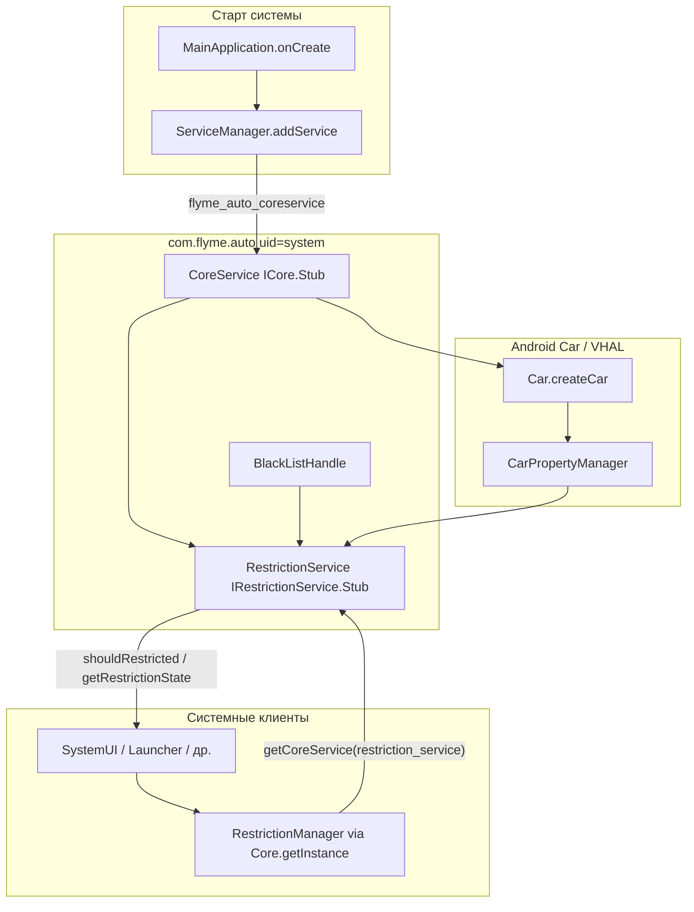
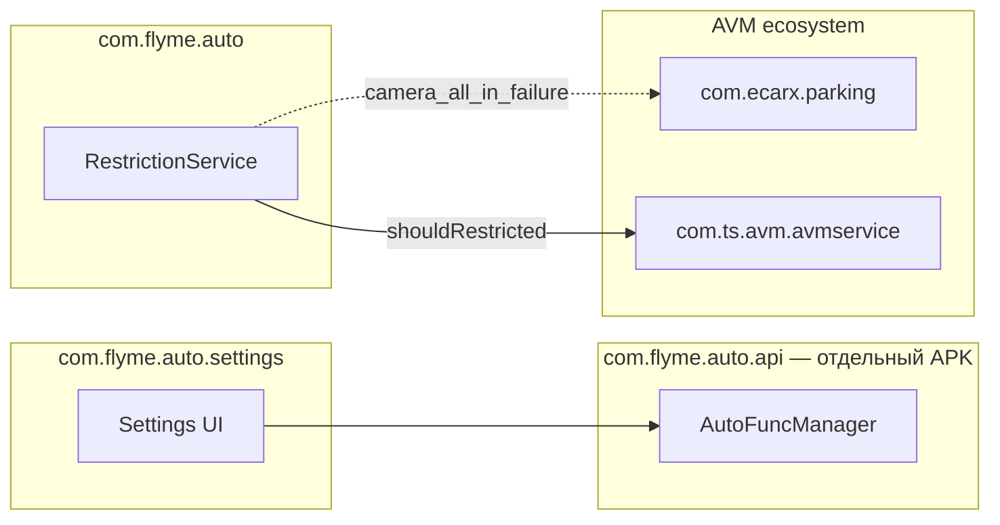

# com.flyme.auto — справочник по разбору APK (FlymeAutoService)

Документ описывает системное приложение **FlymeAutoService** (`com.flyme.auto`) с головного устройства Geely **IHU629G**: что внутри APK, как оно регистрирует core-сервис на ГУ, и как реализует **ограничения использования приложений при движении** (driving restrictions).

**Важно:** это **не** библиотека `com.flyme.auto.api` (AutoFunc / VHAL-обёртка для настроек авто). `com.flyme.auto.api` — отдельный системный APK; Settings и Geely EX2 Tools обращаются к нему напрямую (см. [flyme-settings-apk.md](./flyme-settings-apk.md)).  
`com.flyme.auto` — **хост-процесс** с `CoreService`, который публикуется в `ServiceManager` и отдаёт клиентам подсервис `RestrictionService`.

---

## 0. Обзор приложения

| Параметр | Значение |
|----------|----------|
| Пакет | `com.flyme.auto` |
| Label | **FlymeAutoService** |
| versionCode | `26012722` |
| versionName | `flyme.beta.(FlymeAutoService)(null)(26012722)(1b5f169)` |
| product flavor (BuildConfig) | `e02` |
| minSdk / targetSdk | 28 / 31 |
| compileSdk | 31 (Android 12) |
| sharedUserId | `android.uid.system` |
| Application | `com.flyme.auto.MainApplication` (`android:persistent=true`, `directBootAware=true`) |
| Launcher Activity | **нет** (в манифесте только `<application>`) |
| DEX | один `classes.dex` (~7.4 MB, ~5155 классов) |
| Размер APK | ~10.5 MB |

**Назначение:** persistent system-приложение, которое при старте:

1. Регистрирует в `ServiceManager` binder `flyme_auto_coreservice` (`CoreService`).
2. Подключается к `android.car.Car` / `CarPropertyManager`.
3. Ведёт логику **car restrictions** — блокировка сторонних приложений в передачах D/R/N при включённом «режиме ограничений», отдельные правила для AVM и Alipay-миниаппов.
4. Публикует SDK `com.flyme.auto.sdk` для системных клиентов (`RestrictionManager`).

**Что ещё вшито в APK (не бизнес-логика сервиса):**

| Пакет в dex | Классов (≈) | Назначение |
|-------------|-------------|------------|
| `androidx.*` | 2428 | Material / AppCompat |
| `com.google.*` | 800 | Material Components |
| `com.flyme.auto.design.*` | 490 | Flyme Auto Design (виджеты, диалоги, тосты) |
| `android.car.*` | 458 | Android Car API (зашит в APK) |
| `com.flyme.auto.sdk.*` | 26 | Клиентский SDK + AIDL |
| `com.flyme.auto.restriction.*` | 9 | Сервер ограничений |
| `com.flyme.auto` (ядро) | 27 | `MainApplication`, `CoreService`, `Utils` |

Зависимость **`com.ecarx.xui.adaptapi`** в dex **не входит** — на устройстве подключается отдельно (`Car.createWrapper()` для property id joy-limit switch).

---

## 1. Источник и артефакты

| Параметр | Значение |
|----------|----------|
| Платформа (источник дампа) | IHU629G |
| Исходный APK (ADBAppControl) | `downloads/250060 IHU629G/FlymeAutoService (com.flyme.auto) [v.flyme.beta.(FlymeAutoService)(null)(26012722)(1b5f169)].apk` |
| Локальная копия | `.tmp/flyme-auto-service.apk` |
| Распакованный APK | `.tmp/flyme-auto-service-apk/` |
| JADX | `.tmp/flyme-auto-service-jadx/` |

### Получить APK с устройства

```bash
adb shell pm path com.flyme.auto
adb pull /system/app/.../FlymeAutoService.apk .tmp/flyme-auto-service.apk
```

### Распаковать и искать

```powershell
Copy-Item -LiteralPath ".tmp\flyme-auto-service.apk" -Destination ".tmp\flyme-auto-service.zip"
Expand-Archive -Path .tmp\flyme-auto-service.zip -DestinationPath .tmp\flyme-auto-service-apk -Force

$aapt = (Get-ChildItem "$env:LOCALAPPDATA\Android\Sdk\build-tools" -Recurse -Filter "aapt.exe" | Select-Object -First 1).FullName
& $aapt dump badging .tmp\flyme-auto-service.apk

$dexdump = (Get-ChildItem "$env:LOCALAPPDATA\Android\Sdk\build-tools" -Recurse -Filter "dexdump.exe" | Select-Object -First 1).FullName
& $dexdump -d .tmp\flyme-auto-service-apk\classes.dex | Select-String "RestrictionService|flyme_auto_coreservice|PERF_VEHICLE_SPEED"
```

**JADX** — для чтения `CoreService`, `RestrictionService`, `RestrictionManager`, AIDL-интерфейсов.

---

## 2. Архитектура



### 2.1 Регистрация core-сервиса

При `Application.onCreate()` сервис **не** объявлен в `AndroidManifest.xml` как `<service>`. Вместо этого binder добавляется в глобальный `ServiceManager`:

```java
// MainApplication.onCreate()
Class.forName("android.os.ServiceManager")
    .getMethod("addService", String.class, IBinder.class)
    .invoke(null, Core.CORE_SERVICE_NAME, new CoreService(this));
```

| Константа | Значение |
|-----------|----------|
| `Core.CORE_SERVICE_NAME` | `flyme_auto_coreservice` |
| Реализация | `com.flyme.auto.CoreService` extends `ICore.Stub` |

`CoreService` при создании:

- Инициализирует `RestrictionService`.
- Вызывает `Car.createCar(context, …, CarServiceLifecycleListener)`.
- При успешном подключении уведомляет слушателей (`RestrictionService` подписывается на VHAL).

### 2.2 Клиентский SDK (`com.flyme.auto.sdk`)

Сторонние **системные** приложения получают менеджеры через singleton:

```java
Core.getInstance().getManager(ServiceName.RESTRICTION_SERVICE);
// → RestrictionManager
```

`Core` подключается к `ServiceManager.getService("flyme_auto_coreservice")`, до **50 попыток** с интервалом **500 ms**, отслеживает `linkToDeath` и переподключается.

| `ServiceName` | Подсервис |
|---------------|-----------|
| `restriction_service` | `RestrictionService` (единственный в этой сборке) |

---

## 3. RestrictionService — логика ограничений

Основной класс: `com.flyme.auto.restriction.RestrictionService` (AIDL `IRestrictionService`).

### 3.1 Состояния (`RestrictionManager`)

| Константа | int | Смысл |
|-----------|-----|-------|
| `UNKNOWN` | -1 | Сервис недоступен |
| `FUNC_OFF` | 0 | Переключатель ограничений выключен (`mLastLimitState == false`) |
| `NO_RESTRICTED` | 1 | Ограничения включены, но передача **не** D/R/N (например P) |
| `RESTRICTED_START` | 2 | Ограничения включены, передача **D, R или N** — блокировать приложения из чёрного списка |
| `RESTRICTED_RUNNING` | 3 | Объявлен в SDK, в `RestrictionService` не выставляется |

Состояние пишется в `Settings.Global`:

```text
car_restriction_state = 0 | 1 | 2
```

### 3.2 Условие «ограничивать сейчас»

```text
shouldRestricted(packageName):
  если package == com.ts.avm.avmservice (AVM):
    если camera_all_in_failure == 1 → restrict + toast (AVM fault)
    если speed > 30 km/h → restrict + toast (speed)
    иначе → не ограничивать
  иначе:
    если package в blacklist И state == RESTRICTED_START (2) → restrict + toast
    иначе → не ограничивать
```

Публичный API:

| Метод AIDL | Назначение |
|------------|------------|
| `getRestrictionState()` | Текущее состояние 0/1/2 |
| `isPermittedPkg(pkg)` | `false`, если пакет/миниапп в blacklist |
| `shouldRestricted(pkg)` | Нужно ли блокировать запуск/использование |
| `registerListener` / `unregisterListener` | Колбэк `onRestrictionStateChange` |
| `showToast(msg)` | Системный `FlymeToast` (private flag) |

### 3.3 VHAL-свойства

| Константа в коде | Property ID (dec) | Property ID (hex) | Использование |
|------------------|-------------------|-------------------|---------------|
| `CURRENT_GEAR` | 289408001 | `0x11400401` | `GEAR_SELECTION` — передача |
| `PARKING_BRAKE_ON` | 287310850 | `0x11200402` | Стояночный тормоз (читается, в формуле state не участвует напрямую) |
| `PERF_VEHICLE_SPEED` | 291504647 | `0x11600207` | Скорость; rate 5.0 при подписке |
| `TYPE_JOY_LIMIT_SWITCH` | runtime | `0x21200032` (≈555775090 в этой прошивке) | Boolean «включить ограничения»; id через `com.ecarx.xui.adaptapi.car.Car.createWrapper(ctx).getWrappedPropertyId(3, 4215296)` |

**Передачи для `RESTRICTED_START`:** `GEAR_DRIVE (8)`, `GEAR_REVERSE (2)`, `GEAR_NEUTRAL (1)` — см. `android.car.VehicleGear`.

**Пороги скорости:**

| Порог | Значение | Поведение |
|-------|----------|-----------|
| `OVER_SPEED_THRESHOLD_15` | 15 km/h | Запуск таймера 5 с → `mIsOverSpeed` (для общей логики) |
| `OVER_SPEED_THRESHOLD_30` | 30 km/h | Блокировка AVM (`com.ts.avm.avmservice`) |

### 3.4 Settings.Global (наблюдатели)

| Ключ | Тип | Назначение |
|------|-----|------------|
| `car_restriction_state` | int | Кэш текущего state (пишет сервис) |
| `car_restriction_switch` | int 0/1 | Ручной override переключателя (observer) |
| `camera_all_in_failure` | int 0/1 | Ошибка камер AVM |
| `running_mini_appid` | string | ID запущенного Alipay-миниаппа |

Специальный пакет миниаппов: `com.alipay.arome.app` — в blacklist проверяется не пакет, а `running_mini_appid`.

### 3.5 Broadcast (EasyConnect / drive mode)

| Action | Направление | Когда |
|--------|-------------|-------|
| `net.easyconn.drivemode.checkstatus` | **in** (receiver) | Запрос текущего статуса |
| `net.easyconn.drivemode.opened` | **out** | State ≠ `NO_RESTRICTED` (ограничения активны) |
| `net.easyconn.drivemode.closed` | **out** | State == `NO_RESTRICTED` |

При смене state сервис шлёт `opened` или `closed` и уведомляет AIDL-слушателей.

### 3.6 Чёрный список приложений

`BlackListHandle.readBlackListFromXml()`:

1. `/data/misc/security_data/restriction/restriction_black_list.xml` (с сервера)
2. Fallback: `/system/etc/restriction_black_list.xml`

Формат XML:

```xml
<restricted-modules>
  <package name="com.example.app"/>
  <applet id="mini_app_id"/>
</restricted-modules>
```

### 3.7 Строки уведомлений (R.string)

| id | EN (default) |
|----|--------------|
| `car_restriction_gear_notification` | Please use this function in P gear |
| `car_restriction_notification` | The app cannot be used while driving |
| `avm_restriction_notification` | Vehicle speed too high, function disabled |
| `avm_err_restriction_notification` | AVM is abnormal |

---

## 4. Связь с другими APK на ГУ



| Компонент | Связь с FlymeAutoService |
|-----------|--------------------------|
| `com.flyme.auto.api` | **Независимый** APK; AutoFunc/VHAL для настроек авто |
| `com.flyme.auto.settings` | Использует `com.flyme.auto.api`, не `RestrictionManager` напрямую |
| `com.ecarx.parking` | AVM-контроллер; restriction проверяет `com.ts.avm.avmservice`, не `com.ecarx.parking` |
| `com.ts.avm.avmservice` | Целевой пакет для speed/camera restrictions |
| SystemUI / Launcher | Типичные клиенты `RestrictionManager.shouldRestricted()` |

---

## 5. Разрешения (манифест)

| Permission | Зачем |
|------------|-------|
| `android.car.permission.CAR_SPEED` | Чтение скорости |
| `android.permission.MANAGE_USERS` | System app |
| `android.permission.ACCESS_CACHE_FILESYSTEM` | System |
| `INTERNET`, `ACCESS_NETWORK_STATE` | Сеть (обновление blacklist?) |
| `FOREGROUND_SERVICE`, `WAKE_LOCK` | Фоновая работа |

---

## 6. Отладка на устройстве

### Проверить, что сервис зарегистрирован

```bash
adb shell service list | findstr flyme_auto
# ожидается: flyme_auto_coreservice
```

### Логи

```bash
adb logcat | findstr /i "FlymeAuto.CoreService FlymeAutoRestrictionService FlymeAutoSDK.Core MainApplication"
```

### Текущее состояние ограничений

```bash
adb shell settings get global car_restriction_state
adb shell settings get global car_restriction_switch
adb shell settings get global camera_all_in_failure
adb shell settings get global running_mini_appid
```

### Типичные проблемы

| Симптом | Вероятная причина |
|---------|-------------------|
| `RestrictionManager.getRestrictionState()` всегда -1 | `com.flyme.auto` не запущен / нет `flyme_auto_coreservice` |
| `ClassNotFoundException: com.flyme.auto.sdk.*` | Клиент собран без system SDK; на ГУ классы в `com.flyme.auto` APK |
| AVM не блокируется | Проверяется `com.ts.avm.avmservice`, не `com.ecarx.parking` |
| `TYPE_JOY_LIMIT_SWITCH` exception в log | Нет `com.ecarx.xui.adaptapi` на прошивке |

---

## 7. Использование из Geely EX2 Tools

Для **управления настройками авто** (режим вождения, подсветка и т.д.) используйте рефлексию на **`com.flyme.auto.api`** — как в `FlymeDrivingModeApi`, `FlymeAmbientLightApi` (см. [flyme-settings-apk.md](./flyme-settings-apk.md)).

`com.flyme.auto` / `RestrictionManager` нужен только если требуется:

- узнать/подписаться на driving restriction state;
- повторить проверку `shouldRestricted()` для своего пакета;
- интегрироваться с broadcast `net.easyconn.drivemode.*`.

Пример (system-privileged / shared UID, **не** из обычного Play-store APK без подписи platform):

```java
// Требует com.flyme.auto.sdk на classpath устройства
RestrictionManager rm = RestrictionManager.getInstance();
int state = rm.getRestrictionState();
boolean blocked = rm.shouldRestricted("com.example.app");
```

---

*Документ основан на разборе APK `com.flyme.auto` v26012722 (IHU629G, build 1b5f169, flavor e02). При смене прошивки повторите разбор — property id joy-limit switch, blacklist и пороги скорости могут отличаться.*
