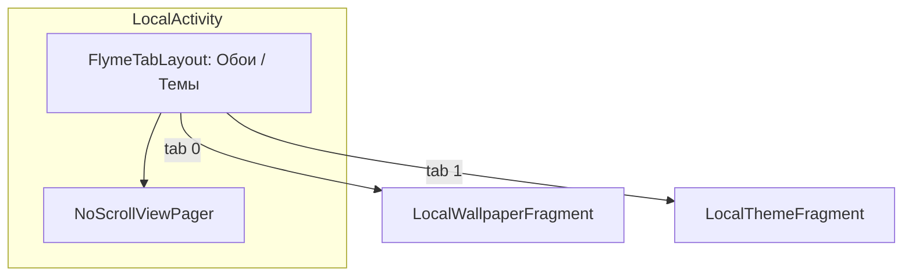
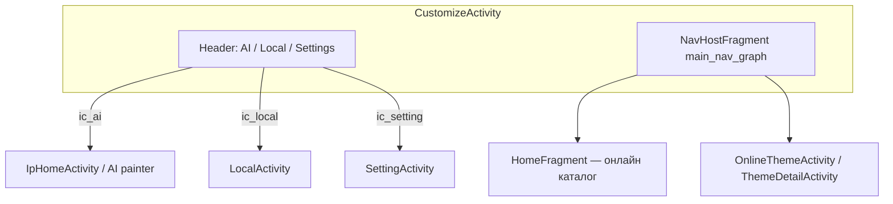
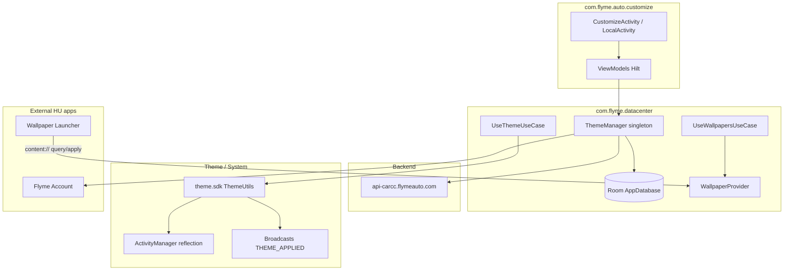

# com.flyme.auto.customize — справочник по разбору APK

Документ описывает штатное приложение **Оформление темы** / **Themes** (`com.flyme.auto.customize`) с головного устройства Geely **IHU629G**: локальные и онлайн темы/обои, AI-генерация обоев (Geely GPT), магазин тем Flyme Auto, применение через Theme SDK и публичный `ContentProvider` для лаунчера обоев.

Системные зависимости **не входят в APK**, но используются активно:

- `com.ecarx.eas.sdk` — DeviceAPI, OpenAPI (UAID, project code, driving joy limit)
- `com.flyme.auto.account` — Flyme Account / авторизация покупок
- `com.flyme.auto.openidsdk` — OpenID / device id
- `com.flyme.auto.coreservice` — FlymeAuthManager
- `com.android.server.ThemeManager` (reflection) — смена темы на уровне ActivityManager

Связанные APK на ГУ: **Wallpaper Launcher** (`com.flyme.auto.wallpaperlauncher`) — потребитель `WallpaperProvider`; см. артефакты `.tmp/flyme-wallpaperlauncher-*`.

---

## 0. Обзор приложения

| Параметр | Значение |
|----------|----------|
| Пакет | `com.flyme.auto.customize` |
| Label (RU) | **Оформление темы** |
| Label (EN) | **Themes** |
| Label (CN) | **主题美化** |
| versionCode | `26012722` |
| versionName | `flyme.beta.(AutoCustomizeCenter)(null)(26012722)(704108a)` |
| product flavor (BuildConfig) | **`e22hg`** (Galaxy E22 / EX2) |
| minSdk / targetSdk | 28 / 33 |
| compileSdk | 33 (Android 13) |
| sharedUserId | **нет** (не `android.uid.system`; привилегии через platform/priv-app signing) |
| Application | `com.flyme.auto.customize.App` (Hilt) |
| Launcher Activity | `com.flyme.auto.customize.ui.local.LocalActivity` |
| Альтернативный hub | `com.flyme.auto.customize.ui.CustomizeActivity` (action `com.flyme.auto.customize.wallpaper.main`) |
| DEX | один `classes.dex` (~8.2 MB, ~4800 классов в JADX) |
| Native `.so` | `librenderfilter.so`, `libflyme_account.so`, `libmmkv.so`, `libbspatch.so` (`arm64-v8a`; `extractNativeLibs=false`) |
| Размер APK | ~16.5 MB |

**Назначение:** центр персонализации Flyme Auto HU — каталог онлайн-тем и обоев, локальная галерея, пробная/платная покупка тем, праздничные обои, AI-обои (Inspired Painter / Geely GPT), настройки и экспорт API для лаунчера.

**Стек (по JADX):**

- UI: **DataBinding** + **Navigation Component** (`CustomizeActivity` → `main_nav_graph`)
- DI: **Dagger Hilt**
- Данные: **Room** (`AppDatabase`, `ThemeDao`, `WallpaperDao`) + **DataStore** (`PrefsDataStore`)
- Сеть: **Retrofit** + OkHttp → `https://api-carcc.flymeauto.com/`
- Темы: `UseThemeUseCase` → `com.flyme.auto.theme.sdk.utils.ThemeUtils` (reflection + broadcast)
- Обои: `UseWallpapersUseCase` + `WallpaperProvider` (ContentProvider)
- Аналитика: SensorsData **v0.3.2** (`ubpdata.geely.com`, project `OneOS`)
- Политика: Flyme Policy SDK (`PolicyAutoSdk`)
- AI: `com.geely.gpt.inspiredpainter.*`, `AlbumFacade` (SDK `0.0.1.18`)

**Особенность flavor `e22hg`:** в `LocalActivity` для этой сборки **скрыта вкладка «Темы»** — остаётся только локальные обои (`LocalWallpaperFragment`). Полный UI с темами доступен в других product flavors (см. §2.2).

---

## 1. Источник и артефакты

| Параметр | Значение |
|----------|----------|
| Платформа (источник дампа) | IHU629G |
| Исходный APK (ADBAppControl) | `downloads/250060 IHU629G/Оформление темы (com.flyme.auto.customize) [v.flyme.beta.(AutoCustomizeCenter)(null)(26012722)(704108a)].apk` |
| Локальная копия | `.tmp/flyme-customize.apk` |
| Распакованный APK | `.tmp/flyme-customize-apk/` |
| JADX | `.tmp/flyme-customize-jadx/` |
| dexdump (полный) | `.tmp/flyme-customize-dexdump.txt` |

### Получить APK с устройства

```bash
adb shell pm path com.flyme.auto.customize
adb pull /system/priv-app/.../Customize.apk .tmp/flyme-customize.apk
```

### Распаковать и искать

```powershell
Copy-Item -LiteralPath ".tmp\flyme-customize.apk" -Destination ".tmp\flyme-customize.zip"
Expand-Archive -LiteralPath .tmp\flyme-customize.zip -DestinationPath .tmp\flyme-customize-apk -Force

$aapt = (Get-ChildItem "$env:LOCALAPPDATA\Android\Sdk\build-tools" -Recurse -Filter "aapt.exe" | Select-Object -First 1).FullName
& $aapt dump badging .tmp\flyme-customize.apk

$dexdump = (Get-ChildItem "$env:LOCALAPPDATA\Android\Sdk\build-tools" -Recurse -Filter "dexdump.exe" | Select-Object -First 1).FullName
& $dexdump -d .tmp\flyme-customize-apk\classes.dex | Select-String "WallpaperProvider|ThemeManager|UseThemeUseCase"
```

**JADX** — основной инструмент для `ThemeManager`, `WallpaperProvider`, `ThemeRetrofitApi`, `App`, `CustomizeActivity`.

---

## 2. UI и навигация

### 2.1 Точки входа (манифест)

| Компонент | exported | Intent / назначение |
|-----------|----------|---------------------|
| `LocalActivity` | да | `MAIN` + `LAUNCHER` — иконка «Themes» в launcher |
| `LocalActivity` | да | `com.flyme.auto.customize.wallpaper.pick` — picker обоев |
| `CustomizeActivity` | да | `com.flyme.auto.customize.wallpaper.main` — hub с онлайн-каталогом и AI |
| `WallpaperDetailActivity` | да | `com.flyme.auto.customize.wallpaper.setting` — детали/применение обоев |
| `WallpaperPickerActivity` | да | внешний picker (exported) |
| `IpGenerateActivity` | да | AI-генерация обоев (Geely GPT) |
| `UseThemeReceiver` | да | `com.flyme.auto.theme.action.use` — применить тему по broadcast |

### 2.2 `LocalActivity` — локальная галерея



| Вкладка | Fragment | Содержимое |
|---------|----------|------------|
| Обои | `LocalWallpaperFragment` | Локальные коллекции, USB/галерея, AI-запись (`IpRecordActivity`) |
| Темы | `LocalThemeFragment` | Установленные `.mtpk`, системная тема |

**Flavor `e22hg`:** метод `LocalActivity.i()` возвращает `true` → вкладка «Темы» **скрыта** (`tabLayout.visibility = GONE`, один fragment). Аналогично для flavors `p417`, `l946` и ряда платформ (`e245`, `e335cn`, `fx11a2`, …).

### 2.3 `CustomizeActivity` — онлайн + AI hub



- После принятия privacy (`LifecycleExtensionKt.checkValidity`) загружается `HomeFragment` через Navigation.
- `onBackPressed()` → `moveTaskToBack(true)` (не finish).
- Шапка: переход в AI-обои, локальную галерею, настройки.

### 2.4 Прочие Activity

| Activity | Назначение |
|----------|------------|
| `OnlineThemeActivity` | Онлайн-магазин тем |
| `ThemeDetailActivity` | Карточка темы, покупка/скачивание/применение |
| `WallpaperDetailActivity` | Превью обоев (blur через `librenderfilter.so`) |
| `SettingActivity` | Настройки (festival switch, privacy, about) |
| `WebActivity` | In-app WebView (политики, help) |
| `LoginQrCodeActivity` | QR-логин Geely GPT album |
| `PolicyAutoWebViewActivity` | Flyme Policy SDK |

---

## 3. Архитектура



### 3.1 Инициализация (`App.onCreate`)

1. `ConfigInitializer` + `DeviceServiceImpl` (eCarX `DeviceAPI`).
2. `OpenApiManager.e(context, config, "e22hg")` — product code для API headers.
3. `PolicyAutoSdk.initSDK(...)` — privacy / GDPR.
4. `FlymeAuthManager` + coreservice auth.
5. **AI stack:** `AIUtils.initAI()` — `AlbumFacade`, `GenerationManager`, `WallpaperService` callback → `WallpaperUtils.useWallpaper`.
6. `Settings.Global.NET_CONFIG` → `PROD` / test для Geely GPT (`Platform.EnvType`).
7. `ThemeManager.init(...)` через Hilt / `SyncInitializer`.

Meta-data в манифесте:

| key | назначение |
|-----|------------|
| `com.flyme.auto.customize.Account_AppId` | Flyme Account |
| `com.flyme.auto.customize.UsageStat_AppId` | Usage stats |
| `eCarX_OpenAPI_AppId` / `AppKey` | eCarX OpenAPI |
| `com.sensorsdata.analytics.android.version` | `0.3.2` |

---

## 4. Файловая система на ГУ

Базовый каталог per-user (`Utility.myUserId()`):

| Путь | Содержимое |
|------|------------|
| `/data/customizecenter/{userId}/` | корень данных приложения |
| `.../Themes/` | скачанные `.mtpk` тем |
| `.../TrialThemes/` | пробные темы |
| `.../Wallpapers/` | пользовательские обои |
| `/system/customizecenter/theme/mtpks/{pkg}.mtpk` | предустановленные темы |
| `/system/customizecenter/theme/preview/` | превью системных тем |
| `system/customizecenter/wallpaper/` | **read-only** системные обои (default `s01.jpg`) |
| `system/customizecenter/wallpaper_ext/` | расширенный набор |

Формат темы: ZIP-архив **`.mtpk`** с `description.xml` (парсинг `ThemeManifestHandler` / SAX).

Системные package id тем (не удаляются):

| packageName | Роль |
|-------------|------|
| `com.meizu.theme.system` | заводская системная |
| `com.meizu.theme.flyme` | Flyme default |
| `com.meizu.theme.model.default` | fallback |
| `com.meizu.theme.flyme.test` | test build |

---

## 5. Settings / System properties

Ключи, которые приложение **читает и пишет** (лаунчер и CustomizeCenter должны быть согласованы):

| Key | Store | Назначение |
|-----|-------|------------|
| `flyme_theme_switch` | `Settings.System` | `1` — разрешить `UseThemeReceiver` применять тему |
| `using_theme_package_name` | prefs / theme state | текущий package темы |
| `key_using_theme_package_name` | DataStore | дублирование active theme |
| `wallpaper_launcher_current_wallpaper_path` | System | путь активной обои для launcher |
| `current_wallpaper_collection_id_settings_key` | System | id коллекции обоев |
| `current_wallpaper_collection_id_settings_pos` | System | позиция в коллекции |
| `current_wallpaper_collection_id_settings_position` | System | alias позиции |
| `key_effective_festival_using_wallpaper_path` | DataStore | праздничная обои |
| `key_effective_festival_using_collection_id` | DataStore | id праздничной коллекции |
| `key_take_effect_festival_entity_list` | DataStore | список festival entities |
| `key_privacy_permission` | DataStore | privacy accepted |
| `NET_CONFIG` | `Settings.Global` | `PROD` → production AI backend |
| `persist.flyme.res.api.level` | system property | уровень Flyme theme API |

Intent extras (theme detail / restore):

| extra | тип |
|-------|-----|
| `key_intent_theme_id` | String |
| `key_intent_theme_name` | String (`UseThemeReceiver`: `theme_name`) |
| `key_intent_theme_path` | String |

Trial service prefs (`ThemeConstants`):

| key | назначение |
|-----|------------|
| `flyme_theme_trail_packagename` | package пробной темы |
| `flyme_theme_trail_start_time` | start timestamp |
| `flyme_theme_trail_service_wake_up_intent` | wake trial service |

---

## 6. `WallpaperProvider` — API для лаунчера

**Authority:** `com.flyme.auto.customize.provider.WallpaperProvider`  
**exported:** да

| URI path | code | Назначение |
|----------|------|------------|
| `/query` | 1 | текущие обои / коллекция |
| `/update_current` | 2 | обновить текущую |
| `/query_desktop` | 3 | desktop wallpaper query |
| `/apply_desktop` | 4 | применить на desktop |
| `/check_desktop` | 5 | проверка desktop |
| `/check_wow` | 6 | WOW mode check |
| `/apply_wow` | 7 | apply WOW |
| `/query_current_wallpaper_size` | 8 | размер коллекции |
| `/query_collections_size` | 9 | число коллекций |
| `/set_pre_wallpaper` | 10 | предыдущая |
| `/set_next_wallpaper` | 11 | следующая |
| `/apply_other_wallpaper` | 12 | другая коллекция |

Пример:

```text
content://com.flyme.auto.customize.provider.WallpaperProvider/query
content://com.flyme.auto.customize.provider.WallpaperProvider/apply_desktop
```

Лимит пользовательских обои в коллекции: **15** (`WallpaperUtils.checkMaxSize` — при превышении удаляется oldest).

---

## 7. Broadcast / Service

### 7.1 Receivers

| Receiver | Action | Назначение |
|----------|--------|------------|
| `UseThemeReceiver` | `com.flyme.auto.theme.action.use` | применить тему (`theme_name` extra), если `flyme_theme_switch=1` |
| `ThemeReceiver` | `com.flyme.auto.theme.trial.end` | конец trial |
| | `com.flyme.auto.theme.trial.purchase` | покупка после trial |
| | `com.flyme.auto.theme.download.CHECK_UPDATE` | check update |
| | `flyme_theme_trail_service_wake_up_intent` | wake trial |
| `FestivalBroadcastReceiver` | `BOOT_COMPLETED`, `com.flyme.auto.theme.festival.check`, `ecarx.intent.action.power.STRMODE` | праздничные обои |
| `IPOBroadReceiver` (Policy SDK) | `ACTION_BOOT_HU`, `ACTION_SHUTDOWN_HU` | policy lifecycle |

### 7.2 Services

| Service | Назначение |
|---------|------------|
| `ThemeTrialService` | foreground notification, countdown trial → `ThemeRestoreService` |
| `ThemeRestoreService` | откат темы после trial |
| `FestivalUpdateJobService` | JobScheduler — festival wallpaper sync |
| `Downloader` (`com.meizu.flyme.appstore.appmanager`) | download manager для `.mtpk` |

### 7.3 Применение темы (Theme SDK)

`com.flyme.auto.theme.sdk.utils.ThemeUtils.c(context)`:

1. Reflection: `ActivityManager.getDefault()` → `getConfiguration()` → `configurationExt.fireThemeChange()`.
2. `ActivityManager.updateConfiguration(...)`.
3. Broadcast `com.android.server.ThemeManager.action.THEME_APPLIED`.
4. Broadcast `com.meizu.theme.change`.

---

## 8. Сеть (ThemeRetrofitApi)

**Base URL:** `https://api-carcc.flymeauto.com/` (`RetrofitManager`, timeout 6s)

| Method | Path | Назначение |
|--------|------|------------|
| GET | `/carcc/public/v{version}/index` | каталог тем (home blocks) |
| GET | `/carcc/public/detail/{themeId}` | карточка темы |
| GET | `/carcc/public/detail/check_update` | проверка обновлений |
| GET | `/carcc/public/download` | URL бесплатного скачивания |
| GET | `/carcc/public/download/trial_url` | trial URL |
| GET | `/carcc/public/wallpaperset/detail/{id}` | набор обоев |
| GET | `/carcc/public/wallpaperset/download` | URL обоев |
| GET | `/carcc/public/festivalWallpaper/config` | festival config |
| GET | `{url}` | dynamic content set |
| POST | `/carcc/oauth/order/indpay/add` | создать заказ |
| POST | `/carcc/oauth/order/indpay/check` | статус заказа |
| POST | `/carcc/oauth/order/add` | cash order |
| GET | `/carcc/oauth/order/check` | check cash order |
| GET | `/carcc/oauth/order/list` | история заказов |
| GET | `/carcc/oauth/order/check_qualification` | eligibility pay |
| GET | `/carcc/oauth/device/record/list` | device records |

**Analytics:** `https://ubpdata.geely.com/sa?project=OneOS`  
**Policy H5:** `https://policy-h5.flyme.com/?appId=` / `https://policy.flyme.com/`

### Geely GPT / AI painting (не carcc)

| Env | Base URL |
|-----|----------|
| PROD | `https://ai-draw.geely.com/ai-painting-cloud/` |
| TEST | `https://ai-draw.geely-test.com/ai-painting-cloud/` |
| SIT | `https://ai-draw-sit.geely-test.com/ai-painting-cloud/` |

Выбор через `Settings.Global.NET_CONFIG == "PROD"`.

AI-обои после генерации идут в `WallpaperUtils.useWallpaper` с `collectionName = "AI"`, id `2147483546`.

---

## 9. Room / доменные модели

| DAO | Модель | Назначение |
|-----|--------|------------|
| `ThemeDao` | `Theme` | локальные/скачанные темы, state using |
| `WallpaperDao` | `Wallpaper`, `WallpaperCollection` | коллекции обоев |

Use-cases (repository layer):

| Class | Действие |
|-------|----------|
| `UseThemeUseCase` | apply theme |
| `ThemeDownloadUseCase` | download `.mtpk` |
| `ThemeDeleteUseCase` | delete |
| `ThemeUpdateUseCase` | check/update |
| `UseWallpapersUseCase` | apply wallpaper + Glide resize |
| `GetThemeUseCase` | lookup by name |

Публичный фасад для UI/других модулей: **`ThemeManager.INSTANCE`** (`com.flyme.datacenter.api.ThemeManager`).

---

## 10. Разрешения (выборочно)

Приложение запрашивает расширенный набор priv-permissions:

| Permission | Зачем |
|------------|-------|
| `WRITE_SECURE_SETTINGS` / `WRITE_SETTINGS` | theme switch, wallpaper keys |
| `MANAGE_EXTERNAL_STORAGE` / `WRITE_MEDIA_STORAGE` | `/data/customizecenter`, media |
| `SET_WALLPAPER` / `SET_WALLPAPER_COMPONENT` | apply wallpaper |
| `INTERACT_ACROSS_USERS` / `MANAGE_USERS` | multi-user paths |
| `android.car.permission.CAR_VENDOR_EXTENSION` | vendor car info |
| `com.flyme.auto.coreservice.permission.CONNECTION` | Flyme core auth |

---

## 11. Native / RenderFilter

`assets/renderfilter/` — GLSL шейдеры (Kawase/Gaussian blur, decor, downscaling).  
`librenderfilter.so` — GPU blur в `WallpaperDetailActivity` preview.

`libflyme_account.so` — native часть Flyme Account.  
`libmmkv.so` — Tencent MMKV storage.  
`libbspatch.so` — bsdiff патчи (обновления ресурсов).

---

## 12. Пакеты в DEX (бизнес-логика)

| Пакет | Назначение |
|-------|------------|
| `com.flyme.auto.customize.*` | UI, Hilt, widgets, AI glue |
| `com.flyme.datacenter.*` | data layer, network, Room, provider |
| `com.flyme.app.base.*` | constants, utils, Glide wrappers |
| `com.flyme.auto.theme.sdk.*` | apply theme / reflection |
| `com.geely.gpt.*` | AI painter, album login, network |
| `com.flyme.auto.sdk.policy.*` | privacy (вшит SDK) |
| `com.flyme.renderfilter.*` | render filter init provider |
| `com.sensorsdata.analytics.*` | analytics |
| `androidx.*` / `com.google.*` | support libs |

---

## 13. Практика для Geely EX2 Tools

1. **Не дублировать Theme SDK** — смена темы на HU должна идти через `com.flyme.auto.theme.action.use` + `theme_name`, либо не трогать вовсе (на `e22hg` UI тем скрыт).
2. **Обои лаунчера** — читать/менять через `WallpaperProvider` URI, не напрямую файлы (синхронизация Settings keys).
3. **Проверка flavor** — BuildConfig/product `"e22hg"` в `OpenApiManager` / `LocalActivity`; API headers зависят от `OpenApiManager.c()` → `"GEELYGALAXY"`.
4. **Car restrictions** — `DeviceServiceImpl` использует eCarX `IDrivingJoyLimit` (как FlymeAutoService); AI/online может блокироваться при движении.
5. **Связь с Settings** — тема/atmosphere в Settings APK отдельно ([flyme-settings-apk.md](./flyme-settings-apk.md)); CustomizeCenter — персонализация launcher/wallpaper/theme pack, не VHAL.

### Быстрые команды ADB

```bash
# Текущий theme switch
adb shell settings get system flyme_theme_switch

# Открыть hub обоев/тем
adb shell am start -a com.flyme.auto.customize.wallpaper.main -n com.flyme.auto.customize/.ui.CustomizeActivity

# Открыть локальную галерею
adb shell am start -n com.flyme.auto.customize/.ui.local.LocalActivity

# Query wallpaper provider
adb shell content query --uri content://com.flyme.auto.customize.provider.WallpaperProvider/query
```

---

## 14. Связанные документы

| Документ | Связь |
|----------|-------|
| [flyme-auto-service-apk.md](./flyme-auto-service-apk.md) | driving restrictions SDK |
| [flyme-settings-apk.md](./flyme-settings-apk.md) | атmosphere / display settings |
| [flyme-wallpaperlauncher-apk.md](./flyme-wallpaperlauncher-apk.md) | клиент `WallpaperProvider`, live wallpaper |
