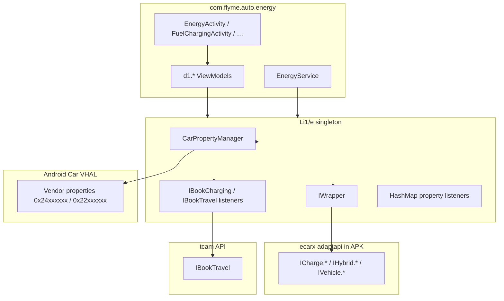

# com.flyme.auto.energy — справочник по разбору APK

Документ описывает штатное приложение **Energy / Мощность** (`com.flyme.auto.energy`) с головного устройства Geely **IHU629G**: энергоцентр (заряд/разряд, пробег, супер-экономия, бронирование поездок), фоновые сервисы, AIDL для статуса зарядки и доступ к автомобилю через **eCarX AdaptAPI** + **Android Car VHAL**.

Системные зависимости **частично вшиты в APK** (в отличие от Climate):

- `com.ecarx.xui.adaptapi` — **~991 класс** в `classes.dex` (IWrapper, ICharge.*, IHybrid.*, tcam IBookTravel/IBookCharging)
- `android.car` — **~672 класса** (CarPropertyManager, CarEnergyManager, VehiclePropertyIds)

На устройстве дополнительно подключается shared library `ecarx.openapi` (PKI/SSL для облачных запросов).

---

## 0. Обзор приложения

| Параметр | Значение |
|----------|----------|
| Пакет | `com.flyme.auto.energy` |
| Label (RU) | **Мощность** |
| Label (EN) | **Energy** |
| Label (ZH) | **能量中心** |
| versionCode | `26012722` |
| versionName | `flyme.beta.(AutoEnergy)(none)(26012722)(d7ebebe)` |
| minSdk / targetSdk | 28 / 33 |
| compileSdk | 34 (Android 14) |
| sharedUserId | `android.uid.system` |
| Application | `com.flyme.auto.energy.EnergyApplication` |
| Главная Activity | `com.flyme.auto.energy.EnergyActivity` |
| DEX | один `classes.dex` (~3.1 MB, **3580** классов) |
| Native | `libpag.so`, `libffavc.so` (arm64-v8a, PAG-анимации) |
| Размер APK | ~29 MB |

**Назначение:** системное приложение «энергоцентр» на Flyme Auto HU — SOC, заряд/разряд (AC/DC/V2L/V2V), лимиты тока/SOC, режимы батареи (HLD/charge/save), статистика пробега и расхода, **супер-экономия** (отключение AC/подсветки/рекuperation и т.д.), **бронирование зарядки/поездки** (BookTravel через tcam API), уведомления и SmartBar-плагин зарядки.

**Стек UI (по dex):**

- Activities + **DataBinding** (`androidx.databinding`, `DataBinderMapperImpl`)
- Domain-модели: `BatteryLife`, `BookTravel`, `ChargeDischargeSetting`, `ChargeDischargeStatus`, `FuelCharging`, `MileageStatistics`, `PreCharge`, `SuperEndurance` (имена из `source_file_idx`, в dex obfuscated как `d1.*`)
- Центральный менеджер авто: **`Li1/e`** (singleton `Li1/e.f()`): `CarPropertyManager` + `IWrapper` + tcam `IBookCharging` + регистрация VHAL-слушателей
- Фон: `EnergyService` (уведомления, реализует callback-интерфейсы `k1.*`)
- Публичный AIDL: `ChargeStatusService` / `IChargeStatusService`
- Облако: OkHttp → Geely OneOSS (`getNewDayEnergySum`, …) с eCarX PKI (`SSLUtils`, `ecarx.openapi`)

**Log tag:** `AutoEnergy`

---

## 1. Источник и артефакты

| Параметр | Значение |
|----------|----------|
| Платформа (источник дампа) | IHU629G |
| Исходный APK (ADBAppControl) | `downloads/250060 IHU629G/Мощность (com.flyme.auto.energy) [v.flyme.beta.(AutoEnergy)(none)(26012722)(d7ebebe)].apk` |
| Локальная копия | `.tmp/flyme-energy.apk` |
| Распакованный APK | `.tmp/flyme-energy-apk/` |
| dexdump (полный) | `.tmp/flyme-energy-dexdump.txt` |
| Строки dex (фильтр) | `.tmp/flyme-energy-strings.txt` |

### Получить APK с устройства

```bash
adb shell pm path com.flyme.auto.energy
adb pull /system/app/.../AutoEnergy.apk .tmp/flyme-energy.apk
```

### Распаковать и искать

```powershell
Copy-Item -LiteralPath ".tmp\flyme-energy.apk" -Destination ".tmp\flyme-energy.zip"
Expand-Archive -LiteralPath .tmp\flyme-energy.zip -DestinationPath .tmp\flyme-energy-apk -Force

$dexdump = (Get-ChildItem "$env:LOCALAPPDATA\Android\Sdk\build-tools" -Recurse -Filter "dexdump.exe" | Select-Object -First 1).FullName
& $dexdump -d .tmp\flyme-energy-apk\classes.dex | Select-String "CHARGE_FUNC|HYBRID_FUNC|SETTING_FUNC_ENERGY|Li1/e"
```

**JADX / jadx-gui** — основной инструмент для `EnergyActivity`, `Li1/e` (car manager), `ChargeDischargeSetting`, `EnergyService`.

### Структура DEX (крупные пакеты)

| Пакет / область | Классов (≈) | Назначение |
|-----------------|-------------|------------|
| `com.ecarx.xui.adaptapi.*` | 991 | AdaptAPI (IWrapper, ICharge, IHybrid, tcam BookTravel) |
| `android.car.*` | 672 | Android Car API (зашит в APK) |
| `com.flyme.auto.energy.*` | 140 | UI, сервисы, виджеты, bean |
| `androidx.*`, `com.google.*`, … | остальное | Material, OkHttp, DataBinding, PAG |

---

## 2. UI и навигация

### 2.1 Activities

| Activity | Launch mode | Intent action | Назначение |
|----------|-------------|---------------|------------|
| `EnergyActivity` | `singleTask` | `MAIN` / `com.flyme.auto.energy.ENERGY` | Главный экран энергоцентра |
| `FuelChargingActivity` | `singleTop` | `com.flyme.auto.energy.FUELCHARGING` | Заряд / разряд / топливо (PHEV) |
| `MileageStatisticsActivity` | `singleTop` | `com.flyme.auto.energy.MILEAGESTATISTICS` | Статистика пробега и расхода |
| `SuperEnduranceActivity` | `singleTop` | `com.flyme.auto.energy.SUPERENDURANCE` | Режим супер-экономии |

```bash
# Главный экран
adb shell am start -a com.flyme.auto.energy.ENERGY \
  -n com.flyme.auto.energy/.EnergyActivity

# Заряд / разряд
adb shell am start -a com.flyme.auto.energy.FUELCHARGING \
  -n com.flyme.auto.energy/.FuelChargingActivity

# Статистика пробега
adb shell am start -a com.flyme.auto.energy.MILEAGESTATISTICS \
  -n com.flyme.auto.energy/.MileageStatisticsActivity

# Супер-экономия
adb shell am start -a com.flyme.auto.energy.SUPERENDURANCE \
  -n com.flyme.auto.energy/.SuperEnduranceActivity
```

### 2.2 Domain ViewModels (DataBinding)

Имена восстановлены по `source_file_idx` в dex (классы obfuscated в пакете `d1`):

| Исходный класс | Dex (obfuscated) | Экран / область |
|----------------|------------------|-----------------|
| `BatteryLife` | `Ld1/a` | SOC, состояние батареи, главный дашборд |
| `BookTravel` | `Ld1/b` | Бронирование зарядки / поездки |
| `ChargeDischargeStatus` | `Ld1/d` | Live-статус заряд/разряд |
| `ChargeDischargeSetting` | `Ld1/e` | Настройки зарядки (ток, SOC, parking charge, …) |
| `MileageStatistics` | `Ld1/f` | Поездки, графики, сброс trip |
| `PreCharge` | `Ld1/g`, `Ld1/i` | Предварительный прогрев / подготовка |
| `SuperEndurance` | `Ld1/l` | Супер-экономия и связанные переключатели |

### 2.3 Состояния зарядки (UI icons)

`EnergyActivity` держит массив из **14** состояний (иконки `ic_connection`, `ic_charging`, `ic_warning`, `ic_complete`, `ic_preheating`, `ic_reservation_light`, `ic_discharging`, …) — соответствуют enum-подобным строкам `BATTERY_STATE_*` / `CHARGE_FUNC_CHARGING_DISCHARGING_STATE`.

---

## 3. Сервисы, AIDL и интеграции

### 3.1 `EnergyService`

| Параметр | Значение |
|----------|----------|
| Класс | `com.flyme.auto.energy.service.EnergyService` |
| exported | `false` |
| Роль | Foreground-service: уведомления о зарядке/разрядке, агрегация property callbacks |

Реализует callback-интерфейсы (dex `k1.*` → исходные имена):

| Dex | Исходный callback |
|-----|-------------------|
| `Lk1/a` | `IBatteryLifeCallback` |
| `Lk1/b` | `IBookTravelCallback` |
| `Lk1/c` | `IChargeDischargeSettingCallback` |
| `Lk1/d` | `IChargeDischargeStatusCallback` |
| `Lk1/e` | `IMileageStatisticsCallback` |
| `Lk1/f` | `IPreChargeCallback` |
| `Lk1/g` | `ISuperEnduranceCallback` |

### 3.2 `ChargeStatusService` (публичный AIDL)

| Параметр | Значение |
|----------|----------|
| Action | `com.flyme.auto.energy.action.CHARGE_STATUS_SERVICE` |
| AIDL | `IChargeStatusService` / `IChargeStatusServiceCallback` |
| exported | `true` |

**Методы `IChargeStatusService`:**

| Метод | Описание |
|-------|----------|
| `getChargingDischargingState()` | Состояние заряд/разряд (int) |
| `getEvBatteryPercentage()` | SOC, % |
| `registerCallback(IChargeStatusServiceCallback)` | Подписка |
| `unRegisterCallback(...)` | Отписка |

**Callback:** `updateChargeStatus(int)`, `updateElectricity(int)`.

```bash
adb shell am startservice -a com.flyme.auto.energy.action.CHARGE_STATUS_SERVICE \
  -n com.flyme.auto.energy/.service.ChargeStatusService
```

### 3.3 SmartBar plugin

| Компонент | Action |
|-----------|--------|
| `SmartBarChargePlugin` | `com.flyme.auto.plugin.action.PLUGIN_SMART_BAR` |

Плагин нижней панели Flyme Auto: компактный статус зарядки (`ChargingHandler`).

### 3.4 AppWidget

| Receiver | Доп. action |
|----------|-------------|
| `DischargingAppWidget` | `flyme.auto.provider.DischargingAppWidget` |

---

## 4. Broadcast и lifecycle

| Receiver | Action | exported | Назначение |
|----------|--------|----------|------------|
| `BootCompleteReceiver` | `BOOT_COMPLETED` | yes | Старт логики после загрузки HU |
| `PowerOnReceiver` | `ENERGY_POWER_ON`, `BOOKING_CHARGING_FAILED` | no | Питание / ошибка бронирования |
| `ChargeStartReceiver` | `ENERGY_CHARGE_START` | no | Начало зарядки |

Кастомные intent (internal):

- `android.intent.action.ENERGY_POWER_ON`
- `android.intent.action.BOOKING_CHARGING_FAILED`
- `android.intent.action.ENERGY_CHARGE_START`

Car manager (`Li1/e`) также слушает `ACTION_SHUTDOWN_HU` / `ACTION_BOOT_HU` и регистрирует `CarPowerManager` listener.

---

## 5. Архитектура доступа к автомобилю



**Паттерн записи/чтения** (типичный для `ChargeDischargeSetting`, `FuelCharging`):

1. Adapt **function id** (строка `CHARGE_FUNC_*`, `HYBRID_FUNC_*`, …) → VHAL property id через `IWrapper.getFuncIPropertyId()` (косвенно, через `Li1/e`).
2. `CarPropertyManager.getProperty` / `setProperty` (или обёртки `Li1/e.d`, `Li1/e.i`, `Li1/e.y`, `Li1/e.p`).
3. Для write с подтверждением — `Handler` + timeout 2 s (пример: `CHARGE_FUNC_PARKING`, `HYBRID_FUNC_BATTERY_MODE`).

**Регистрация слушателей:** `Li1/e.b()` обходит статические массивы `La/a.k` … `La/a.o` (списки property id) и вызывает `r()` / `s()` для subscribe на изменения.

---

## 6. Ключевые Adapt / VHAL function id

Полный список — тысячи строк в `.tmp/flyme-energy-strings.txt`. Ниже — функции, **явно используемые** в Energy APK (log strings + bytecode).

### 6.1 Заряд / разряд (`CHARGE_FUNC_*`)

| Function id | Назначение (по строкам в APK) |
|-------------|-------------------------------|
| `CHARGE_FUNC_CHARGING_DISCHARGING_STATE` | Общее состояние заряд/разряд |
| `CHARGE_FUNC_CHARGING_SOC` / `_MAX` / `_MIN` / `_STEP` | Лимит SOC зарядки (seekbar) |
| `CHARGE_FUNC_CHARGING_CURRENT` / `_MAX` / `_MIN` / `_STEP` | Лимит тока зарядки |
| `CHARGE_FUNC_CHARGING_PLUG_STATE` / `CHARGE_FUNC_DISCHARGING_PLUG_STATE` | Подключение разъёма |
| `CHARGE_FUNC_AC_CHARGING` / `CHARGE_FUNC_DC_CHARGING` | AC / DC зарядка |
| `CHARGE_FUNC_DISCHARGING_SWITCH_V2L` / `_V2V` | Разряд V2L / V2V |
| `CHARGE_FUNC_DISCHARGING_SOC` | Лимит SOC разряда |
| `CHARGE_FUNC_PARKING` | Зарядка на парковке (bool, timeout write) |
| `CHARGE_FUNC_BATTERY_*` | Мощность, температура, предупреждения, stability |
| `CHARGE_FUNC_EXTERNAL_CHARGING_LIGHT` | Подсветка порта зарядки |

**Примеры VHAL id из bytecode:**

| Function id | Property id (hex) |
|-------------|-------------------|
| `CHARGE_FUNC_PARKING` | `0x24205a00` |
| `HYBRID_FUNC_BATTERY_MODE` | `0x24030300` |
| `TRIP_FUNC_RESET` | `0x24800200` |

### 6.2 Гибрид / батарея (`HYBRID_FUNC_*`)

| Function id | Назначение |
|-------------|------------|
| `HYBRID_FUNC_BATTERY_MODE` | Режим батареи (normal / charge / HLD) |
| `HYBRID_FUNC_BATTERY_CHARGE_MODE` | Подрежим charge mode |
| `HYBRID_FUNC_BATTERY_SAVE_MODE` | Save mode |
| `HYBRID_FUNC_BATTERY_SOC` | Целевой SOC удержания |
| `HYBRID_FUNC_SUPER_ENERGY_SAVING` | Мастер-переключатель супер-экономии |
| `HYBRID_FUNC_SUPER_ENERGY_SAVING_AIR_CONDITIONER` | Отключение AC |
| `HYBRID_FUNC_SUPER_ENERGY_SAVING_AMBIENT_LIGHTING` | Отключение ambient |
| `HYBRID_FUNC_SUPER_ENERGY_SAVING_ENERGY_RECOVERY` | Рекуперация в режиме экономии |
| `HYBRID_FUNC_SUPER_ENERGY_SAVING_SEAT_*` | Массаж / вентиляция сидений |
| `HYBRID_FUNC_SUPER_ENERGY_SAVING_SPEED_LIMIT` | Ограничение скорости |

### 6.3 Пробег / поездки (`TRIP_FUNC_*`)

| Function id | Назначение |
|-------------|------------|
| `TRIP_FUNC_RESET` | Сброс статистики поездки |
| `TRIP_FUNC_TRIP_DISTANCE_SINCE_LAST_CHARGE` | Пробег с последней зарядки |
| `TRIP_FUNC_AVERAGE_ENERGY_CONSUMPTION_SINCE_LAST_CHARGE` | Средний расход |
| `TRIP_FUNC_DRIVING_TIME_SINCE_LAST_CHARGE` | Время в пути |
| `TRIP_FUNC_AVERAGE_SPEED_SINCE_LAST_CHARGE` | Средняя скорость |

### 6.4 Настройки / рекуперация

| Function id | Связь с Geely EX2 Tools |
|-------------|-------------------------|
| `SETTING_FUNC_ENERGY_REGENERATION` | Тот же id, что в [flyme-settings-apk.md](./flyme-settings-apk.md) и `VhalConstants.PROP_SETTING_FUNC_ENERGY_REGENERATION` (`0x22020500`) |
| `SETTING_FUNC_ENERGY_REGENERATION_SUPPORT_VALUE` | Поддерживаемые уровни regen |
| `ENERGY_REGENERATION_LEVEL_*` | AUTO / LOW / MID / HIGH / OFF |

### 6.5 BookTravel (tcam, не VHAL напрямую)

API: `com.ecarx.xui.adaptapi.tcam.IBookTravel`

| Константа | Значение |
|-----------|----------|
| `BOOKTRAVEL_SWITCH_OFF` | 0 |
| `BOOKTRAVEL_TEMPORARY_SWITCH` | 1 |
| `BOOKTRAVEL_CYCLE_SWITCH` | 2 |
| `BOOKTRAVEL_TIMESETTING_TYPE_CHARGE_START` | 10 |
| `BOOKTRAVEL_TIMESETTING_TYPE_VALLEY` | 9 |

Listener: `onBookTravelChargeStartChange`, `onBookTravelCycleSwitchChange`, `onBookTravelBattPreHeatgActSwitchChange`, …

---

## 7. Облачная статистика (OneOSS)

OkHttp + eCarX PKI (`ecarx.openapi.permission.ACCESS_PKI`):

| URL | Назначение |
|-----|------------|
| `https://oneoss-ecu.geely.com/.../getNewDayEnergySum?localDate=` | Сумма энергии за день |
| `https://oneoss-ecu.geely.com/.../getNewMonthEnergySum?localDate=` | За месяц |
| `https://oneoss-ecu.geely.com/.../getNewYearEnergySum` | За год |

DTO: `EnergyBean`, `EnergySumBean` (`dayMileageSum`, `monthMileageSum`, `yearMileageSum`).

---

## 8. Permissions (Car)

| Permission | Зачем |
|------------|-------|
| `android.car.permission.CAR_ENERGY` | Энергия / батарея |
| `android.car.permission.CAR_POWERTRAIN` | Силовая установка |
| `android.car.permission.CAR_MILEAGE` | Пробег |
| `android.car.permission.ADJUST_RANGE_REMAINING` | Запас хода |
| `android.car.permission.CAR_VENDOR_EXTENSION` | Vendor VHAL |
| `android.car.permission.CAR_SPEED` | Скорость (trip/stat) |
| `ecarx.openapi.permission.ACCESS_PKI` | TLS к OneOSS |

---

## 9. Связь с Geely EX2 Tools

| Функция EX2 Tools | Пересечение с Energy APK |
|-------------------|----------------------------|
| **Кinetic recovery (regen)** | `SETTING_FUNC_ENERGY_REGENERATION` — тот же Adapt id; EX2 Tools пишет через `com.flyme.auto.api` / VHAL `0x22020500`, Energy — через свой `Li1/e` + `IWrapper` |
| Driving mode / AVAS / Ambient | Нет прямой зависимости; Energy не экспортирует публичный API кроме `ChargeStatusService` |
| Статистика пробега | `TRIP_FUNC_*` — только в штатном UI Energy |

**Практический вывод:** для regen надёжнее повторять паттерн **Settings / Flyme API** (см. `FlymeEnergyRegenerationApi.kt`), а не bind к Energy APK. Для **SOC / charge state** можно использовать `IChargeStatusService` или те же `CHARGE_FUNC_*` через AdaptAPI.

---

## 10. Как копать дальше

1. **JADX** на `.tmp/flyme-energy.apk` → `Li1/e`, `ChargeDischargeSetting`, `EnergyService`.
2. **Строки:** `Select-String .tmp/flyme-energy-strings.txt -Pattern 'CHARGE_FUNC|HYBRID_FUNC'`.
3. **Property id:** искать `const v*, #float … // #24` в dexdump рядом с `const-string … "CHARGE_FUNC_…"`.
4. **Сравнение с Settings:** общие `SETTING_FUNC_*` / `IWrapper` — в [flyme-settings-apk.md](./flyme-settings-apk.md).
5. **Car service:** vendor property groups — в [android-car-apk.md](./android-car-apk.md).

---

## 11. Сводка компонентов (manifest)

```text
com.flyme.auto.energy/
├── EnergyApplication
├── EnergyActivity              # ENERGY / LAUNCHER
├── FuelChargingActivity        # FUELCHARGING
├── MileageStatisticsActivity   # MILEAGESTATISTICS
├── SuperEnduranceActivity      # SUPERENDURANCE
├── service/
│   ├── EnergyService           # foreground, callbacks k1.*
│   └── ChargeStatusService     # AIDL, exported
├── widget/SmartBarChargePlugin
├── appwidget/DischargingAppWidget
├── receiver/ BootComplete, PowerOn, ChargeStart
└── okhttps/ + ssl/             # OneOSS + PKI
```
