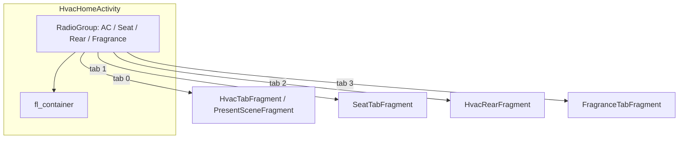
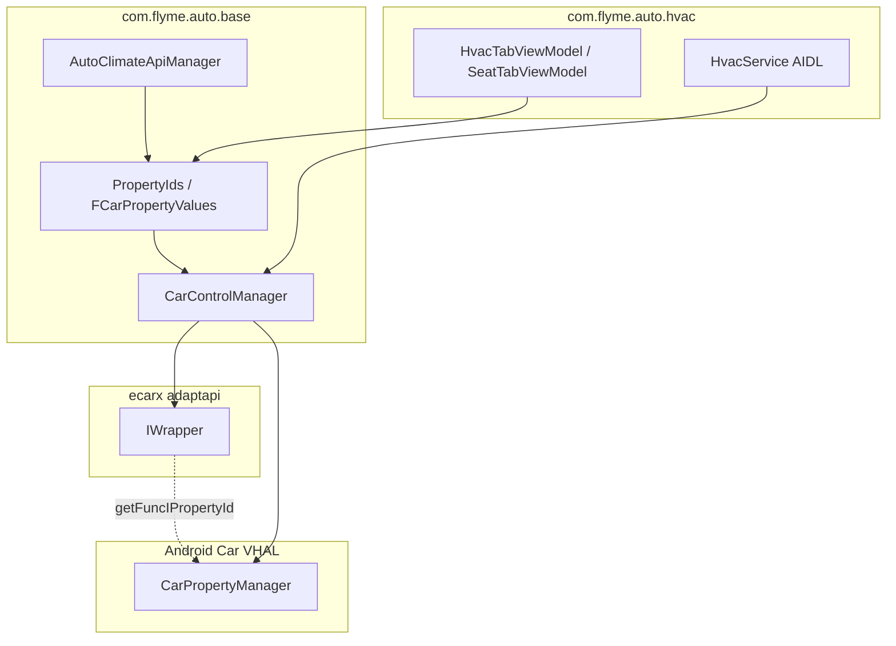

# com.flyme.auto.hvac — справочник по разбору APK

Документ описывает штатное приложение **Climate** (`com.flyme.auto.hvac`) с головного устройства Geely **IHU629G**: UI климата/сидений/ароматизатора, точки входа, сервис `HvacService` для сторонних приложений и доступ к автомобилю через **eCarX AdaptAPI** + **Android Car VHAL**.

Системные зависимости **не входят в APK**, но используются активно:

- `com.ecarx.xui.adaptapi` — `IWrapper`, маппинг `IHvac.*` / `IFunctionId.*` → VHAL property id
- `android.car` — `CarPropertyManager`
- `com.flyme.auto.data` — SDK настроек / `PreferencesProvider`

---

## 0. Обзор приложения

| Параметр | Значение |
|----------|----------|
| Пакет | `com.flyme.auto.hvac` |
| Label (EN) | **Climate** |
| versionCode | `26012721` |
| versionName | `flyme.beta.(AutoClimate)(null)(26012721)(5c75240)` |
| minSdk / targetSdk | 28 / 34 |
| compileSdk | 34 (Android 14) |
| sharedUserId | `android.uid.system` |
| Application | `com.flyme.auto.hvac.CarApplication` |
| Главная Activity | `com.flyme.auto.hvac.home.HvacHomeActivity` |
| taskAffinity (dock) | `FLYME.DOCK.APP.CLIMATE` |
| DEX с основной логикой | `classes2.dex` (~9.2 MB) |
| UI-виджеты (PAG/WebP) | `classes3.dex` (`com.flyme.hvacwidget.*`) |
| Размер APK | ~124 MB (анимации, ресурсы) |

**Назначение:** полноэкранное приложение «Климат» на Flyme Auto HU — передний/задний AC, сиденья (обогрев/вентиляция/массаж), ароматизатор, электронные дефлекторы, PM2.5/ионизация, настройки комфорта. Дополнительно экспортирует **AIDL API** (`HvacService`) для лаунчера, виджетов и других системных приложений.

**Стек UI (по dex/JADX):**

- `HvacHomeActivity` → **DataBinding** (`ActivityHvacHomeBinding`) + нижние вкладки (`RadioGroup`)
- Экраны: `Fragment` + `*ViewModel` + `FCarPropertyValues` / `@PropertyInject`
- Доступ к авто: `CarControlManager` → `CarPropertyManager` + `IWrapper.getFuncIPropertyId()`
- Публичный API: `HvacService` (AIDL `HvacApiService.Stub`)
- Аналитика: SensorsData v0.2.2 (`GlySensorsData.track`)
- VR: `ecarx.intent.action.ECARX_VR_APP_OPEN` → path `/空调调节页面`

**Связанные компоненты в том же APK:**

- `com.flyme.hvacwidget` — кастомные контролы (PAG-анимации вентиляции, рейтинг вентилятора, переключатели)
- `com.flyme.auto.base` — общая база Climate (CarControlManager, PropertyIds, AutoClimateApiManager)
- AppWidget: виджеты массажа сидений (主驾 / 副驾)

---

## 1. Источник и артефакты

| Параметр | Значение |
|----------|----------|
| Платформа (источник дампа) | IHU629G |
| Исходный APK (ADBAppControl) | `downloads/250060 IHU629G/Climate (com.flyme.auto.hvac) [v.flyme.beta.(AutoClimate)(null)(26012721)(5c75240)].apk` |
| Локальная копия | `.tmp/flyme-hvac.apk` |
| Распакованный APK | `.tmp/flyme-hvac-apk/` |
| JADX | `.tmp/flyme-hvac-jadx/` |
| dexdump (полный) | `.tmp/flyme-hvac-dexdump.txt` |

### Получить APK с устройства

```bash
adb shell pm path com.flyme.auto.hvac
adb pull /system/app/.../Hvac.apk .tmp/flyme-hvac.apk
```

### Распаковать и искать

```powershell
Copy-Item -LiteralPath ".tmp\flyme-hvac.apk" -Destination ".tmp\flyme-hvac.zip"
Expand-Archive -LiteralPath .tmp\flyme-hvac.zip -DestinationPath .tmp\flyme-hvac-apk -Force

$dexdump = (Get-ChildItem "$env:LOCALAPPDATA\Android\Sdk\build-tools" -Recurse -Filter "dexdump.exe" | Select-Object -First 1).FullName
& $dexdump -d .tmp\flyme-hvac-apk\classes2.dex | Select-String "HVAC_FUNC_|PropertyIds|CarControlManager"
```

**JADX / jadx-gui** — основной инструмент для `HvacTabViewModel`, `PropertyIds`, `HvacService`, `HvacHomeActivity`.

### Структура DEX

| Файл | Содержимое |
|------|------------|
| `classes.dex` | AndroidX, сторонние SDK |
| `classes2.dex` | `com.flyme.auto.hvac.*`, `com.flyme.auto.base.*` |
| `classes3.dex` | `com.flyme.hvacwidget.*` |
| `classes4.dex` | доп. библиотеки |

Native `.so` в APK **нет** (`extractNativeLibs=false`).

---

## 2. UI и навигация

### 2.1 Главный экран (`HvacHomeActivity`)



| Вкладка (RadioButton) | Fragment tag | ViewModel | Назначение |
|----------------------|--------------|-----------|------------|
| AC (передний климат) | `HvacTabFragment` или `PresentSceneFragment` | `HvacTabViewModel` | Температура, вентилятор, режимы обдува, AC/Auto/ECO, разморозка |
| Seat | `SeatTabFragment` | `SeatTabViewModel` | Обогрев/вентиляция/массаж, руль |
| Rear | `HvacRearFragment` | — | Задний ряд климата |
| Fragrance | `FragranceTabFragment` | `FragranceTabViewModel` | Ароматизатор |

**Режим «Nature» (сценарный климат):** если `SettingsProvider` / `Constant.SETTINGS_GLOBAL_HVAC_NATURE_MODE_SWITCH == 1`, вкладка AC показывает `PresentSceneFragment` вместо `HvacTabFragment`.

**Состояние панели в System UI:** при показе `HvacTabFragment` пишется `Settings.Global`:

- ключ `HVAC_MAIN_PANEL`
- `1` — панель открыта, `0` — скрыта

**3D-фон ветра:** `CarWindModel` / `CarPresentSceneWindModel` — анимация направления обдува (связана с `HVAC_FAN_DIRECTION`, электронными дефлекторами).

### 2.2 Основные переключатели (`HvacTabViewModel`)

Свойства объявлены через `@PropertyInject` на `FCarPropertyValues` и биндятся в `FragmentHvacTabBinding`.

| UI / логика | propertyId (adapt) | areaId | Тип | Описание (из PropertyIds) |
|-------------|-------------------|--------|-----|---------------------------|
| `mPowerSwitch` | `354419984` | 5 | bool | `HVAC_POWER_ON` — общий вкл. |
| `mAutoSwitch` | `354419978` | 1 | bool | `HVAC_AUTO_ON` |
| `mAcSwitch` | `354419973` | 117 | bool | `HVAC_AC_ON` |
| `mAirRecircSwitch` | `354419976` | 117 | bool | `HVAC_RECIRC_ON` |
| `mEcoSwitch` | `268960000` | 117 | bool | `HVAC_FUNC_ECO_SWITCH` |
| `mElectricDefrosterSwitch` | `354419988` | 2 | bool | заднее стекло (электро) |
| `mMaxDefrostSwitch` | `HVAC_MAX_DEFROST_ON` | 1 | bool | передняя макс. разморозка |
| `mTopSpeedDown` / `mTopSpeedUp` | `354419974` / `269750528` | — | bool | 极速降温 / 极速升温 |
| `mFanDirection` | `356517121` | 1 | int | `HVAC_FAN_DIRECTION` |
| `mAirVolume` | `356517120` | — | int | `HVAC_FAN_SPEED` |
| `mTempDualSwitch` | `354419977` | 117 | bool | синхронизация температур |
| Температура (L/R/Rear) | `358614275` | 1 / 4 / 16 | float | `HVAC_TEMPERATURE_SET` |
| Температура в салоне | sensor `3150098` | 0 | float | `ISensor.SENSOR_INNER_TEMP` |
| `mWheelHeatLevel` | `289408269` | — | int | обогрев руля |
| `mIAQCSwitch` / PM2.5 | `268960256`, sensors | 5 | — | качество воздуха |

Запись значений: `FCarPropertyValues.setProperty()` / `setPropertyDelayed()` → `CarControlManager.setIntProperty` / `setFloatProperty` / `setBooleanProperty`.

### 2.3 Дополнительные Activity

| Компонент | Назначение |
|-----------|------------|
| `SettingsActivity` / `SettingsContentActivity` | Настройки климата (auto dry, ventilation, PM2.5 popup, …) |
| `SeatMassageActivity` | Полноэкранный массаж |
| `AcCloseAlertActivity` | Диалог «выключить AC?» |
| `IonsCloseRequestActivity` | Запрос закрыть окна при ионизации |
| `DialogDispatchActivity` | Диалог переключения программы массажа |
| `WindowCloseTipDialogDispatchActivity` | Подсказка «закройте окна» |

### 2.4 Виджеты (AppWidget)

| Provider | Label | Actions |
|----------|-------|---------|
| `SeatMassageWidgetProvider` | 主驾按摩 | `action_seat_massage_level_switch`, `action_seat_massage_program_switch` |
| `SeatMassageCopilotWidgetProvider` | 副驾按摩 | `action_copilot_seat_massage_*` |
| `SeatMassageWidgetClickReceiver` | — | обработка кликов виджета |

---

## 3. Точки входа: как открыть и использовать

### 3.1 Лаунчер / док-плитка

```bash
adb shell am start -n com.flyme.auto.hvac/.home.HvacHomeActivity
```

По умолчанию открывается передний климат (`HvacTabFragment` или Nature-сцена).

### 3.2 Explicit Intent (action → экран)

| Action | Экран |
|--------|-------|
| `com.flyme.auto.hvac.action.ACTION_CLIMATE_HOME` | Главная (передний AC) |
| `com.flyme.auto.hvac.action.ACTION_CLIMATE_REAR` | Задний климат (`HvacRearFragment`) |
| `com.flyme.auto.hvac.action.ACTION_SEAT_SET` | Вкладка сидений |
| `com.flyme.auto.intent.action.ACTION_SEAT_SETTINGS` | Сиденья (+ extra `show_seat_dialog`) |
| `com.flyme.auto.hvac.action.ACTION_FRAGRANCE_SET` | Ароматизатор |
| `com.flyme.auto.hvac.action.ACTION_WINDOW_CLOSE_TIP` | `WindowCloseTipDialogDispatchActivity` |

Примеры:

```bash
# Задний ряд
adb shell am start -a com.flyme.auto.hvac.action.ACTION_CLIMATE_REAR \
  -n com.flyme.auto.hvac/.home.HvacHomeActivity

# Сиденья
adb shell am start -a com.flyme.auto.hvac.action.ACTION_SEAT_SET \
  -n com.flyme.auto.hvac/.home.HvacHomeActivity

# Ароматизатор
adb shell am start -a com.flyme.auto.hvac.action.ACTION_FRAGRANCE_SET \
  -n com.flyme.auto.hvac/.home.HvacHomeActivity
```

### 3.3 Голос / VR deep link (ECARX)

Action: `ecarx.intent.action.ECARX_VR_APP_OPEN`  
URI: `ecarx://vr.com/空调调节页面`  
meta-data `ECARX_VR_APP_NAME_EXPAND`: `空调|空调调节页面`

```bash
adb shell am start -a ecarx.intent.action.ECARX_VR_APP_OPEN \
  -d "ecarx://vr.com/%E7%A9%BA%E8%B0%83%E8%B0%83%E8%8A%82%E9%A1%B5%E9%9D%A2" \
  -n com.flyme.auto.hvac/.home.HvacHomeActivity
```

### 3.4 Сервисы (фоновые команды)

**`FHvacCarService`** — быстрые пресеты с лаунчера / smartbar:

| Action | Эффект |
|--------|--------|
| `com.flyme.auto.hvac.action.ACTION_MAX_CLOUD` | 极速降温 (extra `extra_checked`) |
| `com.flyme.auto.hvac.action.ACTION_MAX_HOT` | 极速升温 |
| `com.flyme.auto.ACTION_HVAC` | общий триггер HVAC |

```bash
adb shell am startservice -a com.flyme.auto.hvac.action.ACTION_MAX_CLOUD \
  --ez extra_checked true -n com.flyme.auto.hvac/.service.FHvacCarService
```

**`HvacService`** — AIDL API для других приложений:

```bash
# bind action (из manifest)
adb shell am startservice -a com.flyme.auto.HVAC_SERVICE \
  -n com.flyme.auto.hvac/.service.HvacService
```

Permission для bind: `com.flyme.auto.HvacApiService` (signature).

### 3.5 Broadcast

| Action | Назначение |
|--------|------------|
| `com.flyme.auto.hvac.broadcast.action.ACTION_CLIMATE_CLOSE` | TTS / закрытие панели климата |

---

## 4. Архитектура доступа к автомобилю

Climate использует **два уровня** поверх VHAL: eCarX AdaptAPI (adapt id → property id) и прямой `CarPropertyManager`.



| Канал | Чтение | Запись |
|-------|--------|--------|
| `FCarPropertyValues` + `@PropertyInject` | callback VHAL / init value | `setProperty`, `setPropertyDelayed` |
| `CarControlManager` | `getIntProperty`, `getFloatProperty`, `getBooleanProperty` | `set*Property` |
| `AutoClimateApiManager` | singleton для внешних API / bindAllPropertyValues | через те же `FCarPropertyValues` |
| `HvacService` (AIDL) | `getIntProperty(id, area)` | `setIntProperty(id, area, value)` |
| Flyme string API | `getIntFlymeProperty(name, area)` | `setIntFlymeProperty` → `FlymeApiManager.dispatchEvent` |

**Маппинг func → VHAL:** `PropertyIds.getFuncPropertyId(adaptId)` вызывает `CarControlManager.getFuncIPropertyId()` → `IWrapper.IPropertyId.getPropertyId()`. В `PropertyIds.createPropertyInfo()` adapt id и resolved property id часто совпадают для стандартных `VehiclePropertyIds.*`.

---

## 5. Зоны (areaId)

Класс `com.flyme.auto.hvac.car_api.Zone`:

| Константа | Значение | Использование |
|-----------|----------|---------------|
| `GLOBAL` | 0 | глобальные сенсоры |
| `SEAT_ROW_1_LEFT` | 1 | водитель |
| `SEAT_ROW_1_RIGHT` | 4 | пассажир |
| `SEAT_ROW_1_CENTER` | 2 | центр 1 ряда |
| `ZONE_ROW_1_ALL` | 5 | весь 1 ряд (power) |
| `ZONE_ROW_2_LEFT` | 16 | 2 ряд лево |
| `ZONE_ROW_2_RIGHT` | 64 | 2 ряд право |
| `ZONE_ALL` | 117 | AC/recirc/ECO (1+2 ряд) |
| `VENT_ROW_1_*` | 1–4 | электронные дефлекторы |

---

## 6. Ключевые VHAL / Adapt property id

Значения из `PropertyIds.createPropertyInfo()` (IHU629G, build 26012721). Hex — **property id** для `CarPropertyManager`.

### 6.1 Климат (основное)

| Имя | Dec id | Hex | Тип | CN-описание в dex |
|-----|--------|-----|-----|-------------------|
| `HVAC_MAX_DEFROST_ON` | 354419985 | `0x15200511` | bool | 前除霜除雾 |
| `HVAC_TEMPERATURE_CURRENT` | 358614274 | `0x15600502` | float | 当前温度显示 |
| `HVAC_TEMPERATURE_SET` | 358614275 | `0x15600503` | float | 温度调节 |
| `HVAC_POWER_ON` | 354419984 | `0x15200510` | bool | 总开关 |
| `HVAC_AC_ON` | 354419973 | `0x15200505` | bool | A/C |
| `HVAC_AUTO_ON` | 354419978 | `0x1520050A` | bool | Auto |
| `HVAC_ELECTRIC_DEFROSTER_ON` | 354419988 | `0x15200514` | bool | 后除霜 |
| `HVAC_FAN_SPEED` | 356517120 | `0x15400500` | int | 风量 |
| `HVAC_FAN_DIRECTION` | 356517121 | `0x15400501` | int | 吹风模式 |
| `HVAC_RECIRC_ON` | 354419976 | `0x15200508` | bool | 空气循环 |
| `HVAC_MAX_AC_ON` | 354419974 | `0x15200506` | bool | 极速降温 |
| `HVAC_DUAL_ON` | 354419977 | `0x15200509` | bool | 温度同步 |
| `HVAC_SEAT_TEMPERATURE` | 356517131 | `0x1540050B` | int | 座椅加热 |
| `HVAC_SEAT_VENTILATION` | 356517139 | `0x15400513` | int | 座椅通风 |
| `HVAC_STEERING_WHEEL_HEAT` | 289408269 | `0x1140050D` | int | 方向盘加热 |
| `HVAC_TEMPERATURE_DISPLAY_UNITS` | 289408270 | `0x1140050E` | int | °C/°F |

### 6.2 Adapt-only (`IHvac.*`, funType=2)

| Adapt id | Hex | Имя |
|----------|-----|-----|
| 268960000 | `0x10080100` | `HVAC_FUNC_ECO_SWITCH` |
| 269746432 | `0x10140100` | `HVAC_FUNC_ELECTRICAL_AIR_VENT` |
| 269754624 | `0x10142100` | `HVAC_FUNC_FAN_DIRECTION_AUTO_STATE` |
| 269750528 | `0x10141100` | `HVAC_FUNC_RAPID_WARMING` |
| 268764928 | `0x10050700` | `HVAC_FUNC_SEAT_MASSAGE` |
| 268765696 | `0x10050800` | `HVAC_FUNC_SEAT_MASSAGE_SWITCH` |
| 268765952 | `0x10050900` | `HVAC_FUNC_SEAT_MASSAGE_PROGRAM` |
| 269157120 | `0x100b0300` | `HVAC_FUNC_AIR_FRAGRANCE_LEVEL` |
| 269157632 | `0x100b0400` | `HVAC_FUNC_AIR_FRAGRANCE_TYPE_ID` |
| 269157376 | `0x100b0200` | `HVAC_FUNC_AIR_FRAGRANCE_SLOT` |

Полный список строк `HVAC_FUNC_*` в dex (`classes3.dex`, ecarx OEM facade) — 80+ имён; см. `.tmp/flyme-hvac-dexdump.txt` или `FuncIds.java`.

### 6.3 Температура: Climate vs geely_ex2_tools

| Источник | Property | Hex | Декодирование |
|----------|----------|-----|---------------|
| **Climate UI** | `HVAC_TEMPERATURE_SET` / `SENSOR_INNER_TEMP` | `0x15600503` / sensor `3150098` | float, логика в UI-компонентах |
| **geely_ex2_tools** (`TemperatureReader`) | `AC_AMBIENT_TEMP` | `0x2140A377` | int: `(raw - 80) / 2` °C |
| fallback | `ENV_OUTSIDE_TEMPERATURE` | `0x11600703` | float AOSP |

Climate **не использует** `AC_AMBIENT_TEMP` в декомпиляте; виджет температуры в EX2 Tools читает OEM vendor property напрямую. См. также [flyme-settings-apk.md](./flyme-settings-apk.md) §6.4.

---

## 7. Публичный API (`HvacService`)

AIDL: `com.flyme.auto.hvac.HvacApiService`  
Реализация: `HvacService` extends `Service`, `onBind` → `Stub`.

| Метод | Описание |
|-------|----------|
| `setIntProperty(propertyId, area, value)` | → `CarControlManager.setIntProperty` |
| `getIntProperty(propertyId, area)` | → `CarControlManager.getIntProperty` |
| `setBooleanProperty` / `getBooleanProperty` | bool properties |
| `setFloatProperty` / `getFloatProperty` | float (температура) |
| `getFunProperty(adaptId)` | resolve через `getFuncPropertyId` |
| `getPropertyStatus(id, area)` | `CarControlManager.isSupport` |
| `registerApiCallback(uid, Event, HvacApiCallback)` | подписка на список property |
| `setIntFlymeProperty(name, area, value)` | строковый Flyme API |
| `registerFlymeApiCallback` | callback по string-key |

**Пример интеграции (концепт):** bind `com.flyme.auto.HVAC_SERVICE`, получить `HvacApiService`, вызвать `setBooleanProperty(354419984, 5, true)` для включения HVAC power (проверить `getPropertyStatus` на конкретной машине).

---

## 8. Карта классов APK

| Класс | Назначение |
|-------|------------|
| `HvacHomeActivity` | Shell: вкладки, routing по intent, VR, `HVAC_MAIN_PANEL` |
| `HvacTabFragment` | UI переднего климата |
| `HvacTabViewModel` | Логика AC: power, temp, fan, defrost, ECO, PM2.5 |
| `SeatTabFragment` / `SeatTabViewModel` | Сиденья и руль |
| `FragranceTabFragment` / `FragranceTabViewModel` | Ароматизатор |
| `HvacRearFragment` | Задний климат |
| `PresentSceneFragment` | Nature / сценарный режим |
| `CarControlManager` | Singleton VHAL + AdaptAPI |
| `PropertyIds` | Таблица property id + описания |
| `AutoClimateApiManager` | API-слой для виджетов / внешних клиентов |
| `FuncIds` / `FuncValues` | Константы adapt func + значения enum |
| `HvacService` | AIDL сервер |
| `FHvacCarService` | MAX cold/hot, виджет массажа |
| `FlymeApiManager` | dispatch string-key events |
| `CarWindModel` | 3D/anim ветра по направлению обдува |

---

## 9. Permissions (manifest)

| Permission | Зачем |
|------------|-------|
| `android.car.permission.CONTROL_CAR_CLIMATE` | запись климата |
| `android.car.permission.CAR_VENDOR_EXTENSION` | vendor properties |
| `com.flyme.auto.data.permission.DATA` | Flyme Data SDK |
| `com.flyme.auto.hvac.permission.FAN_SPEED_CONTROL` | (custom) управление вентилятором |
| `INTERACT_ACROSS_USERS` | system app |

---

## 10. Как найти новую функцию в APK

1. **JADX** — поиск по CN-строкам UI или `HVAC_FUNC_` / `VehiclePropertyIds.`.
2. **ViewModel** — поля `@PropertyInject(propertyId=…, areaId=…, funType=…)`.
3. **PropertyIds.createPropertyInfo()** — human-readable описание на китайском.
4. **dexdump** — `PropertyIds` / `FCarPropertyValues` / `setIntProperty`.
5. Для AIDL — `HvacService.Stub` → `CarControlManager`.

### Шаблон записи bool через AIDL (system app)

```kotlin
// propertyId и area из PropertyIds / ViewModel
val HVAC_POWER_ON = 354419984
val ZONE_ROW_1_ALL = 5
// bind HvacService, затем:
hvacApi.setBooleanProperty(HVAC_POWER_ON, ZONE_ROW_1_ALL, true)
```

### Шаблон прямого VHAL (как TemperatureReader)

```kotlin
carPropertyManager.getIntProperty(0x2140A377, 0) // AC_AMBIENT_TEMP
// decode: (raw - 80f) / 2f
```

---

## 11. Отладка

```bash
adb logcat | findstr /i "HvacHomeActivity HvacTabViewModel CarControlManager HvacService FHvacCarService"

# Проверка открытой вкладки
adb logcat | findstr /i "switchFragment initFragment"
```

| Симптом | Вероятная причина |
|---------|-------------------|
| Property id = 0 | `getFuncIPropertyId` вернул null (нет функции на ECU) |
| Write без эффекта | Неверный `areaId` (см. `Zone`) |
| `HvacService` bind fail | Нет signature permission `com.flyme.auto.HvacApiService` |
| VR открыл не Climate | path должен быть `/空调调节页面` |
| Температура в EX2 ≠ Climate UI | Разные property (`AC_AMBIENT_TEMP` vs `HVAC_TEMPERATURE_*`) |

---

*Документ основан на разборе APK `com.flyme.auto.hvac` v26012721 (IHU629G, build 5c75240). При смене прошивки повторите разбор — property id, VR path и список `HVAC_FUNC_*` могут отличаться.*
