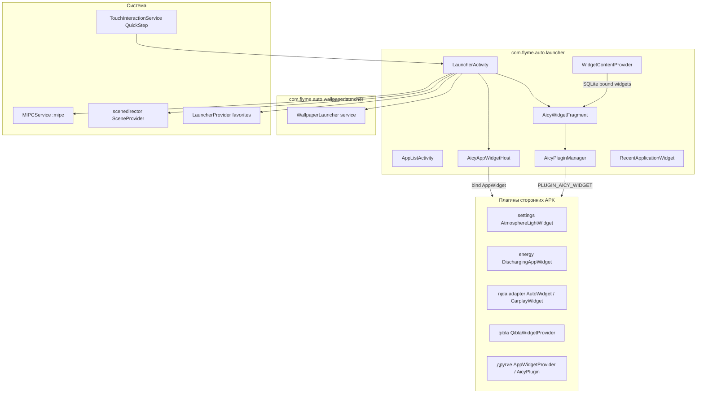

# com.flyme.auto.launcher — справочник по разбору APK (Lib / AutoLauncher)

Документ описывает системное приложение **Lib** / **AutoLauncher** (`com.flyme.auto.launcher`) с головного устройства Geely **IHU629G**: домашний экран Flyme Auto, список приложений, **карточки виджетов (Aicy Widget)**, недавние приложения, интеграция с обоями, Scene Mode, Flyme Link и MIPC.

**Важно:** это **не** live wallpaper (`com.flyme.auto.wallpaperlauncher`) и **не** шторка SystemUI (`com.geely.controlcenter`). Лаунчер — **HOME-приложение** и **хост виджетов** на главном экране.

---

## 0. Обзор приложения

| Параметр | Значение |
|----------|----------|
| Пакет | `com.flyme.auto.launcher` |
| Label (RU/EN) | **Lib** |
| Label (ZH) | **Launcher3** |
| versionCode | `26012721` |
| versionName | `flyme.beta.(AutoLauncher)(none)(26012721)(12c8a3f)` |
| minSdk / targetSdk | 28 / 33 |
| compileSdk | 33 (Android 13) |
| Application | `com.flyme.auto.launcher.LauncherApplication` |
| Главная Activity | `com.flyme.auto.launcher.main.LauncherActivity` (`HOME` / `DEFAULT`) |
| DEX | `classes.dex` + `classes2.dex` + `classes3.dex` (~25.5 MB суммарно) |
| Размер APK | ~34.6 MB |
| Native | `arm64-v8a` (`extractNativeLibs=false`) |

**Назначение:**

1. **Домашний экран** — обои (через `WallpaperService` стороннего APK), сетка **Aicy-карточек**, dock / быстрый доступ.
2. **Редактор виджетов** — экран «Нажмите + или перетащите иконку для добавления в меню» (`AicyWidgetFragment`).
3. **Список приложений** — `AppListActivity` (`ALL_APPS`), мини-приложения, поиск, сортировка.
4. **Недавние приложения** — встроенный виджет `RecentApplicationWidget` + политики энергосбережения.
5. **Жесты / Recents** — QuickStep (`TouchInteractionService`), обработка свайпов.
6. **Интеграции** — Scene Director (`sysui_alive_launcher_settings`), Flyme Link / Cast, MIPC, Car UI plugin host.

**База кода (по dex):**

| Пакет | Классов (≈) | Роль |
|-------|-------------|------|
| `com.android.launcher3.*` | 1866 | AOSP Launcher3 (workspace, icons, backup) |
| `com.android.quickstep.*` | 528 | Recents, жесты, TouchInteractionService |
| `com.flyme.auto.launcher.*` | 854 | Flyme-надстройка (Aicy, applist, link, cast) |
| `com.flyme.auto.*` (plugin SDK) | 2005 | `AicyPlugin`, `PluginManager`, SmartBar/StatusBar plugins |
| `com.geely.*` | 71 | EnergyManageReceiver, recent policies |
| `com.ecarx.*` | 725+ | LauncherAPI, VR, adapt API stubs |
| `com.njda.adapter.*` | 267 | AA/CarPlay widget views (вшиты в dex лаунчера) |

---

## 1. Источник и артефакты

| Параметр | Значение |
|----------|----------|
| Платформа (источник дампа) | IHU629G |
| Исходный APK (ADBAppControl) | `downloads/250060 IHU629G/Lib (com.flyme.auto.launcher) [v.flyme.beta.(AutoLauncher)(none)(26012721)(12c8a3f)].apk` |
| Локальная копия | `.tmp/flyme-launcher.apk` |
| Распакованный APK | `.tmp/flyme-launcher-apk/` |
| aapt dump | `.tmp/flyme-launcher-badging.txt`, `.tmp/flyme-launcher-manifest.txt` |
| Анализ dex | `.tmp/flyme-launcher-analysis.txt`, `.tmp/flyme-launcher-strings.txt` |

### Получить APK с устройства

```bash
adb shell pm path com.flyme.auto.launcher
adb pull /system/app/.../AutoLauncher.apk .tmp/flyme-launcher.apk
```

### Распаковать и искать

```powershell
Copy-Item -LiteralPath ".tmp\flyme-launcher.apk" -Destination ".tmp\flyme-launcher.zip"
Expand-Archive -LiteralPath .tmp\flyme-launcher.zip -DestinationPath .tmp\flyme-launcher-apk -Force

$aapt = (Get-ChildItem "$env:LOCALAPPDATA\Android\Sdk\build-tools" -Recurse -Filter "aapt.exe" | Select-Object -First 1).FullName
& $aapt dump badging .tmp\flyme-launcher.apk
& $aapt dump xmltree .tmp\flyme-launcher.apk AndroidManifest.xml
& $aapt dump --values resources .tmp\flyme-launcher.apk | Select-String "aicy_widget"
```

**JADX** — ключевые пакеты: `com.flyme.auto.launcher.main.aicy`, `com.flyme.auto.launcher.applist`, `com.flyme.auto.launcher.main`, `com.android.launcher3`.

---

## 2. Архитектура



**Поток данных виджетов:**

1. Сторонний APK регистрирует `AppWidgetProvider` и/или `com.flyme.auto.plugin.launcher.AicyPlugin`.
2. Лаунчер сканирует whitelist (`all_aicy_widget_whitelist`) и показывает карточки в режиме редактирования.
3. Пользователь добавляет карточку → запись в `WidgetContentProvider` (`content://com.flyme.auto.launcher.aicywidget/`).
4. На главном экране `AicyAppWidgetHost` биндит remote views провайдера.

---

## 3. UI и навигация

### 3.1 Activities

| Activity | Launch mode | Intent | Назначение |
|----------|-------------|--------|------------|
| `main.LauncherActivity` | `singleTask` | `MAIN` + `HOME` + `DEFAULT` | Домашний экран |
| `applist.AppListActivity` | `singleTask` | `ALL_APPS` | Полный список приложений |
| `superlauncher.cast.CastSinkActivity` | `singleTask` | — | Приём Cast (процесс `:app_cast`) |
| `com.flyme.auto.core.launcherflow.CastSinkActivity` | `singleTask` | — | Flyme Link / launcherflow cast |
| `main.MonkeyTestActivity` | standard | `MAIN`/`LAUNCHER` | Тестовая (disabled) |
| `launcher3.proxy.ProxyActivityStarter` | `singleTask` | — | Прокси для permission/intent |
| `androidx.car.app.CarAppPermissionActivity` | — | — | Разрешения Car App |

```bash
# Домашний экран (если не default launcher)
adb shell am start -n com.flyme.auto.launcher/.main.LauncherActivity

# Список всех приложений
adb shell am start -a android.intent.action.ALL_APPS \
  -n com.flyme.auto.launcher/.applist.AppListActivity
```

### 3.2 Главный экран (фрагменты, по dex)

| Класс | Назначение |
|-------|------------|
| `DesktopFragmentContainer` | Контейнер рабочего стола |
| `DesktopWidgetFragment` | Legacy desktop widgets (Launcher3) |
| `AicyWidgetFragment` | **Редактор / сетка Aicy-карточек** |
| `MapPluginFragment` | Встроенная карта (plugin page) |
| `AliveDesktopWrapper` | «Живой» рабочий стол / интеграция Scene Mode |

### 3.3 Тексты UI редактора виджетов (RU, из APK)

| Строка | Контекст |
|-------|----------|
| **Рекомендации по применению** | Заголовок встроенной карточки-рекомендаций (не отдельный APK) |
| **Нажмите + или перетащите иконку для добавления в меню** | Подсказка в режиме редактирования |
| **Готово** | Сохранить раскладку |
| **Сброс** | Вернуть виджеты по умолчанию |

Карточка «Рекомендации по применению» — **часть лаунчера** (`RECOMMENDED_WIDGETS_*`, `from recommend widget list` в dex). Массив `recommend_aicy_widget` в ресурсах **пустой** (Count=0) — список, вероятно, дополняется в runtime (предикат `RECOMMENDED_WIDGETS_PREDICATION`).

---

## 4. Система Aicy Widget

### 4.1 Ключевые классы

| Класс | Назначение |
|-------|------------|
| `main.aicy.AicyWidgetFragment` | UI редактирования: верхний ряд «доступные», нижний «на главной» |
| `main.aicy.AicyAppWidgetHost` | Кастомный `AppWidgetHost` (host id `APPWIDGET_HOST_ID`) |
| `main.aicy.AicyAppWidgetHostView` | Обёртка remote view карточки |
| `main.aicy.AicyPluginManager` | Загрузка `AicyPlugin` из сторонних APK |
| `main.aicy.WidgetContentProvider` | SQLite: привязанные виджеты, порядок, профили |
| `main.aicy.BoundWidgetModel` / `BoundWidgetAdapter` | Карточки на главном экране |
| `main.aicy.AllWidgetAdapter` | Каталог доступных карточек (+) |
| `main.aicy.WidgetViewModel` | Логика add/remove/reorder, install/uninstall |
| `main.aicy.AicyWidgetClickHandler` | Клики по карточкам |
| `main.aicy.PluginWidgetProviderInfo` | Метаданные plugin-widget |
| `main.aicy.WidgetConstants` | Размеры, анимации, состояния `AICY_STATE_EDIT` / `AICY_STATE_NOMAL` |
| `main.aicy.anim.EditPanelTransitionController` | Анимация панели редактирования |

### 4.2 ContentProvider виджетов

| Authority | Путь | Назначение |
|-----------|------|------------|
| `com.flyme.auto.launcher.aicywidget` | `/` | Корень |
| | `/aicy_widget_default` | Профиль виджетов по умолчанию |
| | `/aicy_widget_demo` | Демо-профиль (шоурум) |

```bash
adb shell content query --uri content://com.flyme.auto.launcher.aicywidget/
adb shell content query --uri content://com.flyme.auto.launcher.aicywidget/aicy_widget_default
```

### 4.3 Массивы конфигурации (`res/values/arrays.xml`)

#### `all_aicy_widget_whitelist` — все карточки, доступные для добавления (13)

| # | Component `package/class` | APK на IHU629G |
|---|---------------------------|----------------|
| 1 | `com.flyme.auto.launcher/.widget.RecentApplicationWidget` | launcher (встроенный) |
| 2 | `com.geely.linkhmi/...AicyAppWidget` | Flyme Link HMI |
| 3 | `com.flyme.auto.music/...MusicRecommendWidget` | Музыка (нет в вашем дампе) |
| 4 | `com.flyme.auto.settings/...AtmosphereLightWidget` | Настройки |
| 5 | `com.flyme.auto.energy/...DischargingAppWidget` | Мощность |
| 6 | `com.flyme.auto.music/...MusicLinkWidget` | Музыка |
| 7 | `com.flyme.auto.localmusic.usb/...HarmanWidget` | USB музыка |
| 8 | `com.wanos.media/...WanosAppWidget` | Wanos (нет в дампе) |
| 9 | `com.geely.gc.cloudautoclient/...CloudWidgetProvider` | Облако Geely |
| 10 | `com.baidu.che.codriver/...WordsChainWidgetProvider` | Baidu VR |
| 11 | `com.dafang.qibla.finder/...QiblaWidgetProvider` | Qibla |
| 12 | `com.njda.adapter/...AutoWidget` | Android Auto |
| 13 | `com.njda.adapter/...CarplayWidget` | Apple CarPlay |

#### `default_aicy_widget` — раскладка «по умолчанию» после сброса (8)

Те же провайдеры, что часто видны на скриншотах: Recent, Cloud, MusicRecommend, Baidu, Energy, Qibla, AutoWidget, CarplayWidget.

**Примечание:** `AtmosphereLightWidget` есть в whitelist, но **не** в default — пользователь добавляет вручную (как на вашем скрине).

#### `demo_aicy_widget` / `demo_aicy_widget_whitelist`

Для режима **модельного зала** (`com.flyme.auto.exhibit`) — другой набор карточек.

#### `recommend_aicy_widget`

Пустой в APK → заполняется динамически для блока «Рекомендации по применению».

### 4.4 Встроенный виджет лаунчера

| Receiver | Action | Назначение |
|----------|--------|------------|
| `widget.RecentApplicationWidget` | `APPWIDGET_UPDATE`, `com.flyme.auto.launcher.action.RECENT_APPLICATION_CLICKED` | Карточка недавних приложений |

Связанные классы: `RecentApplicationRepository`, `RecentAppInfo`, `RecentApplicationViewModel`.

### 4.5 Broadcast / action лаунчера для виджетов

| Action | Назначение |
|--------|------------|
| `com.flyme.auto.launcher.action.TOGGLE_AICY_WIDGET` | Переключить режим редактирования карточек |
| `com.flyme.auto.launcher.action.RECENT_APPLICATION_CLICKED` | Клик по иконке в Recent widget |
| `com.flyme.auto.launcher.CLOSE_APP_LIST_ACTION` | Закрыть список приложений |
| `com.flyme.auto.launcher.CLOSE_LAUNCHER_DIALOG` | Закрыть overlay-диалог |

---

## 5. Plugin SDK (как сторонние APK попадают на главный)

Flyme использует общий SDK `com.flyme.auto.plugin` (классы есть и в лаунчере, и в Settings/Energy).

### 5.1 Actions плагинов

| Action | Кто подписывается | Назначение |
|--------|-------------------|------------|
| `com.flyme.auto.plugin.action.PLUGIN_AICY_WIDGET` | `AicyPluginManager` | Карточка на главном экране |
| `com.flyme.auto.plugin.action.PLUGIN_LAUNCHER_PAGE` | Launcher | Полноэкранная страница в dock |
| `com.flyme.auto.plugin.action.PLUGIN_FLOATING_WIDGET` | Launcher | Плавающий виджет |
| `com.flyme.auto.plugin.action.PLUGIN_SMART_BAR` | SystemUI | Нижняя панель |
| `com.flyme.auto.plugin.action.PLUGIN_STATUS_BAR` | SystemUI | Статус-бар / шторка |

### 5.2 Паттерн в стороннем APK

Типичная связка (по dex Settings / Energy / WirelessCharging):

```text
AppWidgetProvider          → стандартный Android widget (RemoteViews)
com.flyme.auto.plugin.launcher.AicyPlugin → Flyme plugin entry
com.flyme.auto.plugin.launcher.FloatingWidgetFragment → опционально
```

**Примеры на IHU629G:**

| Карточка | APK | Класс виджета |
|----------|-----|---------------|
| Атмосферная подсветка | `com.flyme.auto.settings` | `receiver.AtmosphereLightWidget` |
| Зарядка устройств | `com.flyme.auto.energy` | `appwidget.DischargingAppWidget` |
| Android Auto | `com.njda.adapter` | `view.AutoWidget` |
| Apple CarPlay | `com.njda.adapter` | `view.CarplayWidget` |
| Qibla | `com.dafang.qibla.finder` | `widget.QiblaWidgetProvider` |

`com.njda.aauto` / `com.njda.carplay` сами по себе **не** экспортируют AppWidget — виджеты идут через **`com.njda.adapter`**.

### 5.3 Как попасть в каталог карточек

1. Реализовать `AppWidgetProvider` + `android.appwidget.provider` meta-data (`widgetCategory` включает home).
2. (Рекомендуется) Добавить `AicyPlugin` с action `PLUGIN_AICY_WIDGET`.
3. Пакет должен быть установлен на ГУ; лаунчер подхватит провайдер, если он в whitelist **или** зарегистрирован как обычный AppWidget (динамическое обнаружение через `AppWidgetManager`).

Для **geely_ex2_tools** уже есть `BatteryAppWidgetProvider` с `widgetCategory="home_screen"` — теоретически может появиться в каталоге, но **не** входит в OEM whitelist IHU629G.

---

## 6. ContentProvider и настройки лаунчера

| Provider | Authority | RW permission | Назначение |
|----------|-----------|---------------|------------|
| `LauncherProvider` | `com.flyme.auto.launcher.settings` | `READ_SETTINGS` / `WRITE_SETTINGS` | Избранное Launcher3 (`favorites`) |
| `WidgetContentProvider` | `com.flyme.auto.launcher.aicywidget` | internal | Aicy widgets DB |
| `AppContentProvider` | `com.flyme.auto.launcher.apps` | `WRITE_APPS` | Список/раскладка приложений |
| `LauncherFlowDataProvider` | `com.flyme.auto.launcher.flow.apps` | exported | Flyme Link flow apps |
| `AutoLauncherProvider` | `com.flyme.auto.launcher.autoLauncher` | exported | Состояние auto launcher |
| `GridCustomizationsProvider` | `com.flyme.auto.launcher.grid_control` | exported | Сетка иконок |
| `PreferencesProvider` | `com.flyme.auto.launcher.preferences.provider` | not exported | Flyme Data SDK prefs |

```bash
adb shell content query --uri content://com.flyme.auto.launcher.settings/favorites
adb shell content query --uri content://com.flyme.auto.launcher.apps/apps
```

### Custom permissions

| Permission | protection | Назначение |
|------------|------------|------------|
| `…permission.READ_APPS` | signature | Чтение списка приложений |
| `…permission.WRITE_APPS` | signature | Запись раскладки |
| `…permission.READ_SETTINGS` | signature | Launcher3 settings |
| `…permission.WRITE_SETTINGS` | signature | Launcher3 settings |
| `…permission.KILL_TASKS` | signature | EnergyManageReceiver |

---

## 7. Сервисы и фоновая логика

| Service | process | Назначение |
|---------|---------|------------|
| `TouchInteractionService` | main | QuickStep: жесты, recents |
| `NotificationListener` | main | Бейджи / уведомления на иконках |
| `DialerInterceptService` | main | Перехват `com.android.dialer.action.openDialer` |
| `MIPCService` (`com.flyme.auto.mipcser`) | `:mipc` | Шина MIPC (жесты обоев, Car3D) |
| Car UI installers | `:car_ui` | `CarUiInstaller`, `SearchResultsProvider` |

| Receiver | Назначение |
|----------|------------|
| `SessionCommitReceiver` | Установка APK → иконка на рабочий стол |
| `AppWidgetsRestoredReceiver` | Восстановление виджетов после backup |
| `EnergyManageReceiver` | `KILL_PROCESS_ENERGY_SAVING` — убить фоновые приложения |

---

## 8. Списки приложений и энергосбережение

### 8.1 `app_presorts_list` (порядок в списке приложений, фрагмент)

Первые позиции: Settings, AVM calibration, AVM, Energy, Map, Dialer, Music, BT/USB/Radio music, DAB…

### 8.2 `filtered_components` (скрыты из лаунчера)

- `com.flyme.auto.setup` (онбординг)
- `ecarx.engineeringmodel` (инженерка)

### 8.3 Recent apps policy

| Массив | Назначение |
|--------|------------|
| `recent_app_exclude_list` | Не показывать в recent widget (launcher, map, scenedirector, avm, qibla…) |
| `recent_energy_manage_blacklist` | Убивать при энергосбережении (music, browser, carlink…) |
| `recent_performance_blacklist` | Blacklist для performance mode |
| `recent_performance_whitelist` | Whitelist системных пакетов (53) |
| `recent_performance_whitelist_DAB` | Расширенный whitelist (95) |

```bash
adb shell am broadcast -a com.flyme.auto.launcher.action.KILL_PROCESS_ENERGY_SAVING
```

---

## 9. Интеграция с другими APK

| Связанный APK | Механизм | Документ |
|---------------|----------|----------|
| `com.flyme.auto.wallpaperlauncher` | Wallpaper + MIPC жесты от лаунчера | [flyme-wallpaperlauncher-apk.md](./flyme-wallpaperlauncher-apk.md) |
| `com.flyme.auto.scenedirector` | `sysui_alive_launcher_settings`, AliveDesktop | [flyme-scenedirector-apk.md](./flyme-scenedirector-apk.md) |
| `com.flyme.auto.settings` | `AtmosphereLightWidget`, intents в Settings | [flyme-settings-apk.md](./flyme-settings-apk.md) |
| `com.flyme.auto.energy` | `DischargingAppWidget`, energy kill lists | [flyme-energy-apk.md](./flyme-energy-apk.md) |
| `com.njda.adapter` | AA/CP widgets | — |
| `com.geely.controlcenter` | Отдельная шторка (не карточки HOME) | — |
| `com.flyme.auto.customize` | Темы/обои (косвенно через wallpaper) | [flyme-customize-apk.md](./flyme-customize-apk.md) |

### Settings.Secure / System (пересечения)

| Key | Назначение |
|-----|------------|
| `sysui_alive_launcher_settings` | Режим «живого» рабочего стола / Scene (см. Scene Director) |
| `sysui_proxy` | Прокси SystemUI |
| `wallpaper_launcher_current_wallpaper_path` | Текущие обои (читает wallpaper APK) |

```bash
adb shell settings get secure sysui_alive_launcher_settings
```

---

## 10. Flyme Link / Cast / LauncherFlow

| Компонент | Назначение |
|-----------|------------|
| `superlauncher.cast.CastSinkActivity` | Приём зеркалирования |
| `com.flyme.auto.core.launcherflow.CastSinkActivity` | LauncherFlow cast sink |
| `link.LauncherFlowDataProvider` | `content://com.flyme.auto.launcher.flow.apps/apps` |
| meta-data `app_unite_code` = `com.flyme.auto.launcherflow` | Идентификатор unite SDK |

В dex: protobuf `LauncherDataMessage`, `LauncherEventMessage`, `CastMessage`, `ucar.proto` — протокол связи с телефоном.

---

## 11. Карта пакетов Flyme-надстройки

```text
com.flyme.auto.launcher
├── LauncherApplication
├── main/
│   ├── LauncherActivity
│   ├── AicyWidgetFragment          # редактор карточек
│   ├── aicy/                       # 158 классов — widget host
│   ├── AliveDesktopWrapper         # scene / alive desktop
│   ├── DesktopWidgetFragment
│   ├── MapPluginFragment
│   └── manager/AutoLauncherProvider
├── applist/
│   ├── AppListActivity
│   ├── AppContentProvider
│   └── miniapp/                    # мини-приложения
├── widget/
│   └── RecentApplicationWidget
├── superlauncher/
│   ├── cast/
│   └── indexsearch/
├── link/                           # Flyme Link
└── util/PluginManagerWrapper
```

---

## 12. Использование из geely_ex2_tools

### 12.1 Открыть домашний экран / список приложений

```bash
adb shell am start -n com.flyme.auto.launcher/.main.LauncherActivity
adb shell am start -a android.intent.action.ALL_APPS \
  -n com.flyme.auto.launcher/.applist.AppListActivity
```

### 12.2 Режим редактирования виджетов

```bash
adb shell am broadcast -a com.flyme.auto.launcher.action.TOGGLE_AICY_WIDGET \
  -p com.flyme.auto.launcher
```

(Точные extras зависят от версии; при отсутствии эффекта — long-press на пустой области главного экрана в UI.)

### 12.3 Свой App Widget на главной

Текущий `BatteryAppWidgetProvider` (`widgetCategory=home_screen`) — стандартный Android App Widget. Чтобы карточка стабильно появлялась в OEM-каталоге Flyme:

1. Добавить `AicyPlugin` (action `PLUGIN_AICY_WIDGET`) по образцу Energy/Settings.
2. Запросить попадание в `all_aicy_widget_whitelist` (на стоковом ГУ — только OEM).
3. Альтернатива без whitelist: пользователь вручную добавляет через «+», если виджет виден `AppWidgetManager`.

**Не путать** с виджетами **шторки** (Wi‑Fi/батарея в EX2 Tools) — они идут через `PLUGIN_STATUS_BAR` / Control Center, не через Aicy.

### 12.4 Чтение раскладки виджетов (system app)

```bash
adb shell content query --uri content://com.flyme.auto.launcher.aicywidget/aicy_widget_default
```

Требует системных прав или shell на rooted/system image.

---

## 13. Отладка

```bash
# Процессы лаунчера
adb shell pidof com.flyme.auto.launcher
adb shell ps -A | grep launcher

# Логи Aicy / Launcher
adb logcat -s AicyWidgetFragment AicyPluginManager LauncherActivity \
  AicyAppWidgetHost WidgetContentProvider FlymeLauncher

# MIPC (обои / жесты)
adb logcat -s MIPCService MIPCImpl

# Провайдеры виджетов на устройстве
adb shell dumpsys appwidget | grep -A2 "flyme.auto.launcher\|njda.adapter\|flyme.auto.settings\|flyme.auto.energy"

# Текущие bound widgets
adb shell content query --uri content://com.flyme.auto.launcher.aicywidget/
```

---

## 14. Permissions (выборка)

Лаунчер — привилегированное приложение с широким набором разрешений:

- Управление задачами: `MANAGE_ACTIVITY_TASKS`, `REORDER_TASKS`, `REMOVE_TASKS`, `REAL_GET_TASKS`
- Окна: `SYSTEM_ALERT_WINDOW`, `INTERNAL_SYSTEM_WINDOW`, `INJECT_EVENTS`, `MONITOR_INPUT`
- Пакеты: `QUERY_ALL_PACKAGES`, `INSTALL_PACKAGES`, `DELETE_PACKAGES`, `FORCE_STOP_PACKAGES`
- Виджеты: `BIND_APPWIDGET`
- Авто: `CAR_POWERTRAIN`, `CAR_IDENTIFICATION`, `ACCESS_CAR_PROJECTION_STATUS`
- Обои: `SET_WALLPAPER`, `SET_WALLPAPER_COMPONENT`
- Flyme: `com.flyme.auto.mipc`, `com.flyme.auto.data.permission.DATA`, `FLYME_LINK_*`

---

## 15. Связанные документы

| Документ | Связь |
|----------|-------|
| [flyme-wallpaperlauncher-apk.md](./flyme-wallpaperlauncher-apk.md) | Фон главного экрана, MIPC |
| [flyme-scenedirector-apk.md](./flyme-scenedirector-apk.md) | Scene Mode, `sysui_alive_launcher_settings` |
| [flyme-settings-apk.md](./flyme-settings-apk.md) | `AtmosphereLightWidget` |
| [flyme-energy-apk.md](./flyme-energy-apk.md) | `DischargingAppWidget`, energy kill |
| [flyme-customize-apk.md](./flyme-customize-apk.md) | Темы/обои |
| [README.md](./README.md) | Индекс документации |

---

## 16. Как найти новую функцию в APK

```powershell
# Строка в APK
Select-String -Path .tmp\flyme-launcher.apk -Pattern "AicyWidget" -Encoding byte  # или python bytes search

# Классы
& $dexdump -d .tmp\flyme-launcher-apk\classes2.dex | Select-String "AicyWidget|PluginWidget"

# Ресурсы whitelist
& $aapt dump --values resources .tmp\flyme-launcher.apk | Select-String "aicy_widget"
```

Типичные точки входа:

- Новая карточка → `all_aicy_widget_whitelist` + `AppWidgetProvider` в другом APK
- Новый экран dock → `PLUGIN_LAUNCHER_PAGE`
- Поведение recent → `recent_*` arrays + `EnergyManageReceiver`
