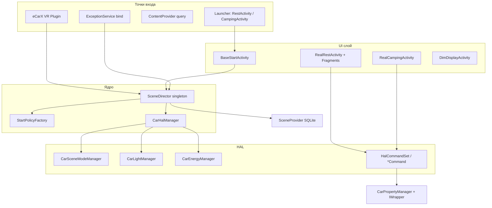

# com.flyme.auto.scenedirector — справочник по разбору APK (Scene Mode / 情景空间)

Документ описывает штатное приложение **Scene Mode** (`com.flyme.auto.scenedirector`) с головного устройства Geely **IHU629G**: сценарные режимы «Отдых» (Nap/Rest), «Кемпинг» (Camping), управление автомобилем через **eCarX AdaptAPI** + **Android Car VHAL**, VR-плагин eCarX и публичный **ContentProvider** для других системных приложений.

**RU label в лаунчере:** «Площадь места действия» (локализация `application-label-ru`).  
**EN label:** Scene Mode. **CN label:** 情景空间.

Системные зависимости **не входят в APK**, но используются активно:

- `com.ecarx.xui.adaptapi` — `IWrapper`, маппинг vendor function id → VHAL property id
- `android.car` — `CarPropertyManager`
- `com.flyme.auto.data` — SDK настроек / `PreferencesProvider`
- eCarX EAS VR — `DecouplingProxy`, `SDOpenPageService`

---

## 0. Обзор приложения

| Параметр | Значение |
|----------|----------|
| Пакет | `com.flyme.auto.scenedirector` |
| Label (RU) | **Площадь места действия** |
| Label (EN) | **Scene Mode** |
| Label (CN) | **情景空间** |
| versionCode | `26012722` |
| versionName | `flyme.beta.(AutoSceneDirector)(null)(26012722)(6bb880e)` |
| minSdk / targetSdk | 28 / 32 |
| compileSdk | 34 (Android 14) |
| sharedUserId | **нет** (в манифесте не объявлен) |
| Application | `com.flyme.auto.scenedirector.SceneDirectorApplication` (`@HiltAndroidApp`) |
| Центральный оркестратор | `com.flyme.auto.scenedirector.SceneDirector` (singleton) |
| Launcher Activity (2) | `RestActivity` (Rest Mode), `CampingActivity` (Camping Mode) |
| DEX | `classes.dex` (~8.3 MB, основная логика), `classes2.dex` (Hilt), `classes3.dex` (Kotlin stdlib) |
| Native `.so` | `libglrenderer.so`, `libmmkv.so` (`extractNativeLibs=false`) |
| Размер APK | ~219 MB (BGM, видео, ресурсы сцен) |
| Аналитика | SensorsData v0.3.2 |
| eCarX OpenAPI | AppId `211056309cc24717ba38ab4b7ef3811c`, OpenAPI 4.6.20 |

**Назначение:** управление **сценарными режимами** на Flyme Auto HU — координация UI, HAL-команд (сиденья, климат, свет, окна, DIM/HUD), проверок перед запуском, VR-команд и публикации текущего режима для лаунчера / System UI.

**Поддерживаемые сцены (по `SceneStateSpec`):**

| Константа | Значение (int) | Hex (scene bits) | UI / политика запуска |
|-----------|----------------|------------------|------------------------|
| `DEFAULT` | `0` | — | нет активной сцены |
| `NAP` | `67108864` | `0x04000000` | Rest Mode — `RestStartPolicy` |
| `PET` | `134217728` | `0x08000000` | имя в VR-слотах; отдельной Activity в манифесте нет |
| `CAMPING` | `201326592` | `0x0C000000` | Camping Mode — `CampingStartPolicy` |
| `WASH` | `603979776` | `0x24000000` | код `CarWashManager` / `ScreenCleanActivity` в dex; **Activity не в манифесте этой сборки** |

**Стек (по dex/JADX):**

- `SceneDirectorApplication` → `CarHalManager.init()` → цепочка `AndroidStartup` (Voice, SceneDirector, Alarm, VR vision, UsageStats, GL renderer, TTS)
- Сцены: `BaseStartActivity` → `RestActivity` / `CampingActivity` → `RealRestActivity` / `RealCampingActivity`
- HAL: `CarHalManager` → `Car*Manager` + `HalCommandSet` / `*Command`
- VR: `VoiceServiceStartup` → `DecouplingProxy.registerPluginCallBack` → `VoiceRecognition`
- Состояние: `SceneProvider` (`content://com.flyme.auto.scenedirector/scene`) + `Settings.Secure`

---

## 1. Источник и артефакты

| Параметр | Значение |
|----------|----------|
| Платформа (источник дампа) | IHU629G |
| Исходный APK (ADBAppControl) | `downloads/250060 IHU629G/Площадь места действия (com.flyme.auto.scenedirector) [v.flyme.beta.(AutoSceneDirector)(null)(26012722)(6bb880e)].apk` |
| Локальная копия | `.tmp/flyme-scenedirector.apk` |
| Распакованный APK | `.tmp/flyme-scenedirector-apk/` |
| JADX | `.tmp/flyme-scenedirector-jadx/` |

### Получить APK с устройства

```bash
adb shell pm path com.flyme.auto.scenedirector
adb pull /system/app/.../SceneDirector.apk .tmp/flyme-scenedirector.apk
```

### Распаковать и искать

```powershell
Copy-Item -LiteralPath ".tmp\flyme-scenedirector.apk" -Destination ".tmp\flyme-scenedirector.zip"
Expand-Archive -LiteralPath .tmp\flyme-scenedirector.zip -DestinationPath .tmp\flyme-scenedirector-apk -Force

$aapt = (Get-ChildItem "$env:LOCALAPPDATA\Android\Sdk\build-tools" -Recurse -Filter "aapt.exe" | Select-Object -First 1).FullName
& $aapt dump badging .tmp\flyme-scenedirector.apk
& $aapt dump xmltree .tmp\flyme-scenedirector.apk AndroidManifest.xml
```

**JADX** — основной инструмент для `SceneDirector`, `CarHalManager`, `RestActivity`, `CampingPresenter`, `CarWashManager`.

### Структура DEX

| Файл | Содержимое |
|------|------------|
| `classes.dex` | `com.flyme.auto.scenedirector.*`, eCarX EAS/VR, HAL, UI |
| `classes2.dex` | Hilt/Dagger generated |
| `classes3.dex` | Kotlin reflect / stdlib |

### Assets (выборочно)

| Путь | Назначение |
|------|------------|
| `assets/bg/*.mp3` | BGM для Rest (aurora, rain, waves, …) |
| `assets/alarm/Rest_Mode_Alarm.wav` | будильник Rest |
| `assets/v_car_wash.mp4`, `v_screen_clean.mp4` | видео для wash/clean (код есть, UI не в манифесте) |
| `assets/vision/vision_data.json` | данные VR vision control |

---

## 2. Архитектура



### 2.1 Жизненный цикл сцены

1. **Старт:** `SceneDirector.startScene(scene, slotName, json)` → `StartPolicyFactory.getStartPolicy(scene).checkPrecondition()` (цепочка checkpoint'ов) → `getSceneIntent()` → `startActivity`.
2. **Активная сцена:** `onSceneStart()` → запись в `SceneProvider` + `Settings.Secure sysui_alive_launcher_settings`.
3. **Стоп:** `stopScene()` / finish UI → HAL restore через `ExceptionService` / presenters → `onSceneStop()`.

**Коды ответа precondition (`SceneResponse`):**

| Code | Смысл |
|------|--------|
| `200` | OK, можно запускать |
| `300` | неисправность / HAL недоступен |
| `301` | низкий заряд (< порога, см. §4.3) |
| `302` | не P-gear |
| `303` | malfunction (доп.) |
| conflict | другая сцена уже активна (`SceneConflictCheckpoint`) |

---

## 3. Компоненты манифеста

### 3.1 Activities

| Activity | exported | taskAffinity | Intent / роль |
|----------|----------|--------------|---------------|
| `activities.nap.RestActivity` | yes | `…rest.task` | `MAIN`/`LAUNCHER`, `android.intent.action.START_REST` |
| `activities.nap.RealRestActivity` | no | `…rest.task` | полноэкранный Rest после стартового экрана |
| `activities.camping.CampingActivity` | yes | `…camping.task` | `MAIN`/`LAUNCHER`, `android.intent.action.START_CAMPING` |
| `activities.camping.RealCampingActivity` | no | `…camping.task` | активный Camping UI |
| `activities.nap.DimDisplayActivity` | no | — | вывод на DIM (приборка) |
| `activities.DebugActivity` | no | — | отладка |

Все launcher/exported Activity помечены `distractionOptimized=true`.

**Rest — фрагменты (`RealRestActivity`):** `StartFragment`, `IdleFragment`, `RunningFragment`, `BackgroundFragment`, `StopByTimeFragment`, `StopByUserFragment`, `StopByLowBatteryFragment`, `StopByExceptionFragment`.

### 3.2 Services

| Service | permission | Назначение |
|---------|------------|------------|
| `SDOpenPageService` | exported | VR decoupling binder: `com.ecarx.DECOUPLING` / `android.ecarx.category.DECOUPLING` |
| `ExceptionService` | `com.flyme.auto.scenedirector.STOP_SCENE_PERMISSION` | сброс сцены при bind без активной Activity (аварийное восстановление HAL/света/DIM) |

`ecarx_register_info` в meta-data:

```text
com.flyme.auto.scenedirector;com.flyme.auto.scenedirector.service.SDOpenPageService;vr_all;plugin;com.flyme.auto.scenedirector
```

### 3.3 Provider / Receiver / Widget

| Компонент | URI / action | Назначение |
|-----------|--------------|------------|
| `SceneProvider` | `content://com.flyme.auto.scenedirector/scene` | SQLite `scene_director.db`, таблица `scene` |
| `RestAppWidgetProvider` | `APPWIDGET_UPDATE` | виджет быстрого запуска Rest |
| `BootReceiver` | `BOOT_COMPLETED`, `com.honeywell.intent.action.BOOT_COMPLETED` | `PropertyManagerFactory.getPropertyManager(NAP).reset()` |
| `PreferencesProvider` | `…scenedirector.preferences.provider` | Flyme Data SDK (не exported) |

### 3.4 Custom permissions

| Permission | protection | Использование |
|------------|------------|---------------|
| `…permission.PROVIDER_READ` | signature | чтение `SceneProvider` |
| `…permission.PROVIDER_WRITE` | signature | запись `SceneProvider` |
| `…permission.SEND_HOME_KEY_STOP_SCENE` | signature | Home → stop scene |
| `…STOP_SCENE_PERMISSION` | signatureOrSystem | bind `ExceptionService` |

---

## 4. HAL, VHAL и AdaptAPI

`CarHalManager` инициализирует `Car.createWrapper()` + `com.ecarx.xui.adaptapi.car.Car.create()`, затем поднимает менеджеры: `CarSceneModeManager`, `CarDisplayManager`, `CarEnergyManager`, `CarLightManager`, `CarSeatManager`, `CarWindowManager`, `CarHvacManager`, `CarPowerTrainManager`, `CarVehicleManager`.

Маппинг vendor id → VHAL: `IWrapper.getWrappedPropertyId(2, vendorFuncId)` (type `2` = vendor extension).

### 4.1 Scene mode switches (`CarSceneModeManager`)

| eCarX / лог | Vendor func id | Hex | Метод |
|-------------|----------------|-----|--------|
| `SCENE_FUNC_PARKING_COMFORT_SWITCH` (Camping) | `788662528` | `0x2F010000` | `setCampingMode(boolean)` |
| `SCENE_FUNC_NAP_MODE` (Rest) | `788726784` | `0x2F020000` | `setNapMode(boolean)` |

### 4.2 Display / DIM (`CarDisplayManager`)

| eCarX / лог | Vendor func id | Hex |
|-------------|----------------|-----|
| `IHUD.SETTING_FUNC_HUD_ACTIVE` | `537985280` | `0x20100000` |
| `SETTING_FUNC_SCENE_MODE_CAST_STATE` | `539560448` | `0x20280000` |
| `SETTING_FUNC_SCENE_MODE_CAST_SWITCH` | `539560704` | `0x20280100` |
| `SETTING_FUNC_SCENE_MODE_DIM_BRIGHTNESS_STATE` | `539560960` | `0x20280200` |
| `SETTING_FUNC_BRIGHTNESS_DIM` | `687999232` | `0x29000000` |
| `SETTING_FUNC_BRIGHTNESS_DIM_AUTO_ADJUST` | `688064512` | `0x29010000` |
| `SETTING_FUNC_AUTO_SHOW_MODE` | `537857024` | `0x20090000` |
| `SETTING_FUNC_AUTO_SHOW_MODE_HVAC_CONTROL` | `540052480` | `0x20320000` |
| `SETTING_FUNC_REST_MODE_THEME` | `541204736` | `0x20480000` |
| `SETTING_FUNC_BLACK_SCREEN_STS` | `541204992` | `0x20480100` |

`SetSceneModeDimBrightnessStateCommand` пишет `539560960` при аварийном сбросе (`ExceptionService`).

### 4.3 HAL-команды (выборка `hal/command/`)

При входе/выходе из Rest/Camping выполняются команды:

- **Климат:** `SetHvacAcCommand`, `SetAbatVentPosCommand`
- **Сиденья:** `SetDriverSeat*PosCommand`, `SetPassengerSeat*PosCommand`, `EasyIngressEgressCommand`
- **Свет:** `AmbienceInitCommand`, `SetAmbience*Command`, `SwitchReadingLightsCommand`, `SwitchExteriorLightCommand`
- **Окна / люк:** `SetWindow*PosCommand`, `SetSunroofPosCommand`
- **Экран / HUD:** `SetCsdScreenBright*Command`, `SetDimScreenBright*Command`, `SetHudStateCommand`
- **Режимы:** `SetNapModeCommand`, `SetCampingModeCommand`, `SetParkingComfortModeCommand`

Состояние «до сцены» сохраняется в **MMKV** (`MMKVUtils` / `ISharedPreferences.IRest`, `ICamping`) и восстанавливается в `ExceptionService.doResetEvent()`.

### 4.4 Precondition checkpoints

**Rest (`RestStartPolicy`):** `GearCheckpoint` → `CarModeCheckpoint` → `UsageModeCheckpoint` → `SceneConflictCheckpoint` → `FinalCheckpoint`.

**Camping (`CampingStartPolicy`):** то же + `BatteryLevelCheckpoint(25)` — минимум **25%** SOC (`SdUtils.getSceneBatteryLevelStart`).

**Camping runtime:** порог остановки по батарее — константа `CAMPING_BATTERY_LEVEL_THRESHOLD_STOP` (строки ресурсов: 20%).

### 4.5 Car Wash property map (код в dex, не в манифесте)

`CarAbilityProperty` / `CarWashManager` — отдельный слой поверх `CarControlManager` для режима мойки:

| Alias | Vendor id | Hex |
|-------|-----------|-----|
| `[ASSIST_CAR_WASH_MODE]` | `788595200` | `0x2F030000` |
| `[ASSIST_PARKING_COMFORT_MODE_STATUS]` | `539495168` | `0x20270000` |
| `[ASSIST_WINDOW_POS]` | `322964416` | `0x13400040` |
| `[ASSIST_CAR_DOOR_STATE]` | `373295872` | `0x16400000` |
| … | см. `CarAbilityProperty.kt` | |

`CarWashManager` отслеживает двери, окна, зеркала, крышку зарядки, PDC, скорость и т.д.; при нарушении условий показывает предупреждение и выходит из режима.

---

## 5. Публичное API и интеграция

### 5.1 ContentProvider

```text
URI:    content://com.flyme.auto.scenedirector/scene
Table:  scene (columns: scene INT, timestamp LONG)
DB:     scene_director.db
Read:   com.flyme.auto.scenedirector.permission.PROVIDER_READ
Write:  com.flyme.auto.scenedirector.permission.PROVIDER_WRITE
```

`SceneDirector.updateScene()` перед insert удаляет предыдущие строки — в таблице всегда **одна** актуальная запись.

SDK bean: `com.flyme.auto.scenedirector.sdk.bean.SceneMode` (`sceneMode`, `timeStamp`).

### 5.2 Settings (System UI / лаунчер)

| Key (`Settings.Secure`) | Значения | Назначение |
|-------------------------|----------|------------|
| `sysui_alive_launcher_settings` | `1` default, `2` Rest, `3` Camping, `101` Wash | состояние «пространства сцен» для System UI |
| `sysui_alive_launcher_settings_success` | `0/1` | успех применения |
| `settings_scene_disable_seat_memory_hint` | `1/2` | подсказка памяти сидений |
| `flyme_auto_scenedirector_dim_rpmsg` | — | DIM RPMSG settings |
| `atmosphere_lamp_mode` (`Settings.System`) | int | режим ambient light |

Broadcast: `com.flyme.auto.scenedirector.HOME_KEY_STOP_SCENE_ACTION` (permission `SEND_HOME_KEY_STOP_SCENE`).

### 5.3 VR / голос

**Plugin callback** (`VoiceServiceStartup`): парсит semantic JSON → `VoiceRecognition.handlePluginData()`.

**Intent'ы NLU (`ISemanticConstants.VrIntent`):**

| Intent | Действие |
|--------|----------|
| `INTENT_SceneMode_Open` | открыть UI сцены |
| `INTENT_SceneMode_Close` | закрыть |
| `INTENT_SceneMode_Start` | запустить сценарий |
| `INTENT_SceneMode_Stop` | остановить |

**Слоты scene name (`SceneModeName`):** `driverest`, `copilotrest`, `frontrest`, `respite`, `camping`, `washCar`, `cleanScreen`, `pet`.

**Слоты seat:** `CarSeat_Driver`, `CarSeat_Copilot`, `CarSeat_FrontLeft`, `CarSeat_FrontRight`.

Обработка: `SceneDirector.startScene()` / `stopScene()` с TTS-ответами (`vr_*` strings).

### 5.4 Зависимости в `<queries>`

- `com.flyme.auto.scenedirector`
- `com.flyme.auto.data`

---

## 6. Permissions (Car + platform)

Широкий набор **Android Car permissions** (climate, doors, windows, seats, lights, energy, vendor extension, audio) + `WRITE_SETTINGS`, `WRITE_SECURE_SETTINGS`, `SYSTEM_ALERT_WINDOW`, `INTERACT_ACROSS_USERS`, `com.flyme.auto.data.permission.DATA`, `com.meizu.permission.READ_ECALL_STATE`.

Приложение **automotive-only** (`android.hardware.type.automotive` required).

---

## 7. Связь с Geely EX2 Tools

| Область | Релевантность |
|---------|---------------|
| Scene state | читать `content://com.flyme.auto.scenedirector/scene` или `Settings.Secure sysui_alive_launcher_settings` |
| Rest / Camping HAL | те же `IWrapper.getWrappedPropertyId(2, …)` id, что в §4.1–4.2 |
| HVAC | пересечение с [flyme-hvac-apk.md](./flyme-hvac-apk.md) — SceneDirector сам шлёт AC/window/seat команды |
| Energy / camping | `CarEnergyManager.setParkingComfortMode`, `IVehicle.PARKING_COMFORT_MODE_*` |
| Wash mode | код и property `788595200` есть; в **этой** сборке APK Activity не экспортированы — возможен другой flavor или запуск из Settings |

**Прямой запуск с ADB:**

```bash
adb shell am start -a android.intent.action.START_REST -n com.flyme.auto.scenedirector/.activities.nap.RestActivity
adb shell am start -a android.intent.action.START_CAMPING -n com.flyme.auto.scenedirector/.activities.camping.CampingActivity
```

**Чтение текущей сцены:**

```bash
adb shell content query --uri content://com.flyme.auto.scenedirector/scene
adb shell settings get secure sysui_alive_launcher_settings
```

---

## 8. Отличия от соседних Flyme APK

| APK | Роль |
|-----|------|
| [flyme-hvac-apk.md](./flyme-hvac-apk.md) | полноценный UI климата + `HvacService` AIDL |
| [flyme-settings-apk.md](./flyme-settings-apk.md) | настройки авто, точка входа в некоторые scene modes |
| [flyme-auto-service-apk.md](./flyme-auto-service-apk.md) | driving restrictions, не scene orchestration |
| **scenedirector** | оркестратор сцен, HAL restore, VR plugin, `SceneProvider` |

---

## 9. Заметки по сборке IHU629G

1. **Две иконки в лаунчере** — Rest и Camping как отдельные `MAIN`/`LAUNCHER` Activity с разными label/icon.
2. **Большой APK** — основной вес: аудио/видео assets, не dex.
3. **Hilt + Kotlin + Java** — wash-модуль на Kotlin (`CarWashManager.kt`), Rest/Camping — Java MVP (`*Presenter`, `*Contract`).
4. **SensorsData + UsageStats** — телеметрия `EVENT_SCENEDIRECTOR_*`, `UsageStatsUtils.reportOpenSceneFail`.
5. **GlRenderer** — native `libglrenderer.so` для фоновых GL-эффектов Rest.
6. **CarWash / ScreenClean** — классы `CarWashFullActivity`, `ScreenCleanActivity`, `CarWashManager` присутствуют в dex, но **не зарегистрированы** в `AndroidManifest.xml` данной версии; функциональность может быть отключена на E22/IHU629G или вынесена в другой APK.
