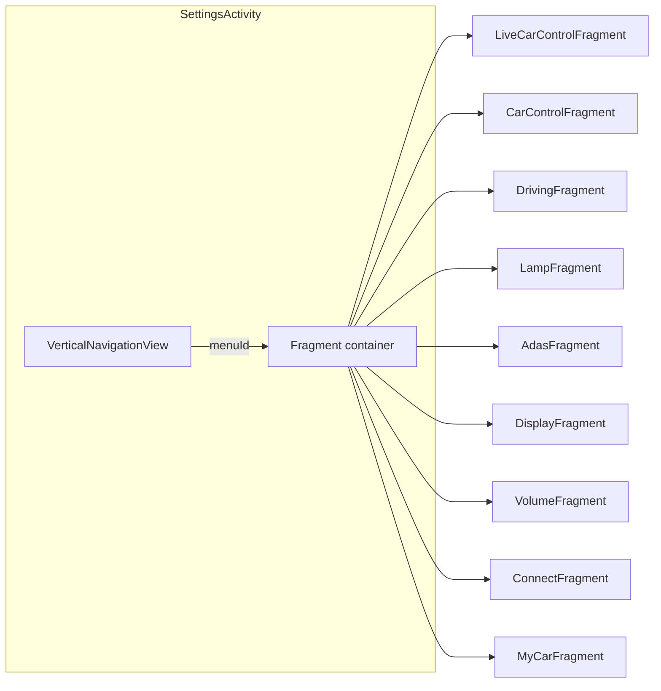
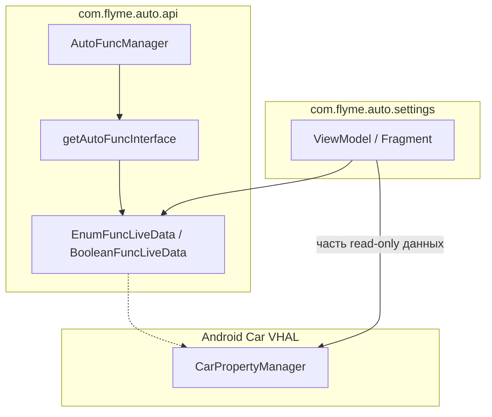

# com.flyme.auto.settings — справочник по разбору APK

Документ описывает штатное приложение **Flyme Auto Settings** (`com.flyme.auto.settings`) с головного устройства Geely **IHU629G**: что внутри APK, как устроен UI, как открыть нужный экран, и как Settings обращается к автомобилю через Flyme API / VHAL.

Системная библиотека **`com.flyme.auto.api`** в APK **не входит** — она установлена на ГУ отдельно; Settings обращается к ней как к зависимости.

---

## 0. Обзор приложения

| Параметр | Значение |
|----------|----------|
| Пакет | `com.flyme.auto.settings` |
| Название (RU/CN) | **Настройки** / 车辆设置 |
| Название (EN) | Vehicle Settings |
| versionCode | `26012820` |
| versionName | `flyme.beta.(AutoSettings)(null)(26012820)(cba4f9a)` |
| minSdk / targetSdk | 28 / 30 |
| compileSdk | 33 (Android 13) |
| Главная Activity | `com.flyme.auto.settings.SettingsActivity` |
| DEX с основной логикой | `classes2.dex` |

**Назначение:** системное приложение «Настройки автомобиля» на Flyme Auto HU. Объединяет быстрые переключатели, полноэкранные разделы (свет, вождение, ADAS, звук и т.д.), диалоги (зеркала, HUD, люк) и интеграцию с голосовым ассистентом (ECARX VR deep link).

**Стек UI (по dex/JADX):**

- `SettingsActivity` → `BaseSettingActivity` + **DataBinding** (`SettingsActivityBinding`)
- Боковое меню: `VerticalNavigationView` (Flyme Design)
- Экраны: `Fragment` + `*ViewModel` + `*FuncLiveData` из `com.flyme.auto.api`
- Маршрутизация: `RouterUtils.handRouter()` — intent action или `ecarx://vr.com/...`
- Аналитика: SensorsData (`GlySensorsData.track`)

**Связанные APK-компоненты (не Settings, но в том же APK):**

- Baidu DuerOS Assistant (`SpeechSkillActivity`, `SpeechSkill.json`)
- Flyme Policy SDK (privacy webview)
- Виджеты: `AtmosphereLightWidget`, `TirePressureWidget`

---

## 1. Источник и артефакты

| Параметр | Значение |
|----------|----------|
| Платформа (источник дампа) | IHU629G |
| Исходный APK (ADBAppControl) | `downloads/250060 IHU629G/Настройки (com.flyme.auto.settings) [v.flyme.beta.(AutoSettings)(null)(26012820)(cba4f9a)].apk` |
| Локальная копия | `.tmp/flyme-settings.apk` |
| Распакованный APK | `.tmp/flyme-settings-apk/` |
| JADX (выборочно) | `.tmp/flyme-settings-jadx2/` |

### Получить APK с устройства

```bash
adb shell pm path com.flyme.auto.settings
adb pull /system/app/.../Settings.apk .tmp/flyme-settings.apk
```

### Распаковать и искать

```powershell
Copy-Item .tmp\flyme-settings.apk .tmp\flyme-settings.zip
Expand-Archive -Path .tmp\flyme-settings.zip -DestinationPath .tmp\flyme-settings-apk -Force

$dexdump = (Get-ChildItem "$env:LOCALAPPDATA\Android\Sdk\build-tools" -Recurse -Filter "dexdump.exe" | Select-Object -First 1).FullName
& $dexdump -d .tmp\flyme-settings-apk\classes2.dex | Select-String "BCM_FUNC_LIGHT_ATMOSPHERE|DM_FUNC_DRIVE_MODE"
```

**JADX / jadx-gui** — основной инструмент для чтения `*ViewModel`, `*Fragment`, `HomePageBeanKt`, `RouterUtils`.

---

## 2. UI и навигация

### 2.1 Главный экран (`SettingsActivity`)



Список разделов задаётся в `HomePageBeanKt.getHomePageList()` и дублируется в `SettingsActivity.initNavView()` через `NavigationMenuItem`.

| menuId (R.id) | sceneId | Fragment | Название в VR / UI (CN) | Фон (drawable) |
|---------------|---------|----------|-------------------------|----------------|
| `navi_live_car` | **-10** (P) / **10** (D/R) | `LiveCarControlFragment` | 快捷设置 | `bg_activity_park` / `bg_activity` |
| `navi_car_control` | 20 | `CarControlFragment` | 车辆控制设置 | `bg_car_control` |
| `navi_driving` | 30 | `DrivingFragment` | 驾驶设置 | `bg_car_driving` |
| `navi_lamp` | **40** / **-40** (sub) | `LampFragment` | 灯光设置 / 车外灯设置 | `bg_light` / `bg_sub_light` |
| `navi_adas` | 50 | `AdasFragment` | 辅助驾驶设置 | `bg_car_adas` |
| `navi_display` | 70 | `DisplayFragment` | 显示设置 | `bg_display` |
| `navi_volume` | 80 | `VolumeFragment` | 声音设置 | `bg_sound` |
| `navi_connect` | 90 | `ConnectFragment` | 连接设置 | `bg_connect` |
| `navi_my_car` | 100 | `MyCarFragment` | 我的车辆设置 | `bg_my_car` |

**sceneId:** идентификатор 3D-сцены / фона. Для `navi_live_car` и `navi_lamp` есть две версии: **отрицательный** sceneId — режим **P (парковка)**, положительный — **D/R (движение)**. Выбор: `HomePageBeanKt.getHomeBeanByMenuId(menuId, isParking, list)` + `SettingsActivity.isParking()`.

**Переключение раздела:** `SettingsActivity.switchFragment()` меняет `currentPageBean`, обновляет `VerticalNavigationView` и подменяет fragment в контейнере. Broadcast `Constants.KEY_MENU_ID` / `KEY_SCENE_ID` → `changCurrentFragCarScene()`.

**Условная видимость ADAS:** пункт `navi_adas` добавляется/убирается по `AutoCarConfig.VEHICLE_RADAR_CONFIGURATION_142` (если конфиг = `NO_RADAR_CONFIGURATION`, ADAS скрыт).

### 2.2 Быстрые настройки (`LiveCarControlFragment`)

Экран «快捷设置» — плитки/переключатели без ухода в подраздел. ViewModel: `LiveCarControlViewModel`.

| UI (id) | AutoFuncId | Запись |
|---------|------------|--------|
| Режим вождения | `DM_FUNC_DRIVE_MODE_SELECT` | `driveMode.updateFuncValue(AutoFuncId)` |
| Атмосфера | `BCM_FUNC_LIGHT_ATMOSPHERE_LAMPS` | `atmosphereLamps.updateFuncValue(Boolean)` |
| Auto Hold | `SETTING_FUNC_AUTO_HOLD` | toggle |
| HUD (HDC) | `SETTING_FUNC_HDC_SWITCH` | toggle |
| ESC sport | `SETTING_FUNC_ESC_SPORT_MODE` | `updateValueDelayWriter` |
| WPC | `WPC_FUNC_WORK_MODE` (zone 5) | toggle |
| Передний багажник | `SETTING_FUNC_FRONT_TRUNK` (zone hood) | toggle |
| Противотуманные | `FOG_LIGHTS_SWITCH` | `updateValueDelayWriter` |
| Reading light | `READING_LIGHTS_SWITCH` (zone 2) | `selectFuncValueForce` |

### 2.3 Раздел «Свет» (`LampFragment`)

ViewModel: `LampViewModel`. Master switch атмосферы: `atmLamp` → `BCM_FUNC_LIGHT_ATMOSPHERE_LAMPS`.

Режимы атмосферы (`currentLampMode` / `atmosphereLampMode`):

| Режим | Константа / AutoFuncId |
|-------|------------------------|
| Drive | `VALUE_AMBIENCE_LIGHT_MAINCOLOR_DRIVERMODE` |
| Breathe | `SETTING_FUNC_AMBIENCE_BREATHE_MODE` |
| Gradient | `SETTING_FUNC_TRANSITION_MODE` |
| Custom color | `VALUE_AMBIENCE_LIGHT_MAINCOLOR_SETCOLOR` |
| Music | `VALUE_AMBIENCE_LIGHT_MAINCOLOR_MUSIC` |
| Speed | `VALUE_AMBIENCE_LIGHT_MAINCOLOR_SPEED_MODE` |

Внешний свет: `headLamp`, `fogLight`, welcome/courtesy lights, home safe light и др.

### 2.4 Раздел «Управление авто» (`CarControlFragment`)

ViewModel: `CarControlViewModel`. Примеры функций:

| Группа | AutoFuncId |
|--------|------------|
| Блокировки | `SETTING_FUNC_APPROACH_UNLOCK`, `AWAY_LOCK`, `TWOSTEP_UNLOCKING`, `KEYLESS_UNLOCKING` |
| HUD | `SETTING_FUNC_HUD_ACTIVE`, `HUD_CALIBRATION`, `HUD_ANGLE_ADJUST`, `HUD_AR_ENGINE`, `HUD_SNOW_MODE` |
| Зеркала / двери | `MIRROR_AUTO_FOLDING`, `TRUNK_OPENING_POSITION`, `APPROACH_TAIL_UNLOCK` |
| Sentry | `SETTING_FUNC_VEHICLE_SENTRY_SWITCH` |
| Сиденье / руль | `SEAT_*_MOVE`, `BCM_FUNC_CUSTOM_KEY` |

### 2.5 Отдельные Activity и диалоги

| Компонент | Назначение |
|-----------|------------|
| `DispatchDialogActivity` | Оверлей-диалоги: зеркала, сиденье, люк, HUD, поездка, custom key, power off, ТО |
| `LampActivity` | Отдельный экран света (виджет атмосферы) |
| `SoundSpaceActivity` | Harman / space effect / virtual venue |
| `PrivacyActivity` | Политики (privacy, user, improve) |
| `SpecialFuncActivity` | Спец. функции |
| `WallpaperCustomizeActivity` | Обои / car view |
| `legalInfoActivity` | Юридическая информация |

**Сервисы:** `TirePressureService` (`com.flyme.auto.action.MYCAR_SERVICE`), `MycarNotificationService`, plugin status bar.

---

## 3. Точки входа: как открыть и использовать

### 3.1 Лаунчер

```bash
adb shell am start -n com.flyme.auto.settings/.SettingsActivity
```

По умолчанию открывается **快捷设置** (`navi_live_car`), scene зависит от передачи P.

### 3.2 Explicit Intent (action → раздел)

`RouterUtils.getActIndex()` кладёт в Bundle ключ `frag_index_tag` и выбирает `menuId`.

| Action | Раздел | `frag_index_tag` |
|--------|--------|------------------|
| `com.flyme.auto.settings.action.DRIVE_MODE` | driving | `drive_mode` |
| `com.flyme.auto.settings.action.ATMOSPHERE_LAMPS` | lamp | `atmosphere_lamps` |
| `com.flyme.auto.settings.action.ADAS` | adas | (+ extra `show_dialog`) |
| `com.flyme.auto.settings.action.MY_CAR` | my car | `my_car` |
| `com.flyme.auto.settings.action.HUD_ADJUST` | car control | `hud_adjust` |
| `com.flyme.auto.settings.action.MIRROR_ADJUST` | car control | `mirror_adjust` |
| `com.flyme.auto.settings.action.MIRROR_FOLD` | car control | `mirror_fold` |
| `com.flyme.auto.settings.action.GLOVE_BOX` | car control | `glove_box` |
| `com.flyme.auto.settings.action.SAFETY_LOCK` | car control | `safety_lock` |
| `com.flyme.auto.settings.action.DOOR_MOVE` | car control | `door_move` |
| `com.flyme.auto.settings.action.SCREEN_BRIGHTNESS` | display | `screen_brightness` |
| `com.flyme.auto.settings.action.DAY_NIGHT_MODE` | display | `day_night_mode` |
| `com.flyme.auto.settings.action.VOLUME` | volume | `volume` |
| `com.flyme.auto.settings.action.harman_adjust` | volume | harman |
| `com.flyme.auto.settings.action.space_effect` | volume | `space_effect` |
| `com.flyme.auto.settings.action.virtual_venue` | volume | `virtual_venue` |
| `com.flyme.auto.settings.action.AUDIO_PRESET_MODE` | volume | `audio_preset_mode` |
| `com.flyme.auto.settings.action.EPB_SWITCH` | driving | `EPB_switch` |
| `com.flyme.auto.settings.action.WORK_MODE` | car control | `wpc` |
| `com.flyme.auto.settings.action.VERSION_VIEW` | my car | `version_view` |

Пример — режим вождения:

```bash
adb shell am start -a com.flyme.auto.settings.action.DRIVE_MODE -n com.flyme.auto.settings/.SettingsActivity
```

Пример — атмосфера:

```bash
adb shell am start -a com.flyme.auto.settings.action.ATMOSPHERE_LAMPS -n com.flyme.auto.settings/.SettingsActivity
```

### 3.3 Голос / VR deep link (ECARX)

Action: `ecarx.intent.action.ECARX_VR_APP_OPEN`  
URI: `ecarx://vr.com/<path>`

`RouterUtils.getNavIndex()` кладёт `frag_voice_tag` (подэкран внутри fragment).

| path (CN) | menuId | frag_voice_tag |
|-----------|--------|----------------|
| `/快捷设置` | live_car | — |
| `/个性化驾驶模式` | driving | `dm_custom` |
| `/能量回收等级设置` | driving | `drive_mode` |
| `/氛围灯设置` | lamp | `atmosphere_lamp` |
| `/灯光设置` | lamp | `lamp` |
| `/车外灯设置` | lamp | `head_lamp` |
| `/HUD调整` | car_control | `hud_adjust` |
| `/后视镜调节` | car_control | `mirror_adjust` |
| `/左后视镜调节` | car_control | `left_mirror_adjust` |
| `/右后视镜调节` | car_control | `right_mirror_adjust` |
| `/天窗调节` | live_car | `sunroof` |
| `/系统音量设置` | volume | `volume` |
| `/辅助驾驶设置` | adas | — |
| `/我的车辆设置` | my_car | — |
| `/连接设置` | connect | — |
| `/显示设置` | display | — |
| `/语音设置` | assistant | — |

Пример deep link:

```bash
adb shell am start -a ecarx.intent.action.ECARX_VR_APP_OPEN \
  -d "ecarx://vr.com/%E6%B0%9B%E5%9B%B4%E7%81%AF%E8%AE%BE%E7%BD%AE" \
  -n com.flyme.auto.settings/.SettingsActivity
```

(путь `/氛围灯设置` URL-encoded)

### 3.4 Диалоги (`DispatchDialogActivity`)

```bash
# HUD
adb shell am start -a com.flyme.auto.settings.action.HUD_ADJUST \
  -n com.flyme.auto.settings/.dialog.DispatchDialogActivity

# Зеркала
adb shell am start -a com.flyme.auto.settings.action.MIRROR_ADJUST \
  -n com.flyme.auto.settings/.dialog.DispatchDialogActivity
```

Другие action: `SEAT_ADJUSTMENT`, `DIALOG_SUN_ROOF_ADJUSTMENT`, `TRIP_INFO`, `custom_key`, `CAR_POWER_OFF`, `MAINTAIN_REPAIR`, `RESET_NETWORK_CONFIRM`.

### 3.5 Использование из стороннего приложения (geely_ex2_tools)

Паттерн совпадает с Settings: `AutoFuncManager.getInstance()` → `getAutoFuncInterface()` → `EnumFuncLiveData` / `BooleanFuncLiveData` → `init()` → read `mValue` / write `updateFuncValueForce`.

Пример в проекте: `FlymeDrivingModeApi.kt` — reflection на `DM_FUNC_DRIVE_MODE_SELECT` + `updateFuncValueForce`, как в `LiveCarControlViewModel.onDriveModeSelected()`.

**Важно:** для записи enum/boolean свойств VHAL напрямую часто недостаточно — нужен Flyme API, как в Settings.

---

## 4. Архитектура доступа к автомобилю

Settings использует **два канала**. Для записи «настроек авто» (режим вождения, атмосфера и т.п.) в dex видно вызовы **`updateFuncValueForce`** / **`updateFuncValue`** через Flyme API, а не прямой `CarPropertyManager.setIntProperty`.



| Канал | Типичное использование в Settings | Чтение | Запись |
|-------|-----------------------------------|--------|--------|
| **Flyme AutoFunc API** | Режим вождения, атмосфера, переключатели BCM | `init()` → `mValue.getValue()` | `updateFuncValueForce` / `updateFuncValue` |
| **VHAL** | Скорость, SOC, температура климата | `getIntProperty` / `getFloatProperty`, area `0` | редко; для enum/boolean — через Flyme |

Подключение VHAL (когда Settings читает property напрямую):

```text
Car.createCar(context) → connect() → getCarManager("property") → CarPropertyManager
areaId = 0
```

---

## 5. Flyme AutoFunc API (по dex APK)

### Классы (`com.flyme.auto.api`)

| Класс | Назначение |
|-------|------------|
| `AutoFuncManager` | Singleton |
| `AutoFuncId` | ID функций и enum-значений |
| `data.EnumFuncLiveData` | Режимы, списки |
| `data.BooleanFuncLiveData` | Переключатели on/off |
| `data.IntegerFuncLiveData` | Числовые значения |
| `data.ProgressFuncLiveData` | SeekBar (яркость lamp) |
| `data.BaseFuncLiveData` | Общая база + preset values |

### Инициализация (перед read/write)

```java
AutoFuncManager manager = AutoFuncManager.getInstance(context);
manager.getAutoFuncInterface(context); // или getAutoFuncInterface()
```

### Чтение `mValue`

В dex у **обоих** типов LiveData поле `mValue` имеет тип **`MutableLiveData`**:

| Тип | Поле | Чтение в APK |
|-----|------|--------------|
| `EnumFuncLiveData` | `mValue` | `liveData.mValue.getValue()` → `AutoFuncId` или `Integer` |
| `BooleanFuncLiveData` | `mValue` | `liveData.mValue.getValue()` → `Boolean` |
| `BooleanFuncLiveData` | `mSupported` | `getValue()` → поддерживается ли функция |
| `BooleanFuncLiveData` | `mActive` | `getValue()` → активность подписки |

Для enum: если пришёл `AutoFuncId`, int-значение — поле **`id`**.

### Запись

| Метод | Когда в APK |
|-------|-------------|
| `updateFuncValueForce(Object)` | Надёжная установка (tailgate, ESM, force select) |
| `updateFuncValue(Object)` | Toggle в UI (atmosphere, auto hold, drive mode в live panel) |
| `updateValueDelayWriter(Object)` | Debounce (fog, ESC) |
| `selectFuncValueForce(AutoFuncId)` | Reading lights |

### Конструкторы LiveData (типичные)

```java
// boolean
new BooleanFuncLiveData(AutoFuncId.BCM_FUNC_LIGHT_ATMOSPHERE_LAMPS, false).init();

// enum
new EnumFuncLiveData(AutoFuncId.DM_FUNC_DRIVE_MODE_SELECT, false).init();

// boolean с zone
new BooleanFuncLiveData(AutoFuncId.SETTING_FUNC_FRONT_TRUNK, AutoFuncAreaId.DOOR_HOOD).init();
```

### On/Off (int, ICarFunction)

| Константа | Int |
|-----------|-----|
| `COMMON_VALUE_ON` | `1` |
| `COMMON_VALUE_OFF` | `0` |

---

## 6. Идентификаторы из APK

Hex property id часто **совпадает** с int, передаваемым в Flyme API.

### 6.1 Режим вождения

| AutoFuncId | VHAL / property id | Hex |
|------------|-------------------|-----|
| `DM_FUNC_DRIVE_MODE_SELECT` | property select | `0x22010100` |

**Значения (`VALUE_DRIVE_MODE_SELECTION_*`):**

| Описание | Hex | AutoFuncId в dex |
|----------|-----|------------------|
| Эко | `0x22010101` | `VALUE_DRIVE_MODE_SELECTION_ECO` |
| Комфорт | `0x22010102` | `VALUE_DRIVE_MODE_SELECTION_COMFORT` |
| «Normal» (UI) | — | `VALUE_DRIVE_MODE_SELECTION_NORMAL` |
| Спорт / Dynamic | `0x22010103` | `VALUE_DRIVE_MODE_SELECTION_DYNAMIC` |
| Autoterrain / XC | `0x22010104` | `VALUE_DRIVE_MODE_SELECTION_AUTOTERRAIN` |
| Adaptive | `0x22010116` | `VALUE_DRIVE_MODE_SELECTION_ADAPTIVE` |

**Где в APK:**

| Класс | Поле / метод |
|-------|----------------|
| `LiveCarControlViewModel` | `driveMode`, `onDriveModeSelected(AutoFuncId)` |
| `DrivingFragment` / driving UI | полный список для рынка |
| dex `1e923c`+ | `EnumFuncLiveData(DM_FUNC_DRIVE_MODE_SELECT, false)` |

**Запись в APK:** `driveMode.updateFuncValue(AutoFuncId)` или `updateFuncValueForce(modeInt)`.

### 6.2 Атмосферная подсветка — master switch

| AutoFuncId | Property id | Hex |
|------------|-------------|-----|
| `BCM_FUNC_LIGHT_ATMOSPHERE_LAMPS` | BCM atmosphere | `0x21051000` |

Значения: `1` / `0`.

**Где в APK:**

| Класс | Деталь |
|-------|--------|
| `LiveCarControlViewModel` | `atmosphereLamps` — toggle через `updateFuncValue` |
| `LampViewModel` | `atmLamp` |
| `LampFragment` | `switchAtmosphereLamps` (databinding) |

### 6.3 Атмосферная подсветка — режимы (расширенно)

| Класс | Поле | Тип |
|-------|------|-----|
| `LampViewModel` | `atmosphereLampMode` | `EnumFuncLiveData` |
| `LampViewModel` | `atmGradientLamp` | `BooleanFuncLiveData` |
| `LampViewModel` | `currentLampMode` | `MutableLiveData<Integer>` |
| `AtmosphereLightManager` | singleton | `getMode()`, `ATMOSPHERE_MODE_*` |

### 6.4 Рекуперация (energy recovery)

| AutoFuncId | Property id (decimal) | Hex |
|------------|----------------------|-----|
| `SETTING_FUNC_ENERGY_REGENERATION` | `537003264` | `0x20020500` |

> Важно: это **`0x20xxxxxx`**, не `0x22xxxxxx` (в отличие от `DM_FUNC_DRIVE_MODE_SELECT` = `0x22010100`). Совпадает с CentralEXAuto `PROP_ENERGY_REGEN`.

**Значения (`VALUE_ENERGY_REGENERATION_LEVEL_*`):**

| UI (DrivingFragment) | Decimal | Hex | AutoFuncId |
|----------------------|---------|-----|------------|
| Низкий | `537003265` | `0x20020501` | `VALUE_ENERGY_REGENERATION_LEVEL_LOW` |
| Средний | `537003266` | `0x20020502` | `VALUE_ENERGY_REGENERATION_LEVEL_MID` |
| Высокий | `537003267` | `0x20020503` | `VALUE_ENERGY_REGENERATION_LEVEL_HIGH` |
| Авто (не на всех рынках) | `537003268` | `0x20020504` | `VALUE_ENERGY_REGENERATION_LEVEL_AUTO` |

**Где в APK:**

| Класс | Поле / метод |
|-------|----------------|
| `DrivingViewModel` | `energyRegeneration` — `EnumFuncLiveData(SETTING_FUNC_ENERGY_REGENERATION, 3000L, false).init2()` |
| `DrivingFragment` | кнопки `levelLow` / `levelMid` / `levelHeight` / `levelAuto` |
| `DrivingViewModel.onSwitchEnergyRegen` | `energyRegeneration.updateValueDelayWriter(AutoFuncId)` |

**Чтение:** `energyRegeneration.mValue.getValue()` → `Integer` или `AutoFuncId.id`.

**Запись в Settings APK:** `updateValueDelayWriter(AutoFuncId)` (debounce 3 с) — передаётся **объект** `AutoFuncId`, не int.

**Запись в geely_ex2_tools:** VHAL `setIntProperty(0x20020500, area 0|1)` как CentralEXAuto (primary); затем Flyme `updateValueDelayWriter(AutoFuncId)` + `updateFuncValueForce(int)` с verify; eCarX fallback. Чтение regen тоже предпочитает VHAL.

### 6.5 Свойства VHAL, встречающиеся в контексте Settings / car UI

| Имя (логическое) | Hex | Тип | Примечание из анализа |
|------------------|-----|-----|------------------------|
| `PERF_VEHICLE_SPEED` | `0x11600207` | float | км/ч |
| `ED_EV_BATTERY_PERCENTAGE` / OEM SOC | `0x2140a6ed` | float | Flyme OEM, 0–100 |
| `EV_BATTERY_LEVEL` | `0x11600309` | float | AOSP fallback |
| `AC_AMBIENT_TEMP` | `0x2140a377` | int | декод: `(raw - 80) / 2` °C |
| `AC_INSIDE_TEMP` | `0x2140a379` | int | то же |
| `ENV_OUTSIDE_TEMPERATURE` | `0x11600703` | float | AOSP fallback |

---

## 7. Карта классов APK (точки входа)

| Класс | Назначение |
|-------|------------|
| `SettingsActivity` | Shell: nav, routing, scene P/D, VR close receiver |
| `HomePageBeanKt` | Список разделов (menuId, sceneId, fragment, фон) |
| `RouterUtils` | Intent action / ecarx path → menuId + bundle tags |
| `LiveCarControlViewModel` | Быстрые переключатели: atmosphere, drive mode, auto hold, HUD, … |
| `CarControlViewModel` | Двери, HUD, зеркала, sentry, сиденья, custom key |
| `LampViewModel` | Внешний/внутренний свет, атмосфера, режимы |
| `LampFragment` | UI lamp + atmosphere switch |
| `DrivingFragment` | Режим вождения, EPB, energy recovery |
| `AdasFragment` | ACC/ICC, NOA dialogs |
| `DisplayFragment` | Яркость, day/night, wallpaper |
| `VolumeFragment` | Громкость, equalizer, presets |
| `ConnectFragment` | BT, Wi‑Fi, hotspot |
| `MyCarFragment` | VIN, версия, ТО, legal |
| `CommonViewModel` | Общие boolean (напр. tailgate → `updateFuncValueForce`) |
| `DispatchDialogActivity` | Модальные диалоги регулировок |

---

## 8. Как найти новую функцию в APK

1. **JADX** — поиск по строкам UI, `RouterUtils.FRAG_*`, или `AutoFuncId.ИМЯ`.
2. **dexdump** — `sget-object … AutoFuncId;.ИМЯ` и следующие `invoke-direct` на `*FuncLiveData.<init>`.
3. Определить тип LiveData по сигнатуре конструктора:
   - `(AutoFuncId, boolean)` → `BooleanFuncLiveData` или `EnumFuncLiveData`;
   - `(AutoFuncId, int)` → `BooleanFuncLiveData` / `EnumFuncLiveData` с zone.
4. Найти **write**: `updateFuncValueForce` / `updateFuncValue` / `selectFuncValueForce`.
5. Найти **read**: цепочка `.mValue` → `MutableLiveData.getValue()`.
6. Сопоставить hex: поле `id` у `AutoFuncId` или int в `updateFuncValueForce`.

### Шаблон Boolean (reflection)

```kotlin
AutoFuncManager.getInstance(ctx).getAutoFuncInterface(ctx)
val id = AutoFuncId::class.java.getField("BCM_FUNC_...").get(null)
val liveData = BooleanFuncLiveData(id, false).apply { init() }
liveData.javaClass.getMethod("updateFuncValueForce", Any::class.java)
    .invoke(liveData, true)
val mValue = liveData.javaClass.getField("mValue").get(liveData)
val on = mValue.javaClass.getMethod("getValue").invoke(mValue) as Boolean
```

### Шаблон Enum (reflection)

```kotlin
val liveData = EnumFuncLiveData(AutoFuncId.DM_FUNC_DRIVE_MODE_SELECT, false).apply { init() }
liveData.updateFuncValueForce(0x22010101)
val raw = liveData.mValue.getValue()
val modeInt = when (raw) {
    is Int -> raw
    else -> raw.javaClass.getField("id").get(raw) as Int
}
```

---

## 9. Отладка при интеграции с API Settings

```bash
# Логи Settings
adb logcat | findstr /i "flyme.auto.settings AutoFunc SettingsActivity RouterUtils"

# Проверка, что открылся нужный раздел
adb logcat | findstr /i "handRouter getActIndex getNavIndex"
```

| Симптом | Вероятная причина |
|---------|-------------------|
| `ClassNotFoundException: com.flyme.auto.api.*` | Не Flyme HU или другая прошивка |
| Read всегда `null` | Не вызван `init()` или `getAutoFuncInterface()` |
| Write без эффекта через VHAL | Нужен Flyme `updateFuncValueForce`, как в Settings |
| `mSupported == false` | Функция недоступна на комплектации |
| VR открыл не тот экран | Проверить `ecarx://vr.com` path и `frag_voice_tag` в `RouterUtils` |

---

*Документ основан на разборе APK `com.flyme.auto.settings` v26012820 (IHU629G, build cba4f9a). При смене прошивки повторите разбор APK — имена `AutoFuncId`, hex и список VR path могут отличаться.*
