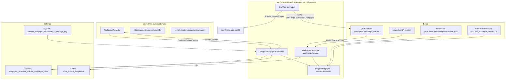

# com.flyme.auto.wallpaperlauncher — справочник по разбору APK (主题美化服务)

Документ описывает системное приложение **主题美化服务** / **AutoWallpaperLauncher** (`com.flyme.auto.wallpaperlauncher`) с головного устройства Geely **IHU629G**: live wallpaper для лаунчера Flyme Auto, переключение обоев жестами, интеграция с **Customize Center**, **Car3D** и шиной **MIPC**.

**Важно:** это **не** приложение «Темы» в UI и **не** `com.flyme.auto.customize` (хранилище обоев). APK — **WallpaperService**, который рисует фон домашнего экрана и синхронизируется с `Settings.System` и `WallpaperProvider`.

---

## 0. Обзор приложения

| Параметр | Значение |
|----------|----------|
| Пакет | `com.flyme.auto.wallpaperlauncher` |
| Label | **主题美化服务** (сервис темы/оформления) |
| versionCode | `26012721` |
| versionName | `flyme.beta.(AutoWallpaperLauncher)(null)(26012721)(ee2f100)` |
| minSdk / targetSdk | 28 / 33 |
| compileSdk | 33 (Android 13) |
| sharedUserId | `android.uid.system` |
| Application | не объявлен (default) |
| Launcher Activity | **нет** (есть debug `MainActivity`) |
| WallpaperService | `com.flyme.auto.wallpaper.WallpaperLauncher` (`exported=true`) |
| DEX | один `classes.dex` (~604 KB, **~385** классов в dex, **530** Java-файлов в JADX) |
| Размер APK | ~1.07 MB |

**Назначение:**

1. **Live wallpaper** — отображение текущего набора обоев на домашнем экране с анимацией свайпа (как карусель).
2. **Синхронизация** — чтение/запись `wallpaper_launcher_current_wallpaper_path`, реакция на смену коллекции в Customize Center.
3. **Ввод** — жесты через MIPC от лаунчера (`com.flyme.auto.launcher`) и eCarX `LauncherAPI`; голосовые команды через broadcast TTS.
4. **Car3D** — в APK вшиты `CarView` / `ISetting` / `IRender` для режима 3D-обоев (`com.flyme.auto.car3d`); при активном wallpaper Car3D скрывает свой `SurfaceView`.
5. **Boot UX** — через 6 с после создания surface выставляет флаги завершения переключения пользователя / лаунчера.

**Стек (по dex/JADX):**

| Слой | Компонент |
|------|-----------|
| Android | `WallpaperService`, `WallpaperColors`, `Settings.System` / `Global` / `Secure` |
| Flyme Customize | `content://com.flyme.auto.customize.provider.WallpaperProvider/*` |
| Flyme MIPC | `com.flyme.auto.mipc_service` → `com.flyme.auto.mipcser.MIPCService` |
| eCarX | `LauncherAPI` (motion), `VrPluginAPI` (заглушка callback) |
| Car3D | `com.flyme.auto.car3d.wallpaper` (broadcast + MIPC topic) |
| Рендер | Canvas + `lockHardwareCanvas` (основной) или OpenGL ES 3 (`TextureRenderer`) |

**Что вшито в APK помимо бизнес-логики (~530 Java-файлов):**

| Пакет в dex | Классов (≈) | Назначение |
|-------------|-------------|------------|
| `com.ecarx.*` | 281 | EAS Framework, Launcher API, VR plugin SDK, protobuf |
| `com.google.gson.*` | 58 | JSON (VR / remote proxy) |
| `com.flyme.auto.wallpaper.*` | 21 | Wallpaper service и контроллер |
| `com.flyme.auto.car3d.settingapi.*` | 6 | Car3D UI API (`CarView`, AIDL-интерфейсы) |
| `androidx.*` | 19 | Core, test stubs |
| Kotlin runtime | ~80 | stdlib, coroutines helpers |

---

## 1. Источник и артефакты

| Параметр | Значение |
|----------|----------|
| Платформа (источник дампа) | IHU629G |
| Исходный APK (ADBAppControl) | `downloads/250060 IHU629G/主题美化服务 (com.flyme.auto.wallpaperlauncher) [v.flyme.beta.(AutoWallpaperLauncher)(null)(26012721)(ee2f100)].apk` |
| Локальная копия | `.tmp/flyme-wallpaperlauncher.apk` |
| Распакованный APK | `.tmp/flyme-wallpaperlauncher-apk/` |
| JADX | `.tmp/flyme-wallpaperlauncher-jadx/` |

### Получить APK с устройства

```bash
adb shell pm path com.flyme.auto.wallpaperlauncher
adb pull /system/app/.../AutoWallpaperLauncher.apk .tmp/flyme-wallpaperlauncher.apk
```

### Распаковать и искать

```powershell
Copy-Item -LiteralPath ".tmp\flyme-wallpaperlauncher.apk" -Destination ".tmp\flyme-wallpaperlauncher.zip"
Expand-Archive -LiteralPath .tmp\flyme-wallpaperlauncher.zip -DestinationPath .tmp\flyme-wallpaperlauncher-apk -Force

$aapt = (Get-ChildItem "$env:LOCALAPPDATA\Android\Sdk\build-tools" -Recurse -Filter "aapt.exe" | Select-Object -First 1).FullName
& $aapt dump badging .tmp\flyme-wallpaperlauncher.apk
& $aapt dump xmltree .tmp\flyme-wallpaperlauncher.apk AndroidManifest.xml
```

**JADX** — ключевые классы: `WallpaperLauncher`, `ImagesWallpaper`, `ImagesWallpaperController`, `ImagesWallpaperResolver`, `CarView`.

---

## 2. Архитектура



### 2.1 Компоненты манифеста

| Компонент | Класс | exported | Назначение |
|-----------|-------|----------|------------|
| Service | `WallpaperLauncher` | true | `android.service.wallpaper.WallpaperService`, `BIND_WALLPAPER`, `directBootAware` |
| Activity | `MainActivity` | true | Debug: кнопка «启动服务» — `setWallpaperComponent` |
| Activity | `InstrumentationActivityInvoker$*` | true | AndroidX Test (артефакт сборки, не пользовательский UI) |

**`<queries>`:**

| Цель | Назначение |
|------|------------|
| `com.flyme.auto.customize` | Customize Center |
| provider `com.flyme.auto.customize.provider.WallpaperProvider` | ContentProvider обоев |
| `com.flyme.auto.car3d` | 3D wallpaper / CarView |

**Разрешения (выборочно):**

| Permission | Зачем |
|------------|-------|
| `SET_WALLPAPER` / `SET_WALLPAPER_COMPONENT` | Установка live wallpaper |
| `WRITE_SETTINGS` / `WRITE_SECURE_SETTINGS` | Запись `Settings`, boot/launcher flags |
| `INTERACT_ACROSS_USERS` | Multi-user paths `/data/customizecenter/{userId}/` |
| `com.flyme.auto.mipc` | MIPC IPC |
| `DatabaseProvider._READ/WRITE_PERMISSION` | Чтение метаданных Customize (legacy naming) |
| `REORDER_TASKS` | Взаимодействие с лаунчером |

---

## 3. Режимы рендера

Переключатель — **`Settings.System` key `test_opengl_engine`** (default **1** = Canvas):

| `test_opengl_engine` | Движок | Классы |
|----------------------|--------|--------|
| `1` (default) | Canvas + `SurfaceHolder.lockHardwareCanvas` | `ImagesWallpaper`, маска XOR, fling-анимация 400 ms |
| ≠ `1` | OpenGL ES 3 | `TextureRenderer`, `WallpaperGLSurfaceView`, 3 текстуры (prev/current/next) |

**Canvas-режим (production):**

- Масштаб bitmap под ширину экрана; при одном изображении — «резиновый» scale при свайпе (`singleImageScaleX`).
- Переключение: scroll/fling по X; порог ~30% ширины; маска из трёх градиентных полос (`onSurfaceChanged`).
- После смены: `ImagesWallpaperController.i()` пишет путь в provider / Settings.

**OpenGL-режим (experimental / A/B):**

- Touch через MIPC → `GLSurfaceView.onTouchEvent`; нормализация delta X на **1280**.
- Порог завершения свайпа: ±0.6; анимация 300 ms.

---

## 4. Источники данных обоев

### 4.1 `ImagesWallpaperResolver`

| Метод | Источник | Описание |
|-------|----------|----------|
| `a()` | `system/customizecenter/wallpaper/` | Системные JPG (`fetchSystemWallpaper`); fallback `a.jpg` |
| `b(context)` | Provider + FS | **Начальная загрузка** списка при старте controller |
| `c()` | — | Базовый путь: `system/customizecenter/wallpaper/` |
| `d()` | — | `/data/customizecenter/{myUserId}/` |
| `e(context)` | Provider | **Gallery**-коллекция (инкрементальное обновление) |

**ContentProvider URIs** (`com.flyme.auto.customize`):

| URI | Назначение |
|-----|------------|
| `content://com.flyme.auto.customize.provider.WallpaperProvider/query` | `QUERY_CONTENT_URI` — observer + выборка |
| `content://com.flyme.auto.customize.provider.WallpaperProvider/update_current` | Запись `wallpaper_launcher_current_wallpaper_path` |
| `content://com.flyme.auto.customize.provider.WallpaperProvider/apply_other_wallpaper` | Объявлен, в controller не используется напрямую |

**Пути на разделах (строки dex):**

| Путь | Тип |
|------|-----|
| `system/customizecenter/wallpaper/` | Штатные системные обои |
| `system/customizecenter/wallpaper_ext` | Расширенный набор (`fetchCustomizeWallpaper`) |
| `/data/customizecenter/{userId}/` | Пользовательские / скачанные темы |

**Festival-коллекция:** ZIP-архивы; bitmap читается через `ZipFile.getInputStream` по entry name (`festival_wallpaper_name:` в log).

**Кэш:** singleton `WallpaperCacheManager` (`i.a`) — `LruCache`-подобное хранение bitmap по path key.

### 4.2 ID коллекций (`current_wallpaper_collection_id_settings_key`)

| ID (int) | Поведение в коде |
|----------|------------------|
| `2147483644` | **Festival** — bitmap из ZIP (`ImagesWallpaperUtils.a()`) |
| `2147483645` | **Gallery** — при смене path инкрементальное слияние списка |
| `2147483547` | **Gallery** (вариант) |
| `2147483546` | **Gallery** (вариант) |
| другие | Полный `refreshLocalData()` при смене collection id |

### 4.3 Сезонные наборы (фильтр карусели)

При текущем файле `s01.jpg` … `s50.jpg` controller **сужает** список свайпа до подгруппы (логика в `ImagesWallpaperController.h()`):

| Текущий файл | Группа карусели |
|--------------|-----------------|
| `s01`–`s06` | только s01–s06 |
| `s07`–`s14` | s07–s14 |
| `s15`–`s20` | s15–s20 |
| `s21`–`s26` | s21–s26 |
| `s27`–`s32` | s27–s32 |
| `s33`–`s38` | s33–s38 |
| `s39`–`s44` | s39–s44 |
| `s45`–`s50` | s45–s50 |

---

## 5. Settings и side-effects

| Key | Namespace | Назначение |
|-----|-----------|------------|
| `wallpaper_launcher_current_wallpaper_path` | `System` | Абсолютный путь текущего wallpaper; observer + sync index |
| `current_wallpaper_collection_id_settings_key` | `System` | ID коллекции Customize; тип ZIP/gallery/system |
| `test_opengl_engine` | `System` | `1` = Canvas (default), иначе OpenGL |
| `user_switch_completed` | `Global` | `1` через 6 s после `onSurfaceCreated` |
| `key_launcher_preference_switch_done` | `Secure` | `1` — завершение переключения лаунчера |
| `service.bootanim.exit_byower` | SystemProperties | `"1"` — ускоренный выход boot animation |

**Запись текущего wallpaper** (`ImagesWallpaperController.i()`):

1. `ContentResolver.update(update_current, { wallpaper_launcher_current_wallpaper_path: path })`
2. Fallback: `Settings.System.putString(...)` при exception

---

## 6. Ввод: жесты, MIPC, голос

### 6.1 MIPC (основной путь для Canvas)

- Клиент: `f.d` (`MIPCImpl`), сервис: `com.flyme.auto.mipc_service` / `com.flyme.auto.mipcser.MIPCService`.
- `from_type = 9` (поле `f246a` в `MIPCImpl`).
- Callback: `WallpaperLauncher.Engine.a()` — bundle с `action=1`, key `"event"` → `MotionEvent`.
- При disconnect Canvas-engine переподключает MIPC (`a()`).

### 6.2 eCarX LauncherAPI

- `LauncherAPI.get().unRegisterMotionEventListener` в `onDestroy`.
- `h.b.a` implements `IMotionEventListener` — проксирует motion в wallpaper (decompile частично сломан).

### 6.3 Broadcast

| Action | Extra | Эффект |
|--------|-------|--------|
| `com.flyme.intent.wallpaper.action.TTS` | `command=next_wallpaper` | Анимация «следующие обои» |
| `com.flyme.intent.wallpaper.action.TTS` | `command=previous_wallpaper` | «Предыдущие обои» |
| `android.intent.action.CLOSE_SYSTEM_DIALOGS` | `reason=app_switch_event` | Довести незавершённый свайп |

VR plugin (`h.c`, `VrPluginAPI`) зарегистрирован, но `semanticResult` только логирует — **обработка NLU не реализована** в этом APK.

---

## 7. Car3D API (встроенный SDK)

Пакет `com.flyme.auto.car3d.settingapi` — публичные `@Keep` классы для интеграции лаунчера с **Car3D**:

| Класс | Роль |
|-------|------|
| `CarView` | `FrameLayout` + `RenderHelper`; `start()` / `startWithMirror()` |
| `ISetting` | Сцены, тема, погода, `setWallpaperRender`, `getWallpaperPtr`, … |
| `IRender` | `hasWallpaper()`, `setWallpaper`, `changeScene`, surface lifecycle |
| `FuncData` | `(funcId, areaId, value)` для `setFuncData` |

**Связь с wallpaper service:**

- Broadcast `com.flyme.auto.car3d.wallpaper` + MIPC topic того же имени.
- Если `IRender.hasWallpaper()` → `textureView.setVisibility(GONE)` (3D не перекрывает live wallpaper).

Зависимость **`com.flyme.auto.car3d`** — отдельный APK; в manifest только `<queries>`.

---

## 8. Debug / установка wallpaper

`MainActivity` — одна кнопка «启动服务»:

```java
wallpaperManager.clear(FLAG_SYSTEM);
wallpaperManager.setWallpaperComponent(
    new ComponentName(context, WallpaperLauncher.class));
```

Полезно на eng/userdebug при ручной активации сервиса:

```bash
adb shell am start -n com.flyme.auto.wallpaperlauncher/.MainActivity
```

Проверить текущий wallpaper component:

```bash
adb shell cmd wallpaper get
```

---

## 9. Практические команды ADB

```bash
# Текущий путь и коллекция
adb shell settings get system wallpaper_launcher_current_wallpaper_path
adb shell settings get system current_wallpaper_collection_id_settings_key
adb shell settings get system test_opengl_engine

# Принудительно Canvas / OpenGL
adb shell settings put system test_opengl_engine 1
adb shell settings put system test_opengl_engine 0

# Голосовое переключение (имитация)
adb shell am broadcast -a com.flyme.intent.wallpaper.action.TTS \
  --es command next_wallpaper
adb shell am broadcast -a com.flyme.intent.wallpaper.action.TTS \
  --es command previous_wallpaper

# Логи
adb logcat -s WallpaperLauncher ImagesWallpaper MIPCImpl Car3D.CarView
```

---

## 10. Связь с Geely EX2 Tools

Прямых импортов из EX2 Tools нет. APK полезен как справочник по:

- ключам `Settings.System` для wallpaper на Flyme Auto HU;
- URI Customize `WallpaperProvider`;
- поведению live wallpaper при смене темы / пользователя;
- интеграции Car3D ↔ static wallpaper (`hasWallpaper`).

Для VHAL / климата / driving mode см. [flyme-settings-apk.md](./flyme-settings-apk.md), [flyme-hvac-apk.md](./flyme-hvac-apk.md), [flyme-auto-service-apk.md](./flyme-auto-service-apk.md).

---

## 11. Ограничения разбора

- `ImagesWallpaperResolver.b()` и `e()` — JADX не восстановил тело (884 / 271 инструкций); логика восстановлена по вызовам, строкам dex и observer-веткам.
- `h.b.a.onMotionEvent` — partial decompile.
- Test activities (`androidx.test.core.app.InstrumentationActivityInvoker$*`) экспортированы с `MAIN` — артефакт dependency, не штатный UX HU.
