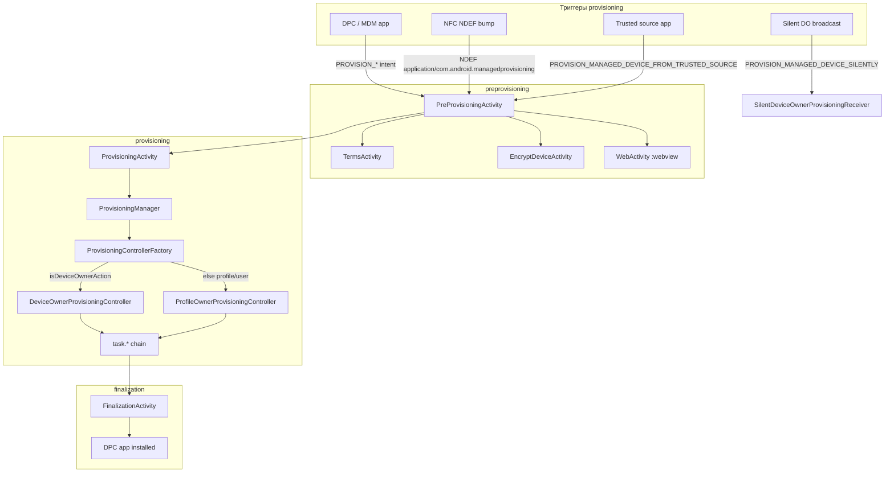

# com.android.managedprovisioning — справочник по разбору APK (Work profile setup)

Документ описывает системное приложение **Managed Provisioning** (`com.android.managedprovisioning`) с головного устройства Geely **IHU629G**: что внутри APK, как запускается настройка рабочего профиля / device owner, и какие intent/extra использует Android Enterprise provisioning.

**Важно:** это **не** Flyme- и **не** automotive-приложение. APK — штатный компонент **AOSP Android 9** для корпоративного управления устройством (MDM / DPC). На ГУ он присутствует как часть системного образа; к VHAL, `com.flyme.auto.api` и логике автомобиля **не подключается**. В dex **не найдено** строк `flyme`, `geely`, `ecarx`.

---

## 0. Обзор приложения

| Параметр | Значение |
|----------|----------|
| Пакет | `com.android.managedprovisioning` |
| Label (EN) | **Work profile setup** |
| Label (RU) | **Настройка рабочего профиля** |
| versionCode | `28` |
| versionName | `9` |
| minSdk / targetSdk / compileSdk | 28 / 28 / 28 (Android 9) |
| sharedUserId | **нет** (обычное priv-app) |
| Размер APK | ~2.9 MB |
| DEX | один `classes.dex` (~1162 класса, из них **174** — `com.android.managedprovisioning.*`) |
| Главная точка входа | `PreProvisioningActivity` (intent actions provisioning) |

**Назначение:** провести пользователя (или MDM) через сценарии Android Enterprise:

1. **Work profile** (profile owner) — отдельный рабочий профиль на личном устройстве.
2. **Fully managed device** (device owner) — полностью управляемое устройство.
3. **Managed user** — отдельный управляемый пользователь.
4. **Shareable device** — корпоративный режим на общем устройстве.
5. **Silent device owner** — тихая установка device owner (системное разрешение).

Типичный поток: MDM/DPC-app шлёт intent с action `android.app.action.PROVISION_*` и extras `android.app.extra.PROVISIONING_*` → `PreProvisioningActivity` (согласие, шифрование, terms) → `ProvisioningActivity` (цепочка task) → `FinalizationActivity`.

**Стек (по dex):**

- UI: **SetupWizard/Glif** (`SetupGlifLayoutActivity`, `suw_*` layouts)
- Модель: `ProvisioningParams`, `WifiInfo`, `CustomizationParams`
- Оркестрация: `ProvisioningManager` → `ProvisioningControllerFactory` → `ProfileOwnerProvisioningController` / `DeviceOwnerProvisioningController`
- Шаги: `com.android.managedprovisioning.task.*` (Wi‑Fi, скачивание/установка DPC, создание профиля, device policy)
- Парсеры: NFC NDEF, QR/properties (`PropertiesProvisioningDataParser`, `ExtrasProvisioningDataParser`)

**Связь с другими APK проекта:**

| APK | Связь |
|-----|-------|
| Flyme Settings / HVAC / Car service | **нет прямой** |
| Geely EX2 Tools | можно вызывать provisioning intent **только** при наличии MDM-сценария и системных прав |
| Любой DPC (Device Policy Controller) | **целевой клиент** — устанавливается этим APK как admin-пакет |

---

## 1. Источник и артефакты

| Параметр | Значение |
|----------|----------|
| Платформа (источник дампа) | IHU629G |
| Исходный APK (ADBAppControl) | `downloads/250060 IHU629G/Настройка рабочего профиля (com.android.managedprovisioning) [v.9].apk` |
| Локальная копия | `.tmp/managedprovisioning.apk` |
| Распакованный APK | `.tmp/managedprovisioning-apk/` |

### Получить APK с устройства

```bash
adb shell pm path com.android.managedprovisioning
adb pull /system/priv-app/ManagedProvisioning/ManagedProvisioning.apk .tmp/managedprovisioning.apk
```

> Точный путь на прошивке может отличаться (`ManagedProvisioning`, `Provision` и т.п.) — смотреть вывод `pm path`.

### Распаковать и искать

```powershell
Copy-Item -LiteralPath ".tmp\managedprovisioning.apk" -Destination ".tmp\managedprovisioning.zip"
Expand-Archive -LiteralPath .tmp\managedprovisioning.zip -DestinationPath .tmp\managedprovisioning-apk -Force

$aapt = (Get-ChildItem "$env:LOCALAPPDATA\Android\Sdk\build-tools" -Recurse -Filter "aapt.exe" | Select-Object -First 1).FullName
& $aapt dump badging .tmp\managedprovisioning.apk
& $aapt dump xmltree .tmp\managedprovisioning.apk AndroidManifest.xml

$dexdump = (Get-ChildItem "$env:LOCALAPPDATA\Android\Sdk\build-tools" -Recurse -Filter "dexdump.exe" | Select-Object -First 1).FullName
& $dexdump -f .tmp\managedprovisioning-apk\classes.dex | Select-String "managedprovisioning"
& $dexdump -d .tmp\managedprovisioning-apk\classes.dex | Select-String "PROVISIONING_"
```

**JADX** — для чтения `PreProvisioningController`, `ProvisioningManager`, task-классов (на дампе декомпилят не создавался).

---

## 2. Архитектура



### 2.1 Выбор контроллера

`ProvisioningControllerFactory.createProvisioningController()` (dex):

- если `Utils.isDeviceOwnerAction(action)` → `DeviceOwnerProvisioningController`
- иначе → `ProfileOwnerProvisioningController`

По строкам в `Utils` (dexdump):

| Метод | Actions (true) |
|-------|----------------|
| `isDeviceOwnerAction` | `android.app.action.PROVISION_MANAGED_DEVICE`, `android.app.action.PROVISION_MANAGED_SHAREABLE_DEVICE` |
| `isProfileOwnerAction` | `android.app.action.PROVISION_MANAGED_PROFILE`, `android.app.action.PROVISION_MANAGED_USER` |

---

## 3. Компоненты манифеста

### 3.1 Activities

| Класс | Назначение |
|-------|------------|
| `PreProvisioningActivity` | Главный обработчик provisioning intents; intro-анимации, проверки, маршрутизация |
| `PreProvisioningActivityViaNfc` (alias) | NFC NDEF `application/com.android.managedprovisioning` |
| `PreProvisioningActivityViaTrustedApp` (alias) | Provisioning из доверенного источника |
| `PreProvisioningActivityAfterEncryption` (alias) | Resume после шифрования (`RESUME_PROVISIONING`) |
| `TermsActivity` | Экран disclaimer / terms |
| `EncryptDeviceActivity` | Запрос шифрования устройства перед provisioning |
| `PostEncryptionActivity` | HOME-alias для продолжения после reboot (disabled по умолчанию) |
| `WebActivity` (`:webview`) | WebView для URL (support, disclaimer) |
| `ProvisioningActivity` | Основной прогресс provisioning (task chain) |
| `FinalizationActivity` | Финализация (`PROVISION_FINALIZATION`) |
| `TrampolineActivity` | Прокси-intent (startActivityForResult + finish) |

### 3.2 Services

| Класс | Назначение |
|-------|------------|
| `ProvisioningService` | Stub service (`onBind` → null) |
| `SilentDeviceOwnerProvisioningService` | Silent device owner flow |
| `OtaService` | OTA-хелперы provisioning state |

### 3.3 Receivers

| Класс | Action |
|-------|--------|
| `SilentDeviceOwnerProvisioningReceiver` | `android.app.action.PROVISION_MANAGED_DEVICE_SILENTLY` |
| `BootReminder` | `BOOT_COMPLETED` — напоминание о незавершённом provisioning |
| `PreBootListener` | `PRE_BOOT_COMPLETED` |
| `ManagedUserCreationListener` | `android.app.action.MANAGED_USER_CREATED` |
| `CrossProfileIntentFiltersSetter$RestrictionChangedReceiver` | `DATA_SHARING_RESTRICTION_CHANGED` |
| `DpcReceivedSuccessReceiver` | (finalization) |

### 3.4 Собственное permission

| Permission | protectionLevel | Кто использует |
|------------|-----------------|----------------|
| `android.permission.PROVISION_MANAGED_DEVICE_SILENTLY` | signature\|privileged | `SilentDeviceOwnerProvisioningReceiver` |

---

## 4. Intent actions и точки входа

### 4.1 Provisioning actions (PreProvisioningActivity)

| Action | Сценарий |
|--------|----------|
| `android.app.action.PROVISION_MANAGED_PROFILE` | **Work profile** (profile owner) |
| `android.app.action.PROVISION_MANAGED_USER` | Managed secondary user |
| `android.app.action.PROVISION_MANAGED_DEVICE` | Fully managed device (device owner) |
| `android.app.action.PROVISION_MANAGED_SHAREABLE_DEVICE` | Shareable / corp-owned mode |
| `android.app.action.PROVISION_MANAGED_DEVICE_FROM_TRUSTED_SOURCE` | Trusted app trigger |
| `android.app.action.PROVISION_MANAGED_DEVICE_SILENTLY` | Silent device owner (receiver) |
| `com.android.managedprovisioning.action.RESUME_PROVISIONING` | Продолжить после encryption reboot |

### 4.2 Прочие actions (broadcast / finalization)

| Action | Назначение |
|--------|------------|
| `android.app.action.PROVISION_FINALIZATION` | `FinalizationActivity` |
| `android.app.action.PROVISIONING_SUCCESSFUL` | (в dex, analytics/callbacks) |
| `android.app.action.MANAGED_PROFILE_PROVISIONED` | профиль создан |
| `android.app.action.PROFILE_PROVISIONING_COMPLETE` | provisioning профиля завершён |
| `android.app.action.MANAGED_USER_CREATED` | managed user создан |
| `android.app.action.START_ENCRYPTION` | старт шифрования |
| `android.app.action.DATA_SHARING_RESTRICTION_CHANGED` | cross-profile restrictions |

### 4.3 NFC

| MIME | Alias |
|------|-------|
| `application/com.android.managedprovisioning` | `PreProvisioningActivityViaNfc` |

Требует permission `android.permission.DISPATCH_NFC_MESSAGE`.

---

## 5. Intent extras (`android.app.extra.PROVISIONING_*`)

Ключи, найденные в `classes.dex` (стандартный Android 9 provisioning API):

| Extra | Назначение |
|-------|------------|
| `PROVISIONING_DEVICE_ADMIN_COMPONENT_NAME` | ComponentName DPC (admin receiver) |
| `PROVISIONING_DEVICE_ADMIN_PACKAGE_NAME` | Пакет DPC |
| `PROVISIONING_DEVICE_ADMIN_PACKAGE_DOWNLOAD_LOCATION` | URL APK DPC |
| `PROVISIONING_DEVICE_ADMIN_PACKAGE_CHECKSUM` | SHA-256 checksum APK |
| `PROVISIONING_DEVICE_ADMIN_SIGNATURE_CHECKSUM` | Checksum подписи DPC |
| `PROVISIONING_DEVICE_ADMIN_PACKAGE_DOWNLOAD_COOKIE_HEADER` | Cookie для download |
| `PROVISIONING_DEVICE_ADMIN_MINIMUM_VERSION_CODE` | Мин. versionCode DPC |
| `PROVISIONING_DEVICE_ADMIN_PACKAGE_ICON_URI` | Иконка DPC |
| `PROVISIONING_DEVICE_ADMIN_PACKAGE_LABEL` | Label DPC |
| `PROVISIONING_ADMIN_EXTRAS_BUNDLE` | Bundle extras → DPC |
| `PROVISIONING_ACCOUNT_TO_MIGRATE` | Account для миграции в профиль |
| `PROVISIONING_KEEP_ACCOUNT_ON_MIGRATION` | Не удалять account на personal side |
| `PROVISIONING_LEAVE_ALL_SYSTEM_APPS_ENABLED` | Не удалять system apps |
| `PROVISIONING_SKIP_ENCRYPTION` | Пропустить шаг encryption |
| `PROVISIONING_SKIP_USER_CONSENT` | Пропустить UI согласия |
| `PROVISIONING_SKIP_USER_SETUP` | Пропустить user setup |
| `PROVISIONING_LOCAL_TIME` | Локальное время при provisioning |
| `PROVISIONING_TIME_ZONE` | Timezone |
| `PROVISIONING_LOCALE` | Locale |
| `PROVISIONING_WIFI_SSID` | Wi‑Fi SSID для скачивания DPC |
| `PROVISIONING_WIFI_PASSWORD` | Wi‑Fi password |
| `PROVISIONING_WIFI_SECURITY_TYPE` | Тип безопасности Wi‑Fi |
| `PROVISIONING_WIFI_HIDDEN` | Hidden SSID |
| `PROVISIONING_WIFI_PROXY_HOST` / `_PORT` / `_BYPASS` | Wi‑Fi proxy |
| `PROVISIONING_WIFI_PAC_URL` | PAC URL |
| `PROVISIONING_USE_MOBILE_DATA` | Разрешить mobile data |
| `PROVISIONING_LOGO_URI` | Лого организации |
| `PROVISIONING_MAIN_COLOR` | Accent color UI |
| `PROVISIONING_ORGANIZATION_NAME` | Название организации |
| `PROVISIONING_SUPPORT_URL` | URL поддержки |
| `PROVISIONING_DISCLAIMERS` / `_HEADER` / `_CONTENT` | Disclaimer docs |

Полный список extras для analytics фильтруется префиксом `android.app.extra.PROVISIONING_` (`AnalyticsUtils.isValidProvisioningExtra`).

---

## 6. Task chain (provisioning steps)

Классы задач в `com.android.managedprovisioning.task` (dex):

| Task | Назначение |
|------|------------|
| `AddWifiNetworkTask` | Подключить Wi‑Fi из extras |
| `ConnectMobileNetworkTask` | Включить mobile data для download |
| `DownloadPackageTask` | Скачать APK DPC по URL |
| `VerifyPackageTask` | Проверить checksum / signature |
| `InstallPackageTask` | Установить DPC |
| `InstallExistingPackageTask` | DPC уже в system — enable existing |
| `CreateManagedProfileTask` | Создать managed profile / user |
| `StartManagedProfileTask` | Запустить профиль после unlock |
| `CopyAccountToUserTask` | Миграция Google/account |
| `DeleteNonRequiredAppsTask` | Удалить non-required apps из профиля/DO |
| `ManagedProfileSettingsTask` | Настройки профиля (icon, name, color) |
| `CrossProfileIntentFiltersSetter` | Cross-profile intent filters |
| `DisableInstallShortcutListenersTask` | Отключить shortcut listeners |
| `SetDevicePolicyTask` | Активировать device/profile owner |
| `DeviceOwnerInitializeProvisioningTask` | Init для device owner |
| `DisallowAddUserTask` | Запрет add user (DO) |
| `MigrateSystemAppsSnapshotTask` | Snapshot system apps (DO) |

Точный порядок задаётся в `ProfileOwnerProvisioningController` / `DeviceOwnerProvisioningController` (зависит от extras: нужен ли download, Wi‑Fi, account migration и т.д.).

---

## 7. UI layouts (provisioning-specific)

Помимо AppCompat/SetupWizard (`abc_*`, `suw_*`), в APK есть экраны:

| Layout | Экран |
|--------|-------|
| `intro_profile_owner.xml` | Intro work profile |
| `intro_device_owner.xml` | Intro device owner |
| `intro_profile_owner_info_buttons.xml` | Кнопки info на intro |
| `intro_animation.xml` / `intro_animation_captions.xml` | Анимация benefits |
| `accept_and_continue_footer.xml` | Footer «принять и продолжить» |
| `encrypt_device.xml` | Шифрование |
| `terms_screen.xml` | Terms list |
| `terms_disclaimer_header.xml` / `terms_disclaimer_content.xml` | Disclaimer |
| `delete_managed_profile_dialog.xml` | Удаление managed profile |
| `progress.xml` | Экран прогресса |
| `device_manager_icon_label.xml` | Иконка + label DPC |

Анимации: `enterprise_wp_*` (work profile), `enterprise_do_*` (device owner).

---

## 8. Permissions (uses-permission)

Приложение запрашивает **системные** права (priv-app):

| Permission | Зачем |
|------------|-------|
| `MANAGE_USERS` | Создание managed profile/user |
| `MANAGE_PROFILE_AND_DEVICE_OWNERS` | Назначение PO/DO |
| `MANAGE_DEVICE_ADMINS` / `BIND_DEVICE_ADMIN` | Активация DPC |
| `INSTALL_PACKAGES` / `DELETE_PACKAGES` | Install/remove DPC и apps |
| `INTERACT_ACROSS_USERS` / `_FULL` | Cross-user provisioning |
| `MANAGE_ACCOUNTS` | Account migration |
| `CRYPT_KEEPER` / `MASTER_CLEAR` | Encryption flow |
| `WRITE_SECURE_SETTINGS` / `WRITE_SETTINGS` | System settings during setup |
| `CHANGE_COMPONENT_ENABLED_STATE` | Enable/disable components |
| `CONNECTIVITY_INTERNAL` / Wi‑Fi permissions | Network setup |
| `NFC` | NFC provisioning |
| `FOREGROUND_SERVICE` | Long-running provisioning |
| `RECEIVE_BOOT_COMPLETED` | Resume after reboot |
| `SHUTDOWN` | Reboot for encryption |
| `SET_TIME` / `SET_TIME_ZONE` | Time sync from extras |
| `PEERS_MAC_ADDRESS` | Wi‑Fi provisioning helpers |

---

## 9. Системные свойства и шифрование

`Utils.isEncryptionRequired()` (dex):

- проверяет, зашифровано ли устройство физически;
- учитывает **`persist.sys.no_req_encrypt`** — если `true`, шаг encryption можно пропустить.

На automotive HU это vendor-свойство может быть выставлено OEM; для IHU629G отдельной проверки в проекте не делалось.

---

## 10. Контекст IHU629G / Geely EX2 Tools

| Вопрос | Ответ |
|--------|-------|
| Кастомизация Geely/Flyme? | **Нет** — stock AOSP Android 9, versionName `9` |
| Нужно для EX2 Tools? | **Нет**, если не реализуете MDM/enterprise |
| Когда может понадобиться? | Корпоративный парк авто, kiosk, fleet MDM, work apps в отдельном профиле |
| Как запустить вручную? | Intent от DPC или `adb shell am start` с `PROVISION_*` + extras (на userdebug/с правами) |
| Конфликт с driving restrictions? | Work profile живёт в `UserManager`; Flyme restrictions (`com.flyme.auto`) — отдельный слой |

### Пример: проверить, установлен ли пакет

```bash
adb shell pm list packages com.android.managedprovisioning
adb shell dumpsys package com.android.managedprovisioning | head -40
```

### Пример: work profile intent (упрощённо, нужен валидный DPC)

```bash
adb shell am start -a android.app.action.PROVISION_MANAGED_PROFILE \
  -e android.app.extra.PROVISIONING_DEVICE_ADMIN_COMPONENT_NAME \
     com.example.dpc/.AdminReceiver
```

> На production HU без MDM-сценария activity, скорее всего, завершится ошибкой или покажет системный UI согласия.

---

## 11. Структура пакетов (dex)

| Пакет | Классов (≈) | Роль |
|-------|-------------|------|
| `com.android.managedprovisioning.provisioning` | ~15 | Activity, Manager, Controllers |
| `com.android.managedprovisioning.preprovisioning` | ~20 | Pre-flow, encryption, terms, web |
| `com.android.managedprovisioning.task` | ~25 | Provisioning tasks |
| `com.android.managedprovisioning.model` | ~10 | Data model |
| `com.android.managedprovisioning.parser` | ~6 | NFC / intent parsing |
| `com.android.managedprovisioning.finalization` | ~5 | Post-provision UI |
| `com.android.managedprovisioning.analytics` | ~5 | MetricsLogger, timing |
| `com.android.managedprovisioning.common` | ~20 | Utils, dialogs, SetupGlif base |
| `com.android.managedprovisioning.ota` | ~4 | OTA / pre-boot |
| `com.android.managedprovisioning.manageduser` | ~3 | Managed user creation |
| `android.support.*` / `android.arch.*` | ~900+ | Legacy support libraries |

---

## 12. Ссылки

- [Android Enterprise — Work profile](https://developer.android.com/work/managed-profiles)
- [Device admin / Device owner provisioning](https://developer.android.com/work/dpc/build-device-owner)
- AOSP source (Android 9): `packages/apps/ManagedProvisioning/`
