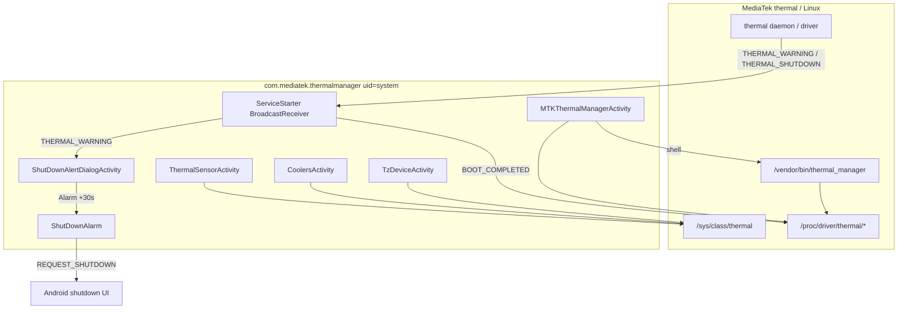
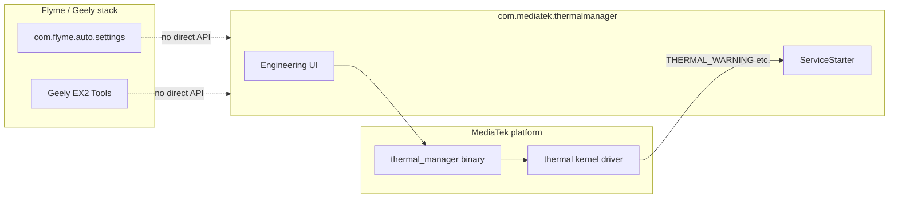

# com.mediatek.thermalmanager — справочник по разбору APK (MTK Thermal Manager)

Документ описывает системное приложение **MTK Thermal Manager** (`com.mediatek.thermalmanager`) с головного устройства Geely **IHU629G**: инженерный UI для thermal policy, мониторинг sysfs-зон, thermal logger и обработка предупреждений о перегреве от MediaTek thermal daemon.

**Важно:** это **не** Flyme/eCarX API и **не** Car/VHAL. APK — тонкая оболочка над **MediaTek thermal stack** (`/vendor/bin/thermal_manager`, `/proc/driver/thermal/*`, `/sys/class/thermal/*`). На user/release-сборках главный экран **сразу закрывается** (`Build.TYPE` должен быть `eng`).

---

## 0. Обзор приложения

| Параметр | Значение |
|----------|----------|
| Пакет | `com.mediatek.thermalmanager` |
| Label | **MTK Thermal Manager** |
| versionCode | `1` |
| versionName | `1.0` |
| minSdk / targetSdk | 15 / 28 |
| compileSdk | 28 (Android 9) |
| sharedUserId | `android.uid.system` |
| Application | не объявлен (default `Application`) |
| Launcher Activity | **нет** (`MTKThermalManagerActivity` с `exported=false`) |
| DEX | один `classes.dex` (~27 KB, **16** классов) |
| Размер APK | ~65 KB |

**Назначение:**

1. **Инженерный UI** — выбор и применение thermal policy (`.conf` / `.mtc`), просмотр thermal zones и cooling devices.
2. **Boot hook** — при `BOOT_COMPLETED` сбрасывает флаг `clsd_rst` в драйвере thermal.
3. **Thermal warning UX** — по broadcast от платформы показывает системный диалог «устройство нужно охладить» и через 30 с планирует shutdown.
4. **Thermal logger** (код в dex) — запись в `/proc/driver/thermal_logger_config`, `storage_logger`, дамп в `/data/` (Switch в layout **отсутствует**, см. §3.1).

**Стек (по dex/JADX):**

| Слой | Путь / компонент |
|------|------------------|
| Native daemon | `/vendor/bin/thermal_manager <conf>` |
| Policy files | `/vendor/etc/.tp/thermal.conf`, `thermal.off.conf`, `.ht120.mtc` |
| Custom policy | `/data/*.mtc` |
| Linux thermal sysfs | `/sys/class/thermal/thermal_zone*`, `cooling_device*` |
| MTK proc nodes | `/proc/driver/thermal/*`, `/proc/driver/thermal_logger_config`, `/proc/driver/storage_logger*` |
| Platform broadcasts | `mediatek.intent.action.THERMAL_*` |

---

## 1. Источник и артефакты

| Параметр | Значение |
|----------|----------|
| Платформа (источник дампа) | IHU629G |
| Исходный APK (ADBAppControl) | `downloads/250060 IHU629G/MTK Thermal Manager (com.mediatek.thermalmanager) [v.1.0].apk` |
| Локальная копия | `.tmp/mediatek-thermalmanager.apk` |
| Распакованный APK | `.tmp/mediatek-thermalmanager-apk/` |
| JADX | `.tmp/mediatek-thermalmanager-jadx/` |

### Получить APK с устройства

```bash
adb shell pm path com.mediatek.thermalmanager
adb pull /system/app/.../MTKThermalManager.apk .tmp/mediatek-thermalmanager.apk
```

### Распаковать и искать

```powershell
Copy-Item -LiteralPath ".tmp\mediatek-thermalmanager.apk" -Destination ".tmp\mediatek-thermalmanager.zip"
Expand-Archive -LiteralPath .tmp\mediatek-thermalmanager.zip -DestinationPath .tmp\mediatek-thermalmanager-apk -Force

$aapt = (Get-ChildItem "$env:LOCALAPPDATA\Android\Sdk\build-tools" -Recurse -Filter "aapt.exe" | Select-Object -First 1).FullName
& $aapt dump badging .tmp\mediatek-thermalmanager.apk
& $aapt dump xmltree .tmp\mediatek-thermalmanager.apk AndroidManifest.xml
```

**JADX** — полный исходник умещается в 8 Java-файлов (+ inner classes).

---

## 2. Архитектура



### 2.1 Компоненты манифеста

| Компонент | Класс | exported | Назначение |
|-----------|-------|----------|------------|
| Activity | `MTKThermalManagerActivity` | false | Главный экран (eng only) |
| Activity | `ThermalSensorActivity` | default | Список `thermal_zone*` |
| Activity | `CoolersActivity` | default | Список `cooling_device*` |
| Activity | `TzDeviceActivity` | default | Детали зоны: temp, trip points, coolers |
| Activity | `ShutDownAlertDialogActivity` | default | Диалог перегрева (`Theme`, window type 2003) |
| Receiver | `ServiceStarter` | default | `BOOT_COMPLETED`, `THERMAL_WARNING` |
| Receiver | `ShutDownAlarm` | false | `THERMAL_SHUTDOWN` → shutdown |

**Protected broadcasts** (объявлены в манифесте):

| Action |
|--------|
| `mediatek.intent.action.THERMAL_DIAG` |
| `mediatek.intent.action.THERMAL_WARNING` |
| `mediatek.intent.action.THERMAL_SHUTDOWN` |

---

## 3. Экраны и логика

### 3.1 MTKThermalManagerActivity

**Ограничение сборки:**

```java
if (!Build.TYPE.equals("eng")) {
    Toast.makeText(this, "Only supported in eng build.", Toast.LENGTH_LONG).show();
    finish();
}
```

На **user** / **userdebug** (если `Build.TYPE != "eng"`) activity сразу завершается. Запуск вручную:

```bash
adb shell am start -n com.mediatek.thermalmanager/.MTKThermalManagerActivity
```

**Thermal policy (Spinner + кнопка Apply):**

| Позиция Spinner | Файл policy |
|-----------------|-------------|
| `default` | `/vendor/etc/.tp/thermal.conf` |
| `thermal protection only` | `/vendor/etc/.tp/thermal.off.conf` |
| `high temp 120deg C` | `/vendor/etc/.tp/.ht120.mtc` |
| динамически | любой `/data/*.mtc` (при открытии Spinner) |

Применение:

```java
executeShellCommand("/vendor/bin/thermal_manager " + confFile);
```

Перед сменой policy, если активен thermal logger, код пытается выключить/включить `thermal_logger_switch` — **виджет Switch в `res/layout/main.xml` отсутствует**, поле не инициализируется в `onCreate()`. Обработчик `onCheckedChangeListener` в dex есть, но UI для него в этой сборке **не подключён** (legacy/dead code).

**Thermal Logger (proc, если вызвать код):**

| Шаг | Файл | Значение |
|-----|------|----------|
| init storage logger | `/proc/driver/storage_logger_config` | `0 0 0 0`, затем `0 0 1` |
| enable thermal log | `/proc/driver/thermal_logger_config` | `5` |
| buffer | `/proc/driver/storage_logger_bufsize_malloc` | `10485760` |
| start | `/proc/driver/storage_logger` | `ENABLE 1` |
| monitor | `/proc/driver/thermal/mtm_monitor` | `1 <HHmmss>` |
| stop monitor | `/proc/driver/thermal/mtm_monitor` | `0` |
| dump | `/proc/driver/storage_logger_display` → `/data/storage_logger_dump_<timestamp>` | append |

Проверка «logger включён»: чтение `/proc/driver/thermal_logger_config` (строки `Enable logger`, `(Bit3)= 1`).

**Навигация (ListView):**

| Пункт | Activity | Условие |
|-------|----------|---------|
| Thermal Sensors | `ThermalSensorActivity` | блокируется, если logger активен |
| Coolers | `CoolersActivity` | всегда |

### 3.2 ThermalSensorActivity

- Сканирует `/sys/class/thermal/`, фильтр имён `thermal_zone*`.
- Для каждой зоны читает `type` и `temp` (millidegree C в UI).
- Клик → `TzDeviceActivity` с extra `tz_sysfs_path`.

### 3.3 CoolersActivity

- Сканирует `/sys/class/thermal/`, фильтр `cooling_device*`.
- Читает `type`, `cur_state`, `max_state`.
- Клик по элементу — пустой handler.

### 3.4 TzDeviceActivity

Для выбранной зоны (`tz_sysfs_path`):

| sysfs | Отображение |
|-------|-------------|
| `type` | заголовок |
| `temp` | текущая температура |
| `mode` | режим (например `kernel`) |
| `trip_point_N_temp` / `trip_point_N_type` | пороги (до 12) |
| `cdevN_trip_point`, `cdevN/type` | привязка cooler → trip point |

### 3.5 ServiceStarter (boot + warning)

**`android.intent.action.BOOT_COMPLETED`** (+ category `HOME`):

```java
write("/proc/driver/thermal/clsd_rst", "1");
```

**`mediatek.intent.action.THERMAL_WARNING`:**

- Запускает `ShutDownAlertDialogActivity` с флагами `NEW_TASK | CLEAR_TOP`.

### 3.6 ShutDownAlertDialogActivity + ShutDownAlarm

**Диалог:**

| R.string | EN |
|----------|-----|
| `alert_dialog_two_buttons_title` | Thermal Warning! |
| `alert_dialog_two_buttons_message` | Phone needs to cool down soon! |
| `alert_dialog_ok` | Ok |
| `alert_dialog_cancel` | Cancel |

Окно: `dialog.getWindow().setType(2003)` — `TYPE_SYSTEM_ALERT` (системный overlay).

**Таймер shutdown:** `AlarmManager` + **30 секунд** → broadcast `ShutDownAlarm` с action `mediatek.intent.action.THERMAL_SHUTDOWN`.

**Shutdown intent** (кнопка Ok или alarm):

```java
Intent intent = new Intent("com.android.internal.intent.action.REQUEST_SHUTDOWN");
intent.putExtra("android.intent.extra.KEY_CONFIRM", false);
intent.setFlags(Intent.FLAG_ACTIVITY_NEW_TASK);
context.startActivity(intent);
```

Требует `android.permission.SHUTDOWN` (есть в манифесте, system UID).

---

## 4. Разрешения

| Permission | Зачем |
|------------|-------|
| `RECEIVE_BOOT_COMPLETED` | `ServiceStarter` |
| `SHUTDOWN` | принудительное выключение |
| `SYSTEM_ALERT_WINDOW` | диалог поверх UI |
| `MODIFY_AUDIO_SETTINGS` | не используется в dex (legacy / platform hook) |
| `com.android.alarm.permission.SET_ALARM` | `AlarmManager` для delayed shutdown |
| `com.android.alarm.permission.WRITE_SETTINGS` | alarm API (legacy) |

---

## 5. Строковые ресурсы (default locale)

| id | EN |
|----|-----|
| `app_name` | MTK Thermal Manager |
| `thermal_sensors` | Thermal Sensors |
| `coolers` | Coolers |
| `thermal_protection` | Thermal Protection |
| `thermal_policy_file_colon` | Thermal Policy File: |
| `apply_new_thermal_policy` | Apply New Thermal Policy |
| `tz_device_info` | TZ Device Info |
| `thermal_logger` | Thermal Logger |

Локализация: ~40 языков (ar, ru, zh-CN, ja, …).

---

## 6. Классы в dex

| Класс | Роль |
|-------|------|
| `MTKThermalManagerActivity` | Главный экран, policy, logger |
| `ThermalSensorActivity` | Список thermal zones |
| `CoolersActivity` | Список cooling devices |
| `TzDeviceActivity` | Детали thermal zone |
| `ServiceStarter` | Boot + thermal warning receiver |
| `ShutDownAlertDialogActivity` | UI предупреждения |
| `ShutDownAlarm` | Shutdown по alarm |
| `ExtensionFilter` | Фильтр `*.mtc` в `/data` |

Log tags: `@M_MTKThermalManagerActivity`, `@M_ThermalSensorActivity`, `@M_TzDeviceActivity`, `thermalmanager.ServiceStarter`, `@M_thermalmanager.ServiceStarter`.

---

## 7. Связь с другими компонентами IHU629G



| Компонент | Связь |
|-----------|-------|
| `com.flyme.auto.*` | **Нет** интеграции с thermal manager |
| `com.android.car` / VHAL | **Нет** — только sysfs/proc |
| Geely EX2 Tools | **Не использует** этот APK; полезен для **отладки перегрева ГУ** |

---

## 8. Отладка на устройстве

### Проверить наличие пакета

```bash
adb shell pm list packages | findstr thermalmanager
adb shell dumpsys package com.mediatek.thermalmanager
```

### Thermal zones / coolers

```bash
adb shell ls /sys/class/thermal/
adb shell cat /sys/class/thermal/thermal_zone0/temp
adb shell cat /sys/class/thermal/cooling_device0/cur_state
```

### MTK proc (может требовать root / eng)

```bash
adb shell cat /proc/driver/thermal/clsd_rst
adb shell cat /proc/driver/thermal_logger_config
adb shell ls /vendor/etc/.tp/
```

### Симуляция warning (осторожно — может показать shutdown UI)

```bash
adb shell am broadcast -a mediatek.intent.action.THERMAL_WARNING
```

### Логи

```bash
adb logcat | findstr /i "MTKThermalManagerActivity thermalmanager.ServiceStarter ThermalSensorActivity TzDeviceActivity"
```

### Типичные проблемы

| Симптом | Вероятная причина |
|---------|-------------------|
| Activity сразу закрывается | `Build.TYPE != eng` |
| «No thermal sensors found» | Нет `/sys/class/thermal` или пустой каталог |
| Policy не применяется | Нет `/vendor/bin/thermal_manager` или conf-файла |
| Shutdown диалог | Реальный перегрев или broadcast `THERMAL_WARNING` / `THERMAL_SHUTDOWN` |
| Logger UI недоступен | Switch удалён из layout в v1.0 |

---

## 9. Использование из Geely EX2 Tools

**Прямая интеграция не требуется** — в проекте нет вызовов `com.mediatek.thermalmanager`.

Практическая польза документа:

- понимать, **откуда на ГУ берётся thermal shutdown** (не Flyme Settings);
- диагностировать перегрев SoC/ГУ через sysfs и proc;
- на **eng**-сборке менять thermal policy для тестов (`thermal_manager`).

Не вызывайте `REQUEST_SHUTDOWN` и `THERMAL_SHUTDOWN` на рабочем автомобиле без крайней необходимости.

---

*Документ основан на разборе APK `com.mediatek.thermalmanager` v1.0 (IHU629G). При смене прошивки пути `/vendor/etc/.tp/*`, набор proc-узлов и тексты broadcast могут отличаться.*
